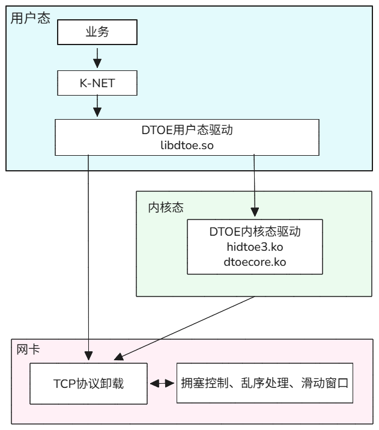

# K-NET DTOE

## 最新消息

[2026.03.31]：DTOE首次发布，新增KNET-DTOE接口。

## DTOE简介

K-NET（K-Network，网络加速套件）旨在打造一款网络加速套件，提供统一的软件框架，发挥软硬协同优势，释放网卡硬件性能。DTOE（Direct TCP Offloading Engine，TCP协议卸载加速引擎）是K-NET网络加速套件的一个加速特性。K-NET的详细介绍可参见[K-NET](https://gitcode.com/openeuler/knet/blob/master/README.md)。
DTOE将TCP数据传输过程卸载到网卡硬件中进行，降低系统CPU的消耗，提高服务器处理性能；连接建立和删除以及连接维护等功能继续由软件内核处理。开发者可基于DTOE API接口对既有业务的TCP网络通信代码编程改造，实现DTOE卸载加速能力。
详细介绍可参见[《Data Acceration Kit 26.0.T1 FlexDA DTOE 开发指南》](https：//)。

K-NET通过封装DTOE接口，提供更接近socket语义的KNET-DTOE接口，提升易用性。

**图 1** KNET-DTOE架构图



## 版本配套关系

### 产品版本信息

|  产品名称      |   软件名称   | 软件版本 |
|------------|-------------|-------------|
| Data Acceleration Kit | K-NET DTOE   | 26.0.T1 |

### 版本配套关系

|  项目       |    版本  |
|------------|-------------|
| 操作系统  |  openEuler 24.03 LTS SP2 |
| 服务器  |  S920X20  |
| 网卡  | SP670  |
| CPU  | 鲲鹏920新型号 7280Z  |

## 源码下载

下载K-NET DTOE源码。

```shell
git clone https://gitcode.com/openeuler/knet.git
git checkout dtoe
```

## 源码目录结构

```shell
.
├── cmake      // 存放构建依赖
├── conf       // 存放初始配置项
├── demo       // 存放示例demo
├── docs       // 文档说明
├── opensource // 存放项目依赖
├── package    // 存放rpm包构建配置
├── src        // 存放项目的功能实现源码，仅该目录参与构建出包
├── test       // 存放项目的UT和SDV测试
└── build.py   // 统一的构建入口
```

## 安装K-NET

### 安装DTOE依赖

安装网卡DTOE驱动固件的指导，请参见[《Data Acceration Kit 26.0.T1 FlexDA DTOE 开发指南》](https：//)。

### 安装开源依赖

安装libboundscheck依赖。

```bash
yum install -y libboundscheck
```

### 安装K-NET

1. 下载K-NET源码并编译。

    ```bash
    git clone https://atomgit.com/openeuler/knet.git
    cd knet
    python build.py Release dtoe rpm
    ```

2. 安装K-NET。
    - 鲲鹏架构：
        ```bash
        rpm -ivh build/rpmbuild/RPMS/knet-1.0.0.aarch64.rpm
        ```

## 业务适配
### 业务适配API接口
根据API接口描述修改对应的业务代码，具体接口描述见[knet_dtoe_api](../../src/knet/api/dtoe_api/include/knet_dtoe_api.h)。

### 业务编译
- 添加编译选项：指定头文件搜索路径与链接的库名称，以iPerf3为例
    ```bash
    // Makefile.am
    libiperf_la_LIBADD = -lknet_frame
    AM_CPPFLAGS = -I/usr/include/knet
    ```

- 编译构建业务，以iPerf3为例。
    ```bash
    // iperf3目录下
    sh bootstrap.sh
    ./configure; make
    ```

## K-NET配置文件DTOE配置参考

```shell
$ vim /etc/knet/knet_comm.conf
```

配置参考如下：

| 配置项 | 说明 | 默认值 | 取值范围 | 约束说明 |
|--------|------|--------|----------|----------|
| **log_level** | 日志级别 | "WARNING" | "ERROR", "WARNING", "INFO", "DEBUG" | 支持大小写混写 |
| **channel_num** | 通道个数 | 1 | 64 | tx和rx通道个数各有channel_num个 |

## K-NET日志

KNET运行过程中打印的日志在目录`/var/log/knet/knet_comm.log`。
