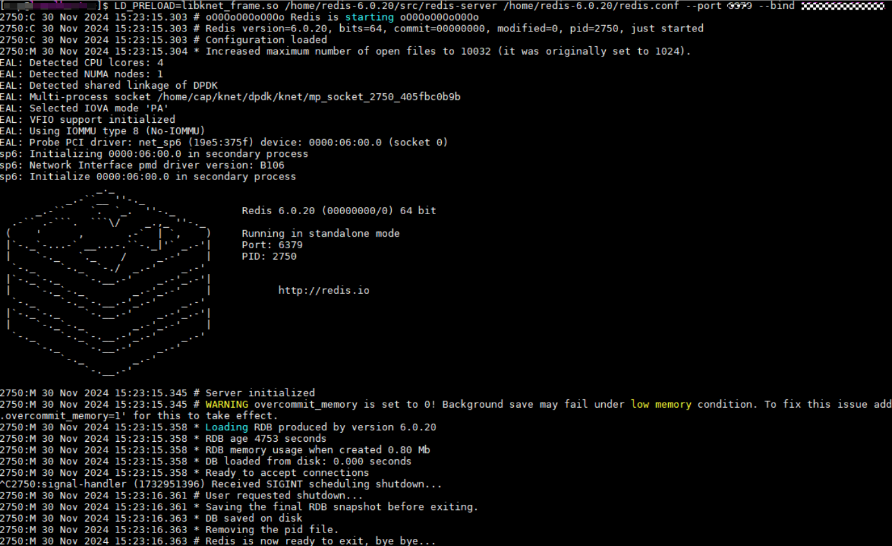
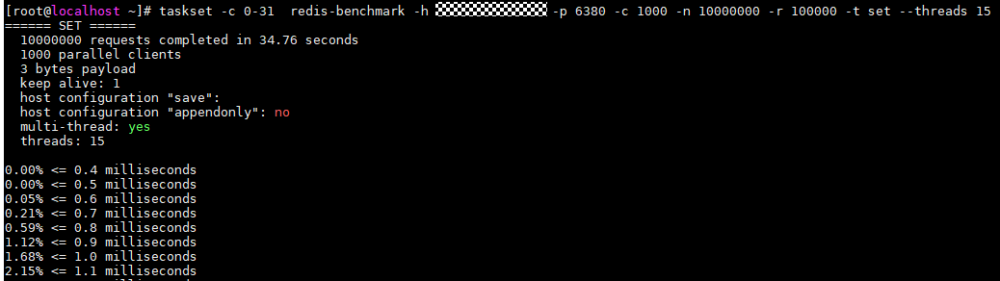
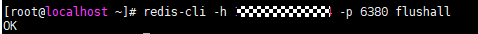
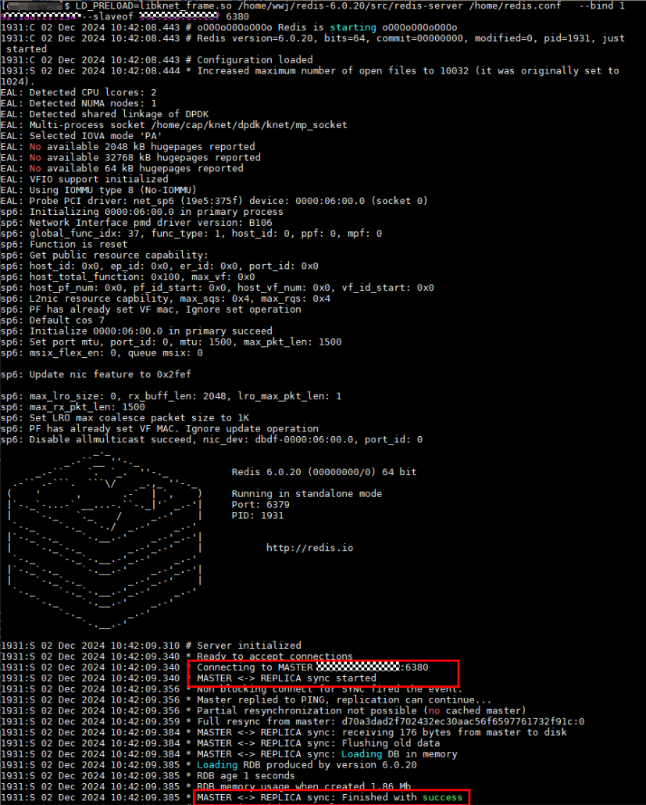
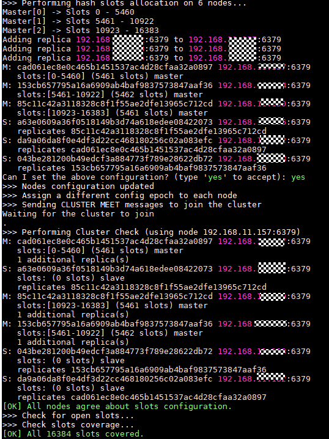

# 单进程模式加速

>**说明：** 
>
>- 该模式支持服务端为配置VF直通的虚拟机以及物理机两种场景，服务端为物理机场景下使用DPDK接管网卡PF运行K-NET，按照[配置大页内存](./Environment_Configuration.md#配置大页内存)进行环境配置。
>- 首先确认knet\_comm.conf配置文件中配置运行模式为单进程，如果“mode”不为0，则应修改为0。

```bash
vi /etc/knet/knet_comm.conf
```

```text
#common配置项
    "common": {
        "mode": 0, # 运行模式，0表示单进程模式，1表示多进程模式；
        ...
    }
```

# Redis业务加速

## 单实例加速

> **说明：** 
>服务端组网参考[物理机组网规划或虚拟机组网规划](../Installation/Installation_Planning.md)，按照[配置大页内存](./Environment_Configuration.md#配置大页内存)进行环境配置。

1. 服务端中运行Redis服务端。

    >**说明：** 
    >- 以KNET\_USER为用户名占位符，推荐在“/home/KNET\_USER“目录下执行该命令（KNET\_USER用户在此目录下拥有读写权限），实际运行时将其替换为实际用户名。KNET\_USER需具有命令执行权限。
    >- 若为root用户，执行时需添加so文件路径，运行命令如下：
    > ```bash
    > LD_PRELOAD=/usr/lib64/libknet_frame.so /path/redis-6.0.20/src/redis-server /path/redis-6.0.20/redis.conf --port 6380 --bind 192.168.*.*
    >    ```

    ```bash
    LD_PRELOAD=libknet_frame.so /path/redis-6.0.20/src/redis-server /path/redis-6.0.20/redis.conf --port 6380 --bind 192.168.*.*
    ```

    

    >**说明：** 
    >- --port：Redis Server侦听的端口，请用户根据实际情况替换。且绑定端口后，请勿再使用此端口运行其他业务。
    >- --bind：Redis Server侦听的IP地址，为具体网卡配置的IP地址，请用户根据实际情况替换。
    >- redis-server和redis.conf的路径根据实际安装Redis的路径填写。

2. 客户端主机中运行redis-benchmark进行测试。

    ```bash
    taskset -c 33-62 /path/redis-6.0.20/src/redis-benchmark -h 192.168.*.* -p 6380 -c 1000 -n 10000000 -r 100000 -t set --threads 15
    ```

    回显如下，这里以set测试为例：

    

    >**说明：** 
    >- taskset -c 33-62：将进程绑定到编号33到62的CPU上运行（可选项，CPU范围选择参考[性能调优](../Reference/Performance_Tuning/CPU_Core_Pinning_Consistent_with_NIC_NUMA_Node.md)）。
    >- /path/redis-6.0.20/src/redis-benchmark：redis-benchmark是Redis自带的基准测试工具，用于测试Redis的性能，路径根据实际安装Redis的路径填写。
    >- -h 192.168.\*.\*：Redis服务器的IP地址，这里是步骤1中绑定的IP地址。
    >- -p 6380：Redis服务器的端口号，这里是步骤1中绑定的端口号。
    >- -c 1000：并发连接数，即同时向Redis服务器发送请求的客户端数量。
    >- -n 10000000：总请求数，即客户端向Redis服务器发送的请求总数。
    >- -r 100000：配置指定数据的key，对SET/GET/INCR使用随机key，对SADD使用随机value，对ZADD使用随机成员和分数。
    >- -t set：测试类型，set对应测试类型为set操作，如果是-t get表示测试类型为get操作。
    >- --threads 15：线程数，即每个客户端使用的线程数。同一个客户端可以使用多个线程来发送请求，从而提高并发量和吞吐量。

3. 客户端清理set数据。

    ```bash
    redis-cli -h 192.168.*.* -p 6380 flushall
    ```

    

4. 客户端主机中运行redis-benchmark进行get测试。

    ```bash
    taskset -c 33-62 /path/redis-6.0.20/src/redis-benchmark -h 192.168.*.* -p 6380 -c 1000 -n 10000000 -r 10000000 -t get --threads 15
    ```

## 虚拟机VF硬直通对Redis业务主从场景加速

>**说明：** 
>一主一从场景，虚拟机均按[配置大页内存](./Environment_Configuration.md#配置大页内存)进行环境配置，典型组网参考[Redis典型组网](../Installation/Installation_Planning.md)。
>以主服务端使用的网卡IP地址为192.168.0.1，从服务端使用的网卡IP地址为192.168.0.2为例。

1. 服务端虚拟机（主）运行Redis服务端。

    > **说明：** 
    >- 以KNET\_USER为用户名占位符，推荐在“/home/KNET\_USER“目录下执行该命令（KNET\_USER用户在此目录下拥有读写权限），实际运行时将其替换为实际用户名。KNET\_USER需具有命令执行权限。
    >- 若为root用户，执行时需添加so文件路径，运行命令如下：
    > ```bash
    > LD_PRELOAD=/usr/lib64/libknet_frame.so /path/redis-6.0.20/src/redis-server /path/redis-6.0.20/redis.conf --port 6380 --bind 192.168.0.1
    >    ```

    ```bash
    LD_PRELOAD=libknet_frame.so /path/redis-6.0.20/src/redis-server /path/redis-6.0.20/redis.conf --port 6380 --bind 192.168.0.1
    ```

2. 服务端虚拟机（从）运行Redis服务端。

    > **说明：** 
    >- 以KNET\_USER为用户名占位符，推荐在“/home/KNET\_USER“目录下执行该命令（KNET\_USER用户在此目录下拥有读写权限），实际运行时将其替换为实际用户名。KNET\_USER需具有命令执行权限。
    >- root用户下执行时需添加so文件路径，运行命令如下：
    > ```bash
    > LD_PRELOAD=/usr/lib64/libknet_frame.so /path/redis-6.0.20/src/redis-server /path/redis-6.0.20/redis.conf --port 6380 --bind 192.168.0.2 --slaveof 192.168.0.1 6380
    >    ```

    ```bash
    LD_PRELOAD=libknet_frame.so /path/redis-6.0.20/src/redis-server /path/redis-6.0.20/redis.conf --port 6380 --bind 192.168.0.2 --slaveof 192.168.0.1 6380（主服务端绑定端口）
    ```

    >**说明：** 
    >--slaveof 192.168.0.1 6380：用于将当前Redis实例设置为一个从服务器，并指定主服务器的IP地址为192.168.0.1，端口号为6380。

    回显如下说明成功使能主从：

    

3. 客户端主机中运行redis-benchmark对主服务端进行测试。

    ```bash
    taskset -c 33-62 /path/redis-6.0.20/src/redis-benchmark -h 192.168.0.1 -p 6380（主服务端绑定端口） -c 1000 -n 10000000 -r 100000 -t set --threads 15
    redis-cli -h 192.168.0.1 -p 6380（主服务端绑定端口） flushall #客户端清理set数据
    taskset -c 33-62 /path/redis-6.0.20/src/redis-benchmark -h 192.168.0.1 -p 6380（主服务端绑定端口） -c 1000 -n 100000000 -r 100000 -t get --threads 15
    ```

    >**说明：** 
    >- taskset -c 33-62：将进程绑定到编号33到62的CPU上运行（可选项，CPU范围选择参考[性能调优](../Reference/Performance_Tuning/CPU_Core_Pinning_Consistent_with_NIC_NUMA_Node.md)）。
    >- _/path__/redis-6.0.20/src/_redis-benchmark：redis-benchmark是Redis自带的基准测试工具，用于测试Redis的性能，路径根据实际安装Redis的路径填写。
    >- -h 192.168.\*.\*：Redis服务器的IP地址，这里是步骤1中绑定的IP地址。
    >- -p 6380：Redis服务器的端口号，这里是步骤1中绑定的端口号。
    >- -c 1000：并发连接数，即同时向Redis服务器发送请求的客户端数量。
    >- -n 10000000：总请求数，即客户端向Redis服务器发送的请求总数。
    >- -r 100000：配置指定数据的key，对SET/GET/INCR使用随机key，对SADD使用随机value，对ZADD使用随机成员和分数。
    >- -t set：测试类型，参数set表示本次测试为set操作。如果是-t get表示测试类型为get操作。
    >- --threads 15：线程数，即每个客户端使用的线程数。同一个客户端可以使用多个线程来发送请求，从而提高并发量和吞吐量。

4. 客户端主机中运行redis-benchmark对从服务端进行测试。

    ```bash
    taskset -c 33-62 /path/redis-6.0.20/src/redis-benchmark -h 192.168.0.2 -p 6379 -c 1000 -n 100000000 -r 100000 -t get --threads 15
    ```

    >**说明：** 
    >-p 6379：从服务端运行redis命令没有指定端口号，因此其绑定端口号为redis配置文件默认值6379。

## 虚拟机VF硬直通对Redis业务集群场景加速

>**说明：** 
>三主三从集群场景，虚拟机均按[配置大页内存](./Environment_Configuration.md#配置大页内存)进行环境配置，典型组网参考[Redis三主三从组网](../Installation/Installation_Planning.md)。

以6个服务端虚拟机使用的网卡IP分别为192.168.0.1、192.168.0.2、192.168.0.3、192.168.0.4、192.168.0.5、192.168.0.6为例，执行以下步骤：

1. 六台服务端虚拟机分别运行Redis客户端。

    > **说明：** 
    >- 以KNET\_USER为用户名占位符，推荐在“/home/KNET\_USER“目录下执行该命令（KNET\_USER用户在此目录下拥有读写权限），实际运行时将其替换为实际用户名。KNET\_USER需具有命令执行权限。
    >- 若为root用户，执行时需添加so文件路径，以虚拟机1为例，运行命令如下：
    > ```bash
    > LD_PRELOAD=/usr/lib64/libknet_frame.so /path/redis-6.0.20/src/redis-server /path/redis-6.0.20/redis.conf --cluster-enabled yes --cluster-config-file /path/nodes-1.conf --cluster-node-timeout 15000 --port 6379 --bind 192.168.0.1
    >    ```

    - 虚拟机1：

        ```bash
        LD_PRELOAD=libknet_frame.so /path/redis-6.0.20/src/redis-server /path/redis-6.0.20/redis.conf --cluster-enabled yes --cluster-config-file /path/nodes-1.conf --cluster-node-timeout 15000 --port 6379 --bind 192.168.0.1
        ```

    - 虚拟机2：

        ```bash
        LD_PRELOAD=libknet_frame.so /path/redis-6.0.20/src/redis-server /path/redis-6.0.20/redis.conf --cluster-enabled yes --cluster-config-file /path/nodes-2.conf --cluster-node-timeout 15000 --port 6379 --bind 192.168.0.2
        ```

    - 虚拟机3：

        ```bash
        LD_PRELOAD=libknet_frame.so /path/redis-6.0.20/src/redis-server /path/redis-6.0.20/redis.conf --cluster-enabled yes --cluster-config-file /path/nodes-3.conf --cluster-node-timeout 15000 --port 6379 --bind 192.168.0.3
        ```

    - 虚拟机4：

        ```bash
        LD_PRELOAD=libknet_frame.so /path/redis-6.0.20/src/redis-server /path/redis-6.0.20/redis.conf --cluster-enabled yes --cluster-config-file /path/nodes-4.conf --cluster-node-timeout 15000 --port 6379 --bind 192.168.0.4
        ```

    - 虚拟机5：

        ```bash
        LD_PRELOAD=libknet_frame.so /path/redis-6.0.20/src/redis-server /path/redis-6.0.20/redis.conf --cluster-enabled yes --cluster-config-file /path/nodes-5.conf --cluster-node-timeout 15000 --port 6379 --bind 192.168.0.5
        ```

    - 虚拟机6：

        ```bash
        LD_PRELOAD=libknet_frame.so /path/redis-6.0.20/src/redis-server /path/redis-6.0.20/redis.conf --cluster-enabled yes --cluster-config-file /path/nodes-6.conf --cluster-node-timeout 15000 --port 6379 --bind 192.168.0.6
        ```

    > **说明：** 
    >- _192.168._0.\*：表示不同虚拟机的使用网卡IP地址，请根据实际情况替换。
    >- --cluster-enabled yes：启用Redis集群模式。
    >- --cluster-config-file /path/nodes-1.conf：集群配置信息文件，由Redis自行更新生成，不用手动配置，每个节点都有一个集群配置文件用于持久化保存集群信息，需确保与运行中实例的配置文件名不冲突，另外路径（path）要在/home/_KNET\_USER_下（KNET\_USER用户在此目录下拥有读写权限），推荐直接填/home/KNET\_USER。
    >- --cluster-node-timeout 15000：集群超时时间（毫秒），节点超时多久则认为它宕机了。如果主节点超过指定的时间不可达，进行故障切换，将其对应的从节点提升为主。

2. 客户端主机中运行redis-cli创建集群。

    ```bash
    redis-cli --cluster create --cluster-replicas 1 192.168.0.1:6379 192.168.0.2:6379 192.168.0.3:6379 192.168.0.4:6379 192.168.0.5:6379 192.168.0.6:6379
    ```

    回显如下，说明成功创建集群：

    

    >**说明：** 
    >- --cluster create：创建集群。
    >- --cluster-replicas 1：从节点个数设置为1（这里有六个节点，因此组成三主三从集群）。

3. 客户端主机中运行redis-benchmark对集群的每个节点进行测试。

    ```bash
    taskset -c 33-62 /path/redis-6.0.20/src/redis-benchmark -h 192.168.0.* -p 6379 -c 1000 -n 10000000 -r 100000 -t set --threads 15 --cluster
    redis-cli -h 192.168.0.* -p 6379 flushall  #仅限主节点IP执行该操作
    taskset -c 33-62 /path/redis-6.0.20/src/redis-benchmark -h 192.168.0.* -p 6379 -c 1000 -n 100000000 -r 100000 -t get --threads 15 --cluster 
    ```

    >**说明：** 
    >--cluster：开启集群模式。

4. 客户端关闭服务端Redis实例。

    ```bash
    redis-cli -h 192.168.0.* -p 6379 shutdown
    ```

5. 服务端删除运行目录下的dump.rdb文件以及运行生成的nodes-\*.conf文件。

    > **说明：** 
    >这两个文件包含集群配置缓存信息，如果不删除，下次在客户端进行执行创建集群会有异常报错

    - 虚拟机1：

        ```bash
        rm /path/nodes-1.conf dump.rdb
        ```

    - 虚拟机2：

        ```bash
        rm /path/nodes-2.conf dump.rdb
        ```

    - 虚拟机3：

        ```bash
        rm /path/nodes-3.conf dump.rdb
        ```

    - 虚拟机4：

        ```bash
        rm /path/nodes-4.conf dump.rdb
        ```

    - 虚拟机5：

        ```bash
        rm /path/nodes-5.conf dump.rdb
        ```

    - 虚拟机6：

        ```bash
        rm /path/nodes-6.conf dump.rdb
        ```
