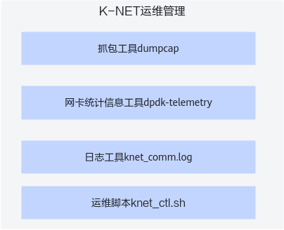
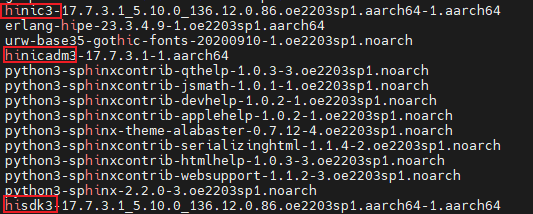
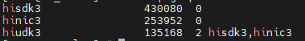
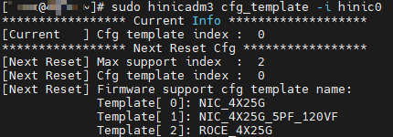
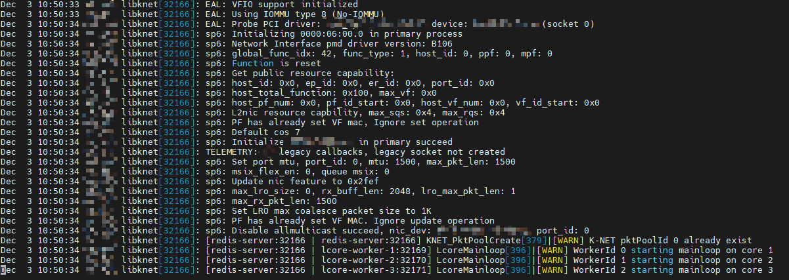
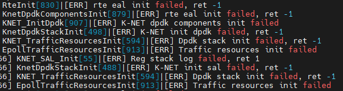
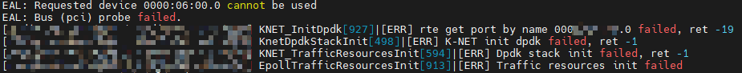
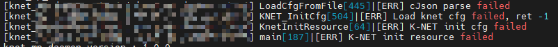
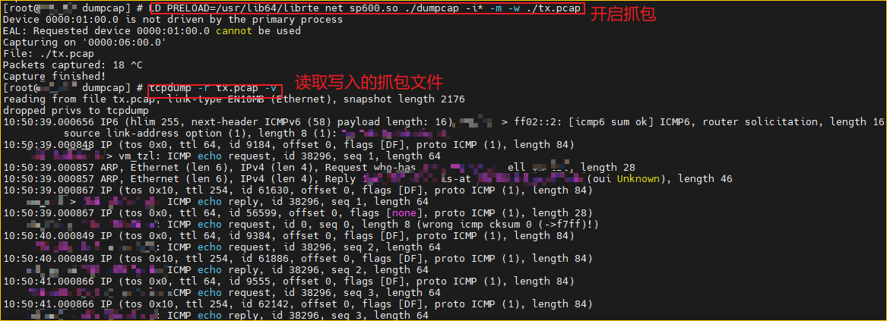

# 运维特性

## 运维架构

<term>K-NET</term>为了方便获取定位能力，提供了运维工具：抓包工具、遥测工具、日志工具以及运维脚本。



- 抓包工具**dumpcap**：为K-NET提供调试抓包功能，提供详细的网络实时监测细节，有两种适配K-NET的抓包模式。
    - 单进程抓包，基于主进程间的socket共享主进程收发队列，将共享报文写入文件，文件可由tcpdump命令和Wireshark工具查看。定位工具在使用抓包获取前需要先编译生成抓包程序。K-NET绑定的抓包获取能力在其他场景抓包可能失败，因此该抓包获取能力仅用于K-NET。
    - 多进程抓包，对多个K-NET加速进程提供抓包能力，可用过滤条件筛选目标进程的隔离数据包。多进程抓包时，仅能抓到在抓包工具启动之前已经启动的业务进程的数据包，即抓包工具启动后再启动的业务进程，无法抓包，需重启抓包工具。

- 遥测工具**dpdk-telemetry**：提供网卡收发报文统计指标，包括但不限于收发报文，错包等统计指标。

    获取网卡统计信息的工具借助了DPDK提供的统计工具 "dpdk-stable-21.11.7/usertools/dpdk-telemetry.py"（DPDK遥测工具）。对于统计信息所列出的所有功能，网卡可能并没有全部适配。目前该工具的使用场景主要是用于获取网卡队列统计信息，报文统计信息。目前常用的场景如下：

    - 验证流量是否正确到达配置的网卡队列。
    - 检查收发包、错包统计数量。
    - 检查TCP报文统计指标，包括TCP相关统计、TCP连接状态统计、协议栈各类报文统计、协议栈异常打点统计、协议栈内存使用统计、协议栈PBUF使用统计等。

- 日志工具**knet\_comm.log**：记录K-NET运行期间程序行为，提供错误跟踪、告警记录等基础功能，方便问题定位。
- 运维信息收集脚本**collect.sh**：收集运维信息，方便问题定位。
- 配置文件合并脚本**merge_conf.sh**：更新K-NET配置文件的历史配置。

## 工具使用

### 1  抓包工具dumpcap

>**说明：** 
>
>- 请用户先参见[安装抓包工具](../installation/installation.md#可选安装抓包工具)后再参考本章节进行使用。
>- K-NET使用的DPDK版本必须与抓包依赖的DPDK版本保持一致。当前仅支持21.11.7版本，该程序会随版本变更，需确保在正确版本下使用抓包工具。
>- 仅SP670网卡用户使用抓包时需要使用**LD\_PRELOAD=/usr/lib64/librte\_net\_hinic3.so**，TM280网卡用户无需使用LD\_PRELOAD加载驱动。

**命令格式**

```shell
LD_PRELOAD=/usr/lib64/librte_net_hinic3.so ./dumpcap [-D] [-h] [-i <pci bdf port>] [-c <packet_num_>] [-f "<filter expression>"] [-w <file_name>] [-a <stop_condition>_][-g] [-n] [-q] [-v] [-d] [-s] [-p] [-P]
```

**高频参数说明**

|        选项       |         是否必选  |            说明 |
|-------------------|------------------|----------------|
|      -D           |        否        | 显示可用PCI网口。  | 
|      -h           |         否       | 使用帮助信息。    | 
| -i <pci bdf port&gt;   |  否   | `-i 0000:06:00.0`：抓取精确指定网口的数据包。例如：`-i 0000:06:00.0`。不加`-i`则查找默认的一个DPDK接管网口。 |
| -c &lt;packet_num&gt;  | 否  | `-c 6000`：统计6000包后结束。例如：-c 6000。    |
|-w &lt;file_name&gt;    |否  |`-w ./tx.pcap`：将文件写入到当前目录的tx.pcap文件中。例如：`-w ./tx.pcap`。<p>若未指定文件路径，默认写入/tmp目录，例如`/tmp/dumpcap_xxxx.pcap`。</p>|
|-f &lt;filter_expression&gt;|否|`-f "host 192.168.1.1 \|\| port 6390"`：抓取数据包中有192.168.1.1或者端口为6390的数据包。

**其他参数说明**

|  选项    | 是否必选|   说明 |
|----------|--------|--------|
|-a &lt;stop_condition&gt;|否|`-a 100`，例如抓取100kB的包停止，`-a filesize:100`。|
|      -g |    否   |支持linux群组用户访问抓包文件。|
|   -q    |    否    |不报告抓包数量。|
|   -v    |    否   |版本信息。|
|   -d    |    否   |打印过滤条件码。|
|    -s   |    否    |抓包大小，该参数对K-NET应用不可用，因此出于安全起见，K-NET仅会抓取数据包头。|
|  -p   |  否  |默认配置参数，关闭混杂。|
|  -P   |  否  |默认配置参数，抓包文件格式pcap。|
|  -n   |  否  |未使用，是预留参数。|

**使用示例**

>**说明：** 
>使用抓包前请先启动K-NET。抓包工具启动前已经运行的业务进程才能被抓包，如果新增业务进程，请重启抓包工具。业务启动命令参见“docs/feature”中各功能示例。

- 进入“dpdk-stable-21.11.7/app/dumpcap”目录再使用抓包定位K-NET劫持的业务。

    ```bash
    LD_PRELOAD=librte_net_hinic3.so ./dumpcap -w /home/KNET_USER/tx.pcap # 使用默认DPDK接管网口，抓取K-NET业务数据包，写入/home/KNET_USER用户目录下，文件名为tx.pcap
    LD_PRELOAD=librte_net_hinic3.so ./dumpcap -w /home/KNET_USER/tx.pcap -f "host 192.168.1.11 && port 6380" # 使用默认DPDK接管网口，在以上条件基础上新增host和port过滤条件, 192.168.1.11为抓包想要过滤的主机ip，6380为想要过滤主机的端口
    ```

- 如果dumpcap被意外终止，例如被执行**pkill -9 dumpcap**或**pkill dumpcap**命令。为了恢复使用，请启动-关闭-重启dumpcap，以恢复抓包定位能力。

    以下是意外终止并恢复模拟：

    ```bash
    pkill -9 dumpcap
    LD_PRELOAD=librte_net_hinic3.so ./dumpcap -w /home/KNET_USER/tx.pcap # 第一次启动
    ```

    “ctrl+C”正常退出：

    ```bash
    LD_PRELOAD=librte_net_hinic3.so ./dumpcap -w /home/KNET_USER/tx.pcap # 重启后恢复
    ```

### 2 遥测工具dpdk-telemetry

**使用前配置**

dpdk-telemetry会在DPDK安装后自动安装到系统可执行目录。

1. 将配置文件knet\_comm.conf中的“telemetry”参数设置为1后，启动业务进程。

    ```bash
    vim /etc/knet/knet_comm.conf
    ```

    按“i“进入编辑模式：

    ```json
    {
        "dpdk": {
            "telemetry": 1
        }
    }
    ```

    按“Esc”键退出编辑模式，输入 **:wq!**，按“Enter”键保存并退出文件。

2. 启动K-NET。

    业务启动命令参见“docs/feature”中各功能示例。

3. 服务端运行脚本。

    >**说明：** 
    >- 普通用户进入工具使用界面前需设置“XDG\_RUNTIME\_DIR”环境变量，如果新开终端，需要在新起的终端中导入。环境变量路径涉及的权限及安全需要用户保证。参考[相关业务配置](preparations.md#相关业务配置)进行设置。
    >- 服务端环境关闭或重启后需要重新执行步骤。
    >- 通过设置环境变量指定运行时目录，路径依据不同用户名会有差异。
    >- 退出普通用户再重新切换到该用户需要重新配置。

    检查脚本是否安装到当前系统目录中：

    ```bash
    whereis dpdk-telemetry.py
    ```

    显示示例如下，表示存在。

    ```ColdFusion
    dpdk-telemetry.py: /usr/bin/dpdk-telemetry.py /usr/local/bin/dpdk-telemetry.py
    ```

    - 回显存在后，可直接使用：

        ```ColdFusion
        dpdk-telemetry.py -f knet -i 1 # 启动telemetry
        ```

    - 若脚本未安装到系统目录中，则从脚本实际位置使用：

        ```ColdFusion
        python3 <your-dpdk-path>/usertools/dpdk-telemetry.py  -f knet -i 1
        ```

        >**说明：** 
        ><your-dpdk-path\>表示脚本实际安装的位置。

**使用方法**

**dpdk-telemetry**详细使用方法参考[dpdk-telemetry.py遥测信息获取脚本](../reference/script_reference/dpdk-telemetry.md)。

### 3 日志工具knet\_comm.log

knet\_comm.log在K-NET安装后即可记录K-NET运行信息。

**命令格式**

```bash
vim /var/log/knet/knet\_comm.log
```

```bash
tail <option> /var/log/knet/knet\_comm.log
```

**命令参数**

**表 1** **tail**命令参数

|  选项    | 是否必选|   说明 |
|----------|--------|--------|
|-n &lt;number&gt;|否|`-n 10`, 查看最后10行日志。                     |
|-s &lt;time&gt;  |否|需配合-f使用，`-f -s 30`, 30s时间后更新日志显示。|
|        -f       |否|实时显示日志尾部。                            |
|-c &lt;bytenum&gt;|否|`-c 1000`，输出日志最后1000字节。                |

**使用示例**

- 通过vim命令回溯查看knet\_comm.log

    ```bash
    vim /var/log/knet/knet_comm.log
    ```

- 实时查看日志

    ```bash
    tail -f /var/log/knet/knet_comm.log
    ```

## 日常运维

### 1 网卡检查

1. 检测网卡驱动是否存在。

    ```bash
    rpm -qa | grep hi
    ```

    检查显示结果，确保hinic3、hisdk3、hinicadm3等网卡驱动已安装。

    

    若不存在请参考[《华为 SP600 智能网卡 用户指南》](https://support.huawei.com/enterprise/zh/doc/EDOC1100309168/426cffd9?idPath=23710424|251364417|9856629|253287505)或[《SP200&SP600 网卡 驱动源码 编译指南》](https://support.huawei.com/enterprise/zh/doc/EDOC1100429557/edc0a769)进行驱动的安装。

2. 网卡驱动存在后还需要进一步确认驱动已经加载到系统。

    检测驱动是否已加载。

    ```bash
    lsmod | grep hi
    ```

    正常情况是包含hinic3、hisdk3、hiudk3等网卡驱动。结果如下：

    

    若驱动不存在则执行如下命令加载驱动：

    ```bash
    modprobe hiudk3
    modprobe hisdk3
    modprobe hinic3
    ```

3. 查看网卡模板。

    ```bash
    hinicadm3 cfg_template -i hinic0
    ```

    

    “Current Info”字段中显示的为“0”表示模板正确，如果为其他值，请按照以下操作修改并重启：

    1. 切换网卡为模板0。

        ```bash
        hinicadm3 cfg_template -i hinic0 -s 0
        ```

    2. 重启。

        ```bash
        reboot
        ```

        > 重启后请再次执行查看命令查看当前网卡模板。
        >**说明：** 
        >若使用流量分叉功能，需将模板切换为ROCE\_2X100G\_UN\_ADAP。

### 2 业务状态检查

1. 检查DPDK接管状态。

    ```bash
    dpdk-devbind.py -s
    ```

    查询结果以SP670网卡VF为例，如下所示：

    ```ColdFusion
    Network devices using DPDK-compatible driver
    ============================================
    0000:06:00.0 'Device 375f' drv=vfio-pci unused=hisdk3
    Network devices using kernel driver
    ===================================
    0000:01:00.0 'Virtio network device 1041' if=enp1s0 drv=virtio-pci unused=virtio_pci,vfio-pci *Active*
    No 'Baseband' devices detected
    ==============================
    No 'Crypto' devices detected
    ============================
    No 'DMA' devices detected
    =========================
    No 'Eventdev' devices detected
    ==============================
    No 'Mempool' devices detected
    =============================
    No 'Compress' devices detected
    ==============================
    No 'Misc (rawdev)' devices detected
    ===================================
    No 'Regex' devices detected
    ===========================
    ```

    确认检查结果：

    - 若SP670网卡查询信息出现在“DPDK-compatible driver”一栏，则检测通过。
    - 若上述查询SP670网卡并未出现在“DPDK-compatible driver”一栏，参考[配置大页内存](preparations.md#配置大页内存)接管网卡部分继续配置。

2. 检查大页情况。

    ```bash
    dpdk-hugepages.py -s
    ```

    显示的示例结果如下：

    ```ColdFusion
    Node Pages Size Total
    0    2     1Gb    2Gb
    Hugepages mounted on /dev/hugepages /dev/hugepages1G
    ```

    若不存在对应大页，需要挂载相应大小大页，建议配置1G大页或者512MB大页，大页配置参考[配置大页内存](preparations.md#配置大页内存)配置大页内存部分。

3. 检查熵池。
    1. 检查是否安装rng-tools：

        ```bash
        rpm -q rng-tools
        ```

        回显示例如下：

        ```ColdFusion
        rng-tools-6.14-5.oe2203sp4.aarch64
        ```

        如果没有就安装：

        ```bash
        yum install -y rng-tools
        ```

    2. 检查rng-tools状态。

        ```bash
        systemctl status rngd
        ```

        - 若状态显示为“active”，表示状态正常：

            ```ColdFusion
            rngd.service - Hardware RNG Entropy Gatherer Daemon
                 Loaded: loaded (/usr/lib/systemd/system/rngd.service; enabled; vendor preset: enabled)
                 Active: active (running) since Fri 2024-12-27 11:07:45 CST; 4 days ago
               Main PID: 935 (rngd)
                  Tasks: 3 (limit: 42430)
                 Memory: 4.0M
                 CGroup: /system.slice/rngd.service
                         └─ 935 /sbin/rngd -f
            ```

        - 若服务不正常，考虑重启rngd服务：

            ```bash
            systemctl daemon-reload
            systemctl restart rngd
            ```

            再次查看状态是否为“active”。

### 3 K-NET状态检查

#### 日志检查

通过日志查看K-NET状态。

- 正常日志情况不应存在ERR记录，下列示例展示了K-NET正常工作状况：

    

- 若存在ERR日志，则表明存在异常情况，常见异常情况包含如下：
    - 如出现以下日志报错，表示DPDK初始化失败，通常由于大页内存未挂载或未找到被接管的网卡。

        

        处理方式：参照[配置大页内存](preparations.md#配置大页内存)配置大页内存并接管网卡。

    - 网口的BDF号不正确，通常在“/etc/knet/knet\_comm.conf”编辑BDF配置时可能配置了网卡的不可用网口，请再次检查填入被DPDK接管网口的BDF号。

        

        处理方式：编辑  “/etc/knet/knet\_comm.conf” 配置文件，配置正确网口的BDF号。

    - “/etc/knet/knet\_comm.conf ”配置不符合json字符串，可能存在符号错误，如未加逗号，引号等，请检查后再次运行K-NET，并检查knet\_comm.log是否还存在报错。

        

        处理方式：检查去掉“/etc/knet/knet\_comm.conf ”错误符号，常见排查方法是确保花括号“\{\}”在/etc/knet/knet\_comm.conf中配对正确， 引号""配对正确，逗号“,”没有多余或遗漏。

#### 遥测工具

>说明： 由于 dpdk-telemetry 底层对响应的条目数和消息长度有限制，输出过多会导致回显失败或截断。对于可能超限的接口(/knet/stack/net_stat、/knet/stack/epoll_stat、/knet/flow/list)，提供起始值和数量参数，允许用户分段查询，确保响应完整有效。关于遥测统计的详细字段说明请参考[遥测信息获取脚本](../reference/script_reference/dpdk-telemetry.md)。

##### 查看网卡收发包

dpdk-telemetry适配后除了查看网口收发包、错包、丢包之外，还能查看TCP等网络状态。K-NET应用启动后，运行`dpdk-telemetry.py -f knet -i 1`进入命令状态，quit可退出。

常用运维命令：

- 查看网卡收发包、错包、丢包状态。

    ```bash
    /ethdev/stats,<port_id> 
    ```

    >**说明：** 
    >port\_id为网口BDF号的port\_id，不是Redis侦听端口。
    >执行/ethdev/list命令可查看DPDK接管网口BDF号的port\_id。

- 查看K-NET的TCP相关统计：TCP连接状态统计、各类报文统计、异常打点统计、内存使用统计。

    ```bash
    /knet/stack/tcp_stat,[pid]
    /knet/stack/conn_stat,[pid]
    /knet/stack/pkt_stat,[pid]
    /knet/stack/abn_stat,[pid]
    /knet/stack/mem_stat,[pid]
    ```

    主要查看imissed, ierrors, oerrors等丢包、错包数据，示例如下，正常情况应为0。

    ```json
    --> /ethdev/stats,0
    {"/ethdev/stats": {"ipackets": 937835, "opackets": 934833, "ibytes": 95559003, "obytes": 66376175, "imissed": 0, "ierrors": 0, "oerrors": 0, "rx_nombuf": 0, "q_ipackets": [937835, 0, 0, 0, 0, 0, 0, 0, 0, 0, 0, 0, 0, 0, 0, 0], "q_opackets": [934835, 0, 0, 0, 0, 0, 0, 0, 0, 0, 0, 0, 0, 0, 0, 0], "q_ibytes": [95559003, 0, 0, 0, 0, 0, 0, 0, 0, 0, 0, 0, 0, 0, 0, 0], "q_obytes": [66376317, 0, 0, 0, 0, 0, 0, 0, 0, 0, 0, 0, 0, 0, 0, 0], "q_errors": [0, 0, 0, 0, 0, 0, 0, 0, 0, 0, 0, 0, 0, 0, 0, 0]}}
    --> /knet/stack/tcp_stat
    {"/knet/stack/tcp_stat": {"Accepts": 1001, "Closed": 1, "Connects": 1001, "DelayedAck": 5717013, "RcvAckBytes": 28580120, "RcvAckPkts": 5719020, "RcvBytes": 205812653, "RcvBytesPassive": 205812653, "RcvTotal": 5720023, "RcvPkts": 5717017, "RcvFIN": 1, "RTTUpdated": 5717020, "SndBytes": 28581869, "SndBytesPassive": 28581869, "SndCtl": 1003, "SndPkts": 5716366, "SndAcks": 1003, "SndTotal": 5717369, "SndFIN": 1, "TcpUserAccept": 1001, "TcpRcvOutBytes": 205796561}}
    ...
    
    ```

    若存在丢包、错包，则表示网络存在异常，可结合dumpcap抓包工具进一步排查异常。

##### 查看协议栈测统计信息

K-NET应用启动后，运行`dpdk-telemetry.py -f knet -i 1`进入命令状态，quit可退出。

查看协议栈测统计信息命令（单进程模式下pid参数可忽略，多进程模式下需要指定pid参数）：

```bash
/knet/stack/tcp_stat,[pid]     # TCP相关统计
/knet/stack/conn_stat,[pid]    # TCP连接状态统计
/knet/stack/pkt_stat,[pid]     # 协议栈各类报文统计
/knet/stack/abn_stat,[pid]     # 协议栈异常打点统计
/knet/stack/mem_stat,[pid]     # 协议栈内存使用统计
/knet/stack/pbuf_stat,[pid]    # 协议栈内存使用统计
```

> 说明：tcp相关状态统计返回时，字段的值为0则不会显示该字段；异常信息打点统计返回时，字段的值为0则不会显示该字段
> 
运行样例：

```json
--> /knet/stack/tcp_stat
{"/knet/stack/tcp_stat": {"Accepts": 38, "Closed": 36, "Connects": 38, "DelayedAck": 147512040, "RcvAckBytes": 2895, "RcvAckPkts": 306764079, "RcvNoTcpHash": 163, "RstByRcvErrAckFlags": 755, "RcvBytes": 6579120164411, "RcvBytesPassive": 6585309755644, "RcvDupBytes": 19257, "RcvDupPkts": 23, "RcvAfterWndPkts": 26, "RcvAfterWndBytes": 53048, "RcvPartDupBytes": 4048, "RcvPartDupPkts": 16, "RcvOutOrderPkts": 344404, "RcvOutOrderBytes": 5883122608, "RcvTotal": 306764892, "RcvPkts": 306366193, "RcvWndUpdate": 1, "RcvFIN": 8, "RTTUpdated": 59, "SndBytes": 2889, "SndBytesPassive": 2889, "SndCtl": 159278679, "SndPkts": 24, "SndAcks": 159277761, "SndTotal": 159278703, "SndWndUpdate": 25698, "DropCtlPkts": 755, "DropDataPkts": 8, "SndRST": 948, "SndFIN": 6, "RespChallAcks": 12, "RstTimeWaitTimerDrops": 1, "TcpUserAccept": 38, "RstRcvNonRstPkt": 163, "RstRcvBufNotClean": 30, "TcpReassSucBytes": 6175640088, "TcpRcvOutBytes": 6556257641765, "TcpCloseNoRcvDataLen": 7824846}}
```

```json
--> /knet/stack/conn_stat
{"/knet/stack/conn_stat": {"Listen": 1, "SynSent": 0, "SynRcvd": 0, "PAEstablished": 1000, "ACEstablished": 0, "PACloseWait": 0, "ACCloseWait": 0, "PAFinWait1": 0, "ACFinWait1": 0, "PAClosing": 0, "ACClosing": 0, "PALastAck": 0, "ACLastAck": 0, "PAFinWait2": 0, "ACFinWait2": 0, "PATimeWait": 0, "ACTimeWait": 0, "Abort": 0}}
```

```json
--> /knet/stack/pkt_stat
{"/knet/stack/pkt_stat": {"LinkInPkts": 0, "EthInPkts": 306765055, "NetInPkts": 306765055, "IcmpOutPkts": 0, "ArpDeliverPkts": 0, "IpBroadcastDeliverPkts": 0, "NonFragDelverPkts": 306765055, "UptoCtrlPlanePkts": 0, "ReassInFragPkts": 0, "ReassOutReassPkts": 0, "NetOutPkts": 159278703, "EthOutPkts": 159278703, "FragInPkts": 0, "FragOutPkts": 0, "ArpMissResvPkts": 0, "ArpSearchInPkts": 0, "ArpHaveNormalPkts": 0, "RcvIcmpPkts": 0, "NetBadVersionPkts": 0, "NetBadHdrLenPkts": 0, "NetBadLenPkts": 0, "NetTooShortPkts": 0, "NetBadChecksumPkts": 0, "NetNoProtoPkts": 0, "NetNoRoutePkts": 0, "TcpReassPkts": 397814, "UdpInPkts": 0, "UdpOutPkts": 0, "TcpInPkts": 306765218, "SndBufInPkts": 49, "SndBufOutPkts": 24, "SndBufFreePkts": 1, "RcvBufInPkts": 306764000, "RcvBufOutPkts": 305385285, "RcvBufFreePkts": 0, "Ip6InPkts": 0, "Ip6TooShortPkts": 0, "Ip6BadVerPkts": 0, "Ip6BadHeadLenPkts": 0, "Ip6BadLenPkts": 0, "Ip6MutiCastDeliverPkts": 0, "Ip6ExtHdrCntErrPkts": 0, "Ip6ExtHdrOverflowPkts": 0, "Ip6HbhHdrErrPkts": 0, "Ip6NoUpperProtoPkts": 0, "Ip6ReassInFragPkts": 0, "Ip6FragHdrErrPkts": 0, "Ip6OutPkts": 0, "Ip6FragOutPkts": 0, "KernelFdirCacheMiss": 0, "IpDevTypeNoMatch": 0, "IpCheckAddrFail": 0, "IpLenOverLimit": 0, "IpReassOverTblLimit": 0, "IpReassMallocFail": 0, "IpReassNodeOverLimit": 0, "IpIcmpAddrNotMatch": 0, "IpIcmpPktLenShort": 0, "IpIcmpPktBadSum": 0, "IpIcmpNotPortUnreach": 0, "IpIcmpUnreachTooShort": 0, "IpIcmpUnreachTypeErr": 0, "Ip6DevTypeErr": 0, "Ip6CheckAddrFail": 0, "Ip6ReassOverTblLimit": 0, "Ip6ReassMallocFail": 0, "Ip6ReassNodeOverLimit": 0, "Ip6ProtoErr": 0, "Ip6IcmpTooShort": 0, "Ip6IcmpBadSum": 0, "Ip6IcmpNoPayload": 0, "Ip6CodeNomatch": 0, "Icmpv6TooBigShort": 0, "Icmpv6TooBigSmall": 0, "Icmpv6TooBigExthdrErr": 0, "Icmpv6TooBigNotTcp": 0, "IpBadOffset": 0, "NfPreRoutingDrop": 0, "NfLocaInDrop": 0, "NfForwardDrop": 0, "NfLocalOutDrop": 0, "NfPostRoutingDrop": 0, "UdpIcmpUnReachShort": 0, "Ip6IcmpUnReachTooShort": 0, "Icmp6UnReachExthdrErr": 0, "Icmp6UnReachNotUdp": 0, "UdpIcmp6UnReachShort": 0, "GsoOutPkts": 0}}
```

```json
--> /knet/stack/abn_stat
{"/knet/stack/abn_stat": {"FdGetClosed": 12, "SockReadBufchainShort": 32913714, "CpdSyncTableRecvErr": 23432272}}
```

```json
--> /knet/stack/mem_stat
{"/knet/stack/mem_stat": {"InitInitMem": 0, "InitFreeMem": 0, "CpdInitMem": 0, "CpdFreeMem": 0, "DebugInitMem": 9360, "DebugFreeMem": 16400, "NetdevInitMem": 664, "NetdevFreeMem": 527264, "NamespaceInitMem": 5760, "NamespaceFreeMem": 0, "PbufInitMem": 0, "PbufFreeMem": 0, "PmgrInitMem": 0, "PmgrFreeMem": 0, "ShmInitMem": 0, "ShmFreeMem": 0, "TbmInitMem": 176, "TbmFreeMem": 33192, "UtilsInitMem": 0, "UtilsFreeMem": 0, "WorkerInitMem": 1584, "WorkerFreeMem": 0, "FdInitMem": 528448, "FdFreeMem": 192, "EpollInitMem": 0, "EpollFreeMem": 0, "PollInitMem": 0, "PollFreeMem": 0, "SelectInitMem": 0, "SelectFreeMem": 0, "SocketInitMem": 0, "SocketFreeMem": 0, "NetlinkInitMem": 0, "NetlinkFreeMem": 0, "PacketInitMem": 0, "PacketFreeMem": 0, "EthInitMem": 0, "EthFreeMem": 0, "IprawInitMem": 0, "IprawFreeMem": 0, "IpInitMem": 432, "IpFreeMem": 0, "Ip6InitMem": 0, "Ip6FreeMem": 0, "TcpInitMem": 1573904, "TcpFreeMem": 525432, "UdpInitMem": 0, "UdpFreeMem": 168}}
```

```json
--> /knet/stack/pbuf_stat
{"/knet/stack/pbuf_stat": {"ipFragPktNum": 0, "tcpReassPktNum": 397814, "sendBufPktNum": 24, "recvBufPktNum": 1378715}}
```

##### 查看流表信息

K-NET应用启动后，运行`dpdk-telemetry.py -f knet -i 1`进入命令状态，quit可退出。

查看流表命令：

```bash
/knet/flow/list,<start_flow_index> <flow_cnt>
```

可查看K-NET应用下的索引号从`start_flow_index`开始`flow_cnt`条流表信息。受到dpdk限制，`flow_cnt`参数值最大为256。当`flow_cnt`为0时，会在dpdk输出长度限制内返回最多的流表信息。运行时参数都需要指定。

```json
-->/knet/flow/list,0 1
{"/knet/flow/list": {"flow0": {"dip": "192.168.1.98", "dipMask": "0xffffffff","dport": "6380", "dportMask": "0xffff", "sip": "0.0.0.0", "sipMask": "0x0", "sport": "0", "sportMask": "0","protocol":"EHT IPV4 TCP","action":"RSS-0,1,2,3"}}}
```

`flow0`代表流表索引号从0开始的流表，其中`dip`表示流表目的ip，`dipMask`表示目的ip掩码，`dport`表示目的端口，`dportMask`表示目的端口掩码，`sip`表示源ip，`sipMask`表示源ip掩码，`sport`表示源端口，`sportMask`表示源端口掩码，`protocol`表示协议匹配类型，`action`表示该五元组匹配使用的队列。

##### 查看网卡队列分配情况

K-NET应用启动后，运行`dpdk-telemetry.py -f knet -i 1`进入命令状态，quit可退出。

查看流表命令：

```bash
/knet/ethdev/queue
```

可查看K-NET应用下的所有队列使用信息。

```json
-->/knet/ethdev/queue
{"/knet/ethdev/queue": {"queue0": {"pid": 5837, "tid": 5840, "lcoreId": 18}, "queue1": {"pid": 5837, "tid": 5841, "lcoreId": 38}, "queue2": {"pid": 5837, "tid": 5842, "lcoreId": 68}, "queue3": {"pid": 5837, "tid": 5843, "lcoreId": 98}}}
```

`queue0`表示队列号从0开的分配队列，`pid`表示队列0分配给了进程5837使用，`tid`表示队列0分配给了线程5840使用, `lcoreId`表示队列0分配给了dpdk的18号逻辑核使用。

##### 获取tcp/udp/epoll句柄个数

K-NET应用启动后，运行`dpdk-telemetry.py -f knet -i 1`进入命令状态，quit可退出。

获取tcp/udp/epoll句柄个数命令：

```bash
/knet/stack/fd_count,[pid] <type>
```

单进程模式下pid参数可忽略，多进程模式下需要指定pid参数，type支持tcp、udp和epoll三种类型。

```json
-->/knet/stack/fd_count,2351 tcp
{"/knet/stack/fd_count": "3"}
```

回显为对应套接字类型句柄个数。

##### 获取所有tcp/udp连接信息

K-NET应用启动后，运行`dpdk-telemetry.py -f knet -i 1`进入命令状态，quit可退出。

持获取所有tcp/udp连接信息命令：

```bash
/knet/stack/net_stat,<pid> <start_fd> <fd_cnt>
```

`pid`为进程id，`start_fd`为获取连接信息的起始fd，`fd_cnt`为从`start_fd`开始获取连接信息的最多fd个数。由于dpdk输出限制，`fd_cnt`最大为256，当`fd_cnt`参数为0时，会在dpdk输出长度限制内输出最多的连接信息。运行时参数都需要指定。

```json
-->/knet/stack/net_stat,2351 56 10
{"/knet/stack/net_stat": {"osFd 56": {"pf": "AF_INET", "proto": "TCP", "lAddr": "192.168.1.98", "lPort": 4890, "rAddr": "0.0.0.0", "rPort": 0, "state": "LISTEN", **"worker_tid": 0, "innerFd": 20}, "osFd 59": {"pf": "AF_INET", "proto": "TCP", "lAddr": "192.168.1.98", "lPort": 4890, "rAddr": "192.168.1.166", "rPort": 51440, "state": "ESTABLISHED", "worker_tid": "44885", "innerFd": 21}, "osFd 60": {"pf": "AF_INET", "proto": "UDP", "lAddr": "192.168.1.98", "lPort": 4890, "rAddr": "192.168.1.166", "rPort": 55658, "state": "INVALID", "worker_tid": 0, "innerFd": 22}}}
```

##### 查看单个tcp/udp连接详细信息

K-NET应用启动后，运行`dpdk-telemetry.py -f knet -i 1`进入命令状态，quit可退出。

支持获取所有tcp/udp连接信息命令：

```bash
/knet/stack/socket_info,[pid] <fd>
```

单进程模式下`pid`参数可忽略，多进程模式下需要指定`pid`参数。`fd`为被劫持的文件描述符，运行时需要指定，可通过获取所有tcp/udp连接信息命令选择osFd值填入。

```bash
-->/knet/stack/socket_info,2351 56
{"/knet/stack/socket_info": {"SockInfo": {"protocol": "TCP", "isLingerOnoff": 0, "isNonblock": 1, "isReuseAddr": 1, "isReusePort": 0, "isBroadcast": 0, "isKeepAlive": 0, "isBindDev": 0, "isDontRoute": 0, "options": 6, "error": 0, "pf": "AF_INET", "linger": 0, "flags": 80, "state": 0, "rdSemCnt": 0, "wrSemCnt": 0, "rcvTimeout": -1, "sndTimeout": -1, "sndDataLen": 0, "rcvDataLen": 0, "sndLowat": 1, "sndHiwat": 1048576, "rcvLowat": 1, "rcvHiwat": 1048576, "bandWidth": 0, "priority": 0, "associateFd": 0, "notifyType": 1, "wid": -1}, "InetSkInfo": {"ttl": 0, "tos": 0, "mtu": 0, "isIncHdr": 0, "isTos": 0, "isTtl": 0, "isMtu": 0, "isPktInfo": 0, "isRcvTos": 0, "isRcvTtl": 0}, "TcpBaseInfo": {"state": "Listen", "connType": "Passive", "noVerifyCksum": 0, "ackNow": 0, "delayAckEnable": 1, "nodelay": 0, "rttRecord": 0, "cork": 0, "deferAccept": 0, "flags": 0, "wid": -1, "txQueid": -1, "childCnt": 0, "backlog": 511, "accDataCnt": 0, "accDataMax": 2, "dupAckCnt": 0, "caAlgId": 0, "caState": 0, "cwnd": 0, "ssthresh": 0, "seqRecover": 0, "reorderCnt": 3, "rttStartSeq": 0, "srtt": 0, "rttval": 0, "tsVal": 0, "tsEcho": 0, "lastChallengeAckTime": 0, "fastMode": 0, "sndQueSize": 0, "rcvQueSize": 0, "rexmitQueSize": 0, "reassQueSize": 0}, "TcpTransInfo": {"lport": 0, "pport": 0, "synOpt": 15, "negOpt": 0, "rcvWs": 0, "sndWs": 0, "rcvMss": 0, "mss": 1460, "iss": 0, "irs": 0, "sndUna": 0, "sndNxt": 0, "sndMax": 0, "sndWnd": 0, "sndUp": 0, "sndWl1": 0, "sndSml": 0, "rcvNxt": 0, "rcvWnd": 0, "rcvMax": 0, "rcvWup": 0, "idleStart": 0, "keepIdle": 14400, "keepIntvl": 150, "keepProbes": 9, "keepProbeCnt": 0, "keepIdleLimit": 0, "keepIdleCnt": 0, "backoff": 0, "maxRexmit": 0, "rexmitCnt": 0, "userTimeout": 0, "userTimeStartFast": 0, "userTimeStartSlow": 0, "fastTimeoutTick": 32768, "slowTimeoutTick": 32768, "delayAckTimoutTick": 32768, "synRetries": 0}}}
```

##### 查看Epoll详细信息

K-NET应用启动后，运行`dpdk-telemetry.py -f knet -i 1`进入命令状态，quit可退出。

查看Epoll信息命令：

```bash
/knet/stack/epoll_stat,<pid> <start_epoll_fd> <epoll_fd_cnt> <start_socket_fd> <socket_fd_cnt>
```

`pid`为目标进程ID。`start_epoll_fd`为遍历epoll实例的起始文件描述符。`epoll_fd_cnt`为从`start_epoll_fd`开始最多返回的有效epoll描述符数量，当`epoll_fd_cnt`参数为0时，会在dpdk输出长度限制内返回最多的有效epoll描述符数量。`start_socket_fd`为在单个epoll监听集合中，待查询socket的起始文件描述符。`socket_fd_cnt`为从`start_socket_fd`开始最多返回的有效socket描述符数量，当`socket_fd_cnt`参数为0时，会在dpdk输出长度限制内返回最多的有效socket描述符信息。`epoll_fd_cnt`和`socket_fd_cnt`受到dpdk限制，最大为256。

运行时所有参数需要指定。

>说明：查询epoll详细信息时，由于 dpdk-telemetry 响应存在最大消息长度限制，当返回数据过长时，可能会导致响应被截断，造成 details 字段丢失或 JSON 格式损坏。
>可通过减小 epoll_fd_cnt 和 socket_fd_cnt 参数值，降低单次查询的输出长度，确保响应完整返回。
>当连接数过多时，推荐设置socket_fd_cnt参数范围为1-100

```json
-->/knet/stack/epoll_stat,26058 0 1 0 1
{"/knet/stack/epoll_stat": {"epoll_73": {"pid": "26058", "tid": "-", "osFd": "73", "inner_fd": "0", "details": {"socket_2": {"fd": "2", "expectEvents": "0x1", "readyEvents": "0", "notifiedEvents": "0", "shoted": "0"}}}}}
```

tid仅在开启共线程时有意义，主要查看details条目中每个连接的套接字的监听事件expectedEvents，就绪事件readyEvents，上报事件notifiedEvents（边缘触发模式下有效），进行问题定位。

##### 查看网卡带宽、包率

K-NET应用启动后，运行`dpdk-telemetry.py -f knet -i 1`进入命令状态，quit可退出。

查看网卡带宽、包率命令：

```bash
/knet/ethdev/usage,<port> <time>
```

>说明：/knet/ethdev/usage统计的带宽包含以太网帧中的数据，包括各层协议头部。

一般使用流程如下：

1.第一个参数值网卡的port号，通过如下命令查看当前dpdk管理了port：

```bash
/ethdev/list
```

回显：

```json
-->/ethdev/list
{"ethdev_list": [0]}
```

2.根据查询到的port号，查询带宽核包率：

```bash
/knet/ethdev/usage,0 1
```

回显：

```json
--> /knet/ethdev/usage,0 1
{"/knet/ethdev/usage": {"0-1s": {"tx": "9.74 Mbit/s, 18453 p/s", "rx": "640.22 Mbit/s, 50450 p/s"}}}

```

3.第二个输出参数 time 可以控制查看多长时间段的带宽和包率：

```bash
/knet/ethdev/usage,0 5
```

回显：

```json
--> /knet/ethdev/usage,0 5
{"/knet/ethdev/usage": {"0-1s": {"tx": "9.74 Mbit/s, 18455 p/s", "rx": "643.83 Mbit/s, 50792 p/s"}, "1-2s": {"tx": "9.73 Mbit/s, 18434 p/s", "rx": "648.21 Mbit/s, 51287 p/s"}, "2-3s": {"tx": "9.76 Mbit/s, 18477 p/s", "rx": "649.77 Mbit/s, 51331 p/s"}, "3-4s": {"tx": "9.75 Mbit/s, 18464 p/s", "rx": "645.81 Mbit/s, 50949 p/s"}, "4-5s": {"tx": "9.75 Mbit/s, 18460 p/s", "rx": "643.58 Mbit/s, 50752 p/s"}}}
```

##### 查看持久化统计信息

无需运行dpdk-telemetry.py，可在终端直接查看。

查看持久化统计信息命令：

```bash
jq . /etc/knet/run/stats/knet-persist.json
```

回显：

```json
{
  "/ethdev/xstats/port0": {
    "rx_good_packets": 43898,
    "tx_good_packets": 70,
    "rx_good_bytes": 2633880,
    "tx_good_bytes": 5876,
    "rx_missed_errors": 0,
    "rx_errors": 0,
    "tx_errors": 0,
    ...
```

统计信息包含日期，DPDK统计信息xstats，K-NET相关TCP统计，TCP连接状态统计，协议栈各类报文统计，协议栈异常打点统计，协议栈内存使用统计，协议栈PBUF使用统计。K-NET启动后每秒定期写入到文件，以便异常退出时拿到统计信息方便定位。

#### 获取网络包

1. 确保已完成[配置大页内存](preparations.md#配置大页内存)，并在“dpdk-stable-21.11.7/app/dumpcap”目录执行下列操作可开启K-NET抓包。

    ```bash
    chmod a+s /usr/lib64/librte_net_hinic3.so 
    setcap cap_sys_rawio,cap_dac_read_search,cap_sys_admin+ep dumpcap  
    LD_PRELOAD=librte_net_hinic3.so ./dumpcap -w /home/<username>/tx.pcap
    ```

2. 抓包完成后，“Ctrl + C”结束，在/home/**_<username\>_**/下生成tx.pcap。
3. 可使用`tcpdump -r /home/_<username\>_/tx.pcap -v`查看抓包文件或使用Wireshark打开查看。
4. 使用`tcpdump -r /home/<username\>/tx.pcap`读取数据包，查看数据包详情，操作示例如下：

    

    - 正常情况应该有ARP建链包，如上图存在ARP请求和回应。
    - 若存在无法建链、丢包、无法接收数据包等异常情况，请先在ping场景下抓包测试，确保网络链路正常，进一步再通过数据包细节排查。

## 日志管理

日志记录于/var/log/knet/knet\_comm.log当中，根据/etc/knet/knet\_comm.conf配置中log\_level配置输出相应级别日志，可选级别包括ERROR、WARNING、INFO、DEBUG。日志仅会输出小于等于设置的级别。例如设置WARNING级别，仅会记录ERROR和WARNING级别日志。

1. 检查系统日志健康状态。

    ```bash
    systemctl status rsyslog
    ```

    示例显示如下：

    ```ColdFusion
    rsyslog.service - System Logging Service
         Loaded: loaded (/usr/lib/systemd/system/rsyslog.service; enabled; vendor preset: enabled)
         Active: active (running) since Mon 2024-11-25 17:24:56 CST; 4h 56min ago
           Docs: man:rsyslogd(8)
                 https://www.rsyslog.com/doc/
        Process: 1651 ExecStartPost=/bin/bash /usr/bin/timezone_update.sh (code=exited, status=0/SUCCESS)
       Main PID: 1030 (rsyslogd)
          Tasks: 3 (limit: 93973)
         Memory: 5.9M
         CGroup: /system.slice/rsyslog.service
                 └─ 1030 /usr/sbin/rsyslogd -n -i/var/run/rsyslogd.pid
    ```

    若“Active”显示为“active\(running\)”，表示正常。否则表示rsyslog服务异常，请参见后续操作恢复。

2. 重启rsyslog服务。

    ```bash
    systemctl restart rsyslog
    ```

    重启后再次检查状态。
