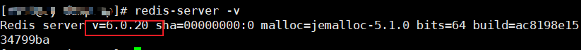

# 特性支持

|特性|描述|支持网卡|示例软件|
|--|--|--|--|
|单进程加速|K-NET网络加速特性支持对单个进程进行网络加速。|SP670|Redis 6.0.20|
|多进程加速|K-NET网络加速特性支持对多个进程进行网络加速。|SP670|Redis 6.0.20|
|流量分叉|K-NET网络加速特性支持使用网卡流量分叉功能|SP670|iPerf3 3.16|
|用户态网卡bond|K-NET网络加速特性支持对2个用户态网卡进行Bond，进行网络加速。|SP670|iPerf3 3.16|
|用户态转发内核协议栈流量|K-NET网络加速特性支持通过用户态网卡进行内核态流量的转发。|SP670|iPerf3 3.16|
|零拷贝接口|K-NET网络加速特性支持零拷贝接口。|SP670|iPerf3 3.16，Tperf 1.0|
|用户态协议栈和业务共线程部署|K-NET网络加速特性支持用户态协议栈和业务共线程部署。|SP670|Tperf 1.0|


>**说明：** 
>示例软件仅支持本章节提供的测试功能，其他功能不保证。

# 已支持应用

**表 1**  业务软件使用说明

|软件版本|说明|
|--|--|
|Redis 6.0.20|示例软件，直接参照[单进程模式加速](single_process%20_mode.md)及[多进程模式加速](multi-process_mode.md)。|
|iPerf3 3.16|K-NET可以直接通过劫持服务端进行网络加速。|
|SockPerf 3.10|由于用户态协议栈recvfrom()暂不支持MSG_NOSIGNAL flag，将src/input_handlers.h第66-68行代码注释或者删除，具体代码如下：<br>`#ifndef __windows__`<br>`        flags = MSG_NOSIGNAL;`<br>`#endif`<br>再进行编译，编译后K-NET可以劫持双端进行网络加速。|
|Tperf 1.0|tperf适配使用请参见[tperf_knet.patch使用示例](../../../demo/tperf/tperf.md)及对应的[tperf_knet.patch](../../../demo/tperf/tperf_knet.patch)。|


参考[版本配套关系](../release_note.md#版本配套关系)安装对应配套版本的业务软件。

以Redis作为示例，运行业务前请校验Redis版本号。

```
redis-server -v
```

若回显结果为6.0.20，则表示满足要求版本，否则需要用户自行源码安装6.0.20版本Redis。

