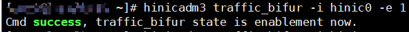
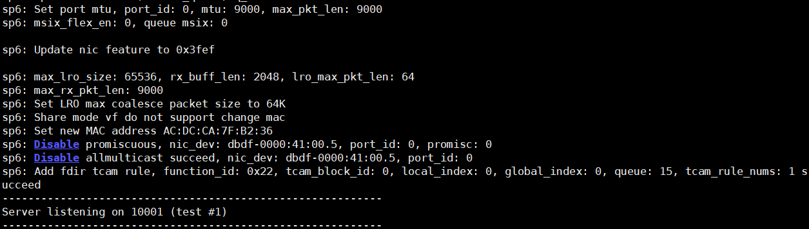
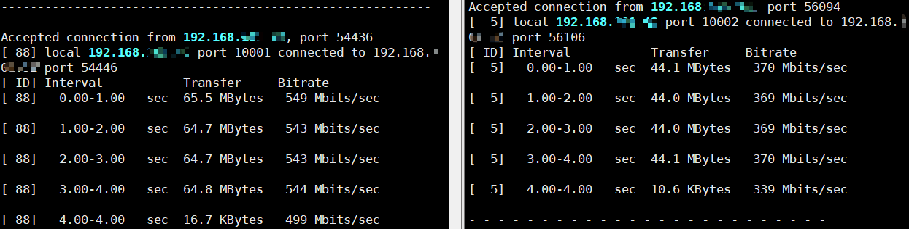
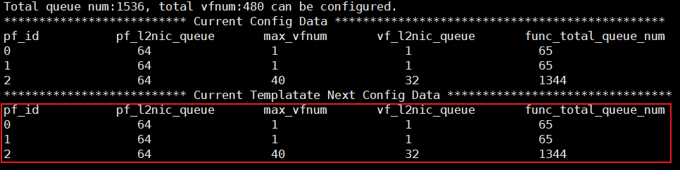
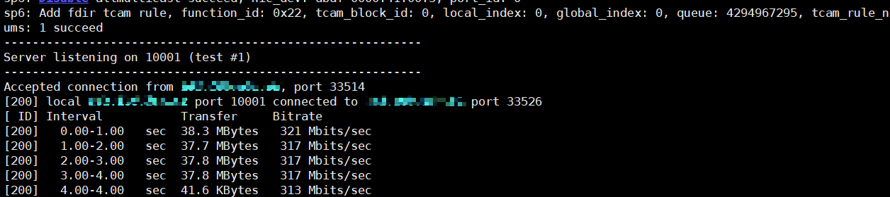

# 流量分叉功能
>
>**说明：** 
>流量分叉功能仅支持在CTyunos-2.0.1系统上使用。
>流量分叉功能仅支持在物理机环境下SP670网卡的ROCE\_2X100G\_UN\_ADAP模板中使用。
>默认支持8队列，队列规格受网卡约束，可通过网卡hinicadm3工具将规格扩展至32队列。
>开启流量分叉时，支持使用SP670 Bond卸载功能。

流量分叉能使DPDK无需接管网卡即可使用K-NET网络加速特性。使用前需使能网卡的流量分叉功能和K-NET流量分叉配置。

## 流量分叉基础功能

以iPerf3单进程为例，说明如何使用流量分叉功能。

1. 启用网卡流量分叉功能。

    ```bash
    modprobe vfio enable_unsafe_noiommu_mode=1
    modprobe vfio-pci
    hinicadm3 traffic_bifur -i hinic0 -e 1
    ```

    有以下回显则代表启用成功。

    

2. K-NET启用网卡流量分叉功能。

    ```bash
    vi /etc/knet/knet_comm.conf
    ```

    ```json
    # common配置项
    "hw_offload": {
        "bifur_enable": 1
    }
    ```

3. 无需DPDK接管网卡，服务端启动iPerf3。

    ```bash
    LD_PRELOAD=/usr/lib64/libknet_frame.so iperf3 -s -4 -p 10001 --bind 192.168.*.*
    ```

    

4. 服务端启动内核态iPerf3。

    ```bash
    iperf3 -s -4 -p 10002 --bind 192.168.*.*
    ```

5. 客户端同时向K-NET、内核态iPerf3打流。

    ```bash
    iperf3 -c 192.168.*.* -t 0 -p 10001 -b 0 -l 64 -P 1 # K-NET
    
    iperf3 -c 192.168.*.* -t 0 -p 10002 -b 0 -l 64 -P 1 # 内核态iPerf3
    ```

    K-NET和内核态iPerf3均有流量。

    

## 流量分叉支持配置32队列

SP670网卡支持队列调整，可修改网卡队列数，使流量分叉能够支持32队列。操作步骤如下。

1. 修改pf0、pf1的队列数，以满足pf2配置32队列的需求。按实际需求配置，以下配置仅供参考。

    ```bash
    hinicadm3 cfg_data -i hinic0 -pf 0 -vfnum 1 -vfq 1
    hinicadm3 cfg_data -i hinic0 -pf 1 -vfnum 1 -vfq 1
    hinicadm3 cfg_data -i hinic0 -pf 2 -vfnum 40 -vfq 32
    
    # 查看网卡队列数，回显如下图红色框中所示，代表配置成功
    hinicadm3 cfg_data -i hinic0
    ```

    

    >**须知：** 
    >1、若内核使用64K页面大小，启用流量分叉32队列配置时至少保证内存有100G以上空闲空间。
    >2、SP670网卡支持的最大队列数为1536，使能流量分叉32队列需配置资源32 \* 40（流量分叉vf数目）+ 64（pf2队列数）。对pf2禁止修改。
    >3、修改网卡队列数后，可能对使用vf的其他功能有影响，建议按需配置。

2. 重启使配置生效。

    ```bash
    reboot
    ```

3. 调整K-NET配置文件，启用流量分叉，开启32队列。

    ```bash
    modprobe vfio enable_unsafe_noiommu_mode=1
    modprobe vfio-pci
    hinicadm3 traffic_bifur -i hinic0 -e 1
    ```

    ```bash
    vi /etc/knet/knet_comm.conf
    ```

    ```json
    # common配置项
    "hw_offload": {
        "bifur_enable": 1
    }
    
    # proto_stack配置项
    "proto_stack": {
        "max_mbuf": 34816, # 按需调整
        "max_worker_num": 32
    }
    
    # dpdk配置项
    "dpdk": {
        "core_list_global": "1-32", # 按实际需求调整
        "queue_num": 32,
    }
    ```

4. 无需DPDK接管网卡，服务端启动iPerf3。

    ```bash
    LD_PRELOAD=/usr/lib64/libknet_frame.so iperf3 -s -4 -p 10001 --bind 192.168.*.*
    ```

5. 客户端向K-NET打流。

    ```bash
    iperf3 -c 192.168.*.* -t 0 -p 10001 -b 0 -l 64 -P 1
    ```

    

## 流量分叉支持Bond卸载

流量分叉场景支持网卡Bond卸载功能。仅支持LACP动态协商聚合（IEEE 802.3ad Dynamic link aggregation）和Bond mode 4。

服务端和客户端均需配置bond，参考如下：

```bash
ifconfig enp1s0f0 0
ifconfig enp1s0f1 0
ip link del bond0
sudo ip link set dev enp1s0f0 down
sudo ip link set dev enp1s0f1 down
sudo ip link add bond0 type bond mode 4 xmit_hash_policy 1 miimon 100 updelay 100 downdelay 100 lacp_rate fast
sudo ip link set dev enp1s0f0 master bond0
sudo ip link set dev enp1s0f1 master bond0
sudo ip link set dev bond0 up
sudo ip addr add 192.168.*.*/24 dev bond0
sudo ip link set dev enp1s0f0 up
sudo ip link set dev enp1s0f1 up
```

交换机配置参考如下：

```bash
system-view # 进入系统视图
inter eth-trunk 0 （创建或者进入trunk 0，确保不和已有trunk编号名称冲突）
inter 100GE1/0/1 #进入网口
eth-trunk 0  #将网卡加入eth-trunk0
commit #保存配置

inter 100GE1/0/2  #进入网口
eth-trunk 0  #将网卡加入网口1所在的eth-trunk0
commit #保存配置

inter eth-trunk 0  #进入trunk 0口
mode lacp-dynamic  #启用lacp动态协商进行聚合
lacp timeout fast #启用lacp超时时间为fast
commit #保存配置
```

>**说明：** 
>服务端和客户端的bond配置需添加lacp\_rate fast，交换机的trunk口配置需添加lacp timeout fast，以实现网口故障快速切换。

1. K-NET启用网卡流量分叉功能。

    ```bash
    vi /etc/knet/knet_comm.conf
    ```

    ```json
    # common配置项
    "hw_offload": {
        "bifur_enable": 1
    }
    ```

2. 无需DPDK接管网卡，服务端启动iPerf3。

    ```bash
    LD_PRELOAD=/usr/lib64/libknet_frame.so iperf3 -s -4 -p 10001 --bind 192.168.*.*
    ```

3. 客户端进行iPerf3打流。

    ```bash
    iperf3 -c 192.168.*.* -t 0 -p 10001 -b 0 -l 64 -P 1
    ```
