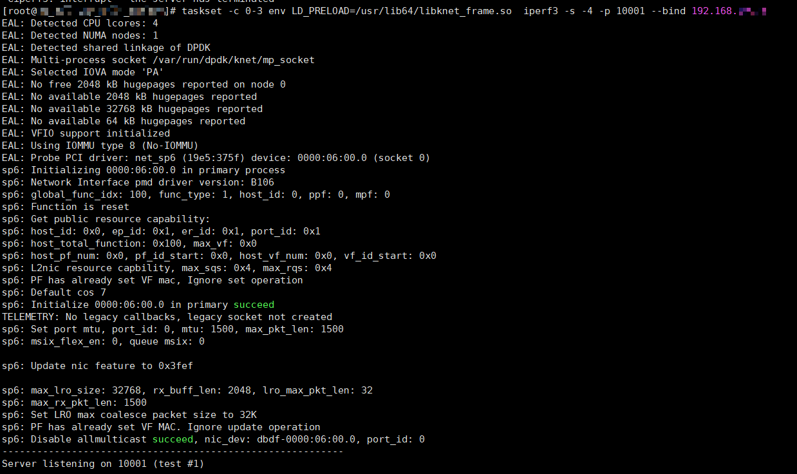
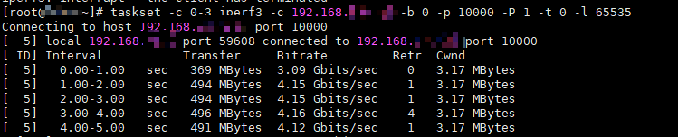

# 内核流量转发功能
>**须知：** 
>K-NET流转发使能侧的MTU需保证不高于对端网卡及链路上交换机的MTU。

#### 前提条件 
本功能需要保证内核协议栈和使用K-NET的进程使用不同的端口区间，否则内核态进程可能收不到流量。请参考[共线程功能的步骤4](shared_thread.md)进行配置，保证内核协议栈与K-NET端口范围不交叉。

内核流量转发旨在提供软件级的流量分流功能，能够在用户态劫持后运行同一个网口的内核进程，用户需要配置knet\_comm.conf的“bifur\_enable”配置项，2代表开启，0代表关闭。

```
{
    "hw_offload": {
        "bifur_enable": 2
    }
}
```

以iPerf3单进程为例，说明如何使用内核流量转发功能。

1.  开启后用户态劫持启动。

    

    ```
    taskset -c 0-3 env LD_PRELOAD=/usr/lib64/libknet_frame.so iperf3 -s -4 -p 10001 --bind 192.168.*.*
    ```

2.  启动内核态进程，该内核进程流量由用户态进程转发处理。

    

    ```
    taskset -c 0-4 iperf3 -s -4 -p 10000 --bind 192.168.*.*
     #此IP地址与用户态IP地址相同，端口不同
    ```

    启动成功后即可与内核进程建立连接，发送流量。

3.  客户端主机中运行iPerf3与内核进程进行测试。

    ```
    taskset -c 32-63  iperf3 -c 192.168.*.* -b 0 -p 10000 -P 1 -t 0 -l 65535
    ```

    内核进程建链并打流成功。

    
