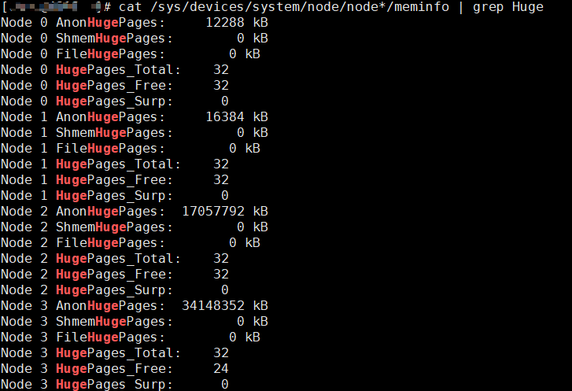
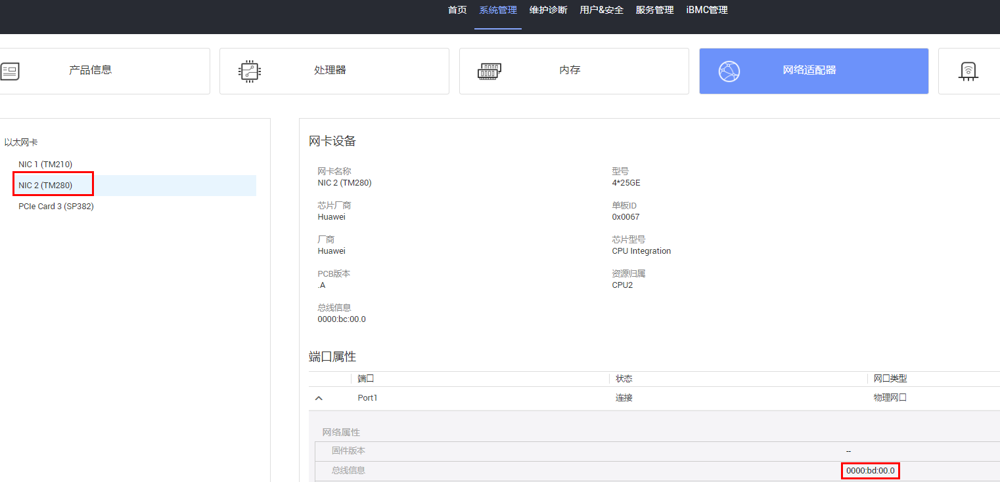
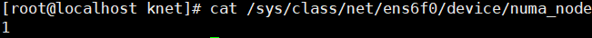
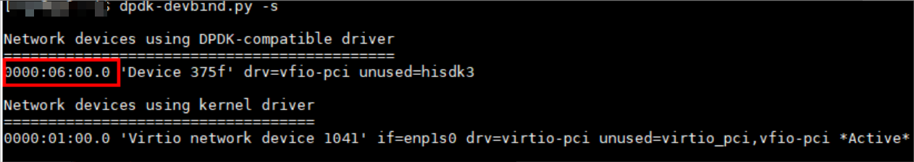

# 环境配置

## 配置大页内存

> [!NOTE]说明  
>
>- 使用大页内存可减少页表与内存管理开销，提升应用程序性能。
>- 请用户根据服务端环境具体的大页配置调整参数，服务端环境关闭或重启后需要重新配置和挂载。
>- 若服务端为物理机，从[步骤1](#查看物理机是否配置大页内存)开始执行；若服务端为虚拟机，可直接从[步骤9](#配置NUMA大页)开始执行。

1. 查看物理机是否配置大页内存。<a id="查看物理机是否配置大页内存"></a>

    ```bash
    cat /sys/devices/system/node/node*/meminfo | grep Huge
    ```

    回显类似如下：

    ```ColdFusion
    Node 0 AnonHugePages:         0 kB
    Node 0 ShmemHugePages:        0 kB
    Node 0 HugePages_Total:     0
    Node 0 HugePages_Free:      0
    Node 0 HugePages_Surp:      0
    Node 1 AnonHugePages:         0 kB
    Node 1 ShmemHugePages:        0 kB
    Node 1 HugePages_Total:     0
    Node 1 HugePages_Free:      0
    Node 1 HugePages_Surp:      0
    ```

    如果所有Node的HugePages\_Total显示信息为0，说明此时系统没有配置内存大页。

    - 如果没有配置大页内存，则执行步骤2以及后续步骤。
    - 如果配置了大页内存，则从步骤8开始执行。

2. 配置物理机内存大页。

    查看主机支持的大页类型：

    ```bash
    ls -la /sys/kernel/mm/hugepages/
    ```

3. 更改Linux默认启动内核版本，修改GRUB设置。
    - 系统架构为aarch64场景时：

        ```bash
        vi /etc/grub2-efi.cfg
        ```

    - 系统架构为x86\_64场景时：

        ```bash
        vi /etc/grub2.cfg
        ```

4. 在Linux行输入以下配置。
    按“i”进入编辑模式，在文件的Linux行后输入以下内容。

    ```text
    default_hugepagesz=1G hugepagesz=1G  hugepages=2 iommu.passthrough=1 pci=realloc
    ```

    

    按“Esc”键退出编辑模式，输入 **:wq!**，按“Enter”键保存并退出文件。

    > [!NOTE]说明  
    >- 此处设置默认大页内存的大小为1G，数量为2。
    >- iommu.passthrough=1 pci=realloc为虚拟化场景所需配置。

5. 重启。

    ```bash
    reboot
    ```

6. 重新进入系统后，确定内存大页配置情况。

    ```bash
    cat /proc/sys/vm/nr_hugepages # 回显显示数量为2
    ```

7. 在Host侧查看各个NUMA节点上的大页分配情况。

    ```bash
    cat /sys/devices/system/node/node*/meminfo | grep Huge
    ```

    

8. 执行命令，确认要用的网卡。<a id="确认所用网卡"></a>
    - SP670网卡：

        ```bash
        # 虚拟机场景
        lspci |grep 375f
        ```

        ```bash
        # 物理机场景
        lspci |grep 0222
        ```

        以虚拟机场景为例：

        

        ```bash
        ls -al /sys/class/net  # 查看当前系统中所有网络接口，可以获取上一步中查找到BDF号为"06:00.0"的网口名为"enp6s0"
        ```

        

        ```bash
        ip a  #可以查询到网卡的IP地址以及MAC地址
        ```

        

    - TM280网卡：

        在服务器BMC界面可以查询到TM280网卡pci号，后续查询网络接口和网卡的IP地址以及MAC地址步骤与上述SP670网卡操作相同。

        

9. 配置NUMA大页内存。从此步骤开始，如果要在虚拟机中运行业务，那就在虚拟机中操作，如果是在物理机中运行业务，则在物理机操作。<a id="配置NUMA大页"></a>

    - 服务端为物理机场景：

        ```bash
        cat /sys/class/net/ens6f0/device/numa_node # 查看网卡所在NUMA
        ```
        
        > [!NOTE]说明  
        >此处以网卡名ens6f0为例，用户根据实际使用的网卡名填写。
        
        回显示例如下，此处说明所在NUMA为1。

        

        ```bash
        echo never > /sys/kernel/mm/transparent_hugepage/enabled # 关闭透明大页
        echo 2 > /sys/devices/system/node/node1/hugepages/hugepages-1048576kB/nr_hugepages # 为指定节点分配2个大小为1048576kB（1GB）的大页
        ```

        > [!NOTE]说明  
        >
        >- 此处node1为上一步查询到的网卡所在NUMA节点，具体node编号根据查询到的网卡所在NUMA进行更改。
        >- 分配的大页数量与单个大页大小根据实际情况替换。

    - 服务端为虚拟机场景：

        ```bash
        echo never > /sys/kernel/mm/transparent_hugepage/enabled # 关闭透明大页
        echo 2 > /sys/kernel/mm/hugepages/hugepages-1048576kB/nr_hugepages
        ```

    > [!NOTE]说明  
    >- 配置2个1G类型内存大页，如果是512M类型推荐配置4个。
    >- 服务端关闭或重启需要重新执行此步骤。
    >- 关闭透明大页会降低Redis的性能，但是性能更稳定，请用户根据实际需要决定透明大页设置。启用透明大页可参考：
    >
    > ```bash
    > echo always > /sys/kernel/mm/transparent_hugepage/enabled
    >    ```

10. 确认是否配置成功。

    ```bash
    dpdk-hugepages.py -s # 回显说明在node1节点配置了2个1G类型
    ```

    

11. 挂载大页。

    用户名以KNET\_USER为占位符进行示例，用户组名以KNET\_USER\_GROUP为占位符进行示例，运行时请将其替换为实际用户名和用户组名，如果创建普通用户时未指定属组，KNET\_USER和KNET\_USER\_GROUP是同名的，将1G类型大页挂载到“/home/KNET\_USER/hugepages”目录下。
    > [!NOTICE]须知 
    >为避免业务冲突，请用户执行此步骤将大页挂载到K-NET业务大页路径，否则会导致大页挂载到默认的大页路径/dev/hugepages。

    ```bash
    mkdir -p /home/KNET_USER/hugepages
    mount -t hugetlbfs -o pagesize=1G hugetlbfs /home/KNET_USER/hugepages   #将1G类型大页挂载到/home/KNET_USER/hugepages目录下，如果虚拟机关闭或重启需要重新执行
    chown -R KNET_USER:KNET_USER_GROUP /home/KNET_USER/hugepages
    ```

12. 查看大页挂载情况。

    ```bash
    mount | grep huge
    ```

    > 回显如下，表示成功使能1G大页：

    ```ColdFusion
    cgroup on /sys/fs/cgroup/hugetlb type cgroup (rw,nosuid,nodev,noexec,relatime,hugetlb)
    hugetlbfs on /dev/hugepages type hugetlbfs (rw,relatime,pagesize=2M)
    hugetlbfs on /home/KNET_USER/hugepages type hugetlbfs (rw,relatime,pagesize=1024M)
    ```

    > [!NOTE]说明  
    >这里需要注意是否存在其他1G类型大页挂载路径，如果存在的话，可能会造成权限问题影响后续业务运行，需要执行以下命令取消挂载：
    >
    >```bash
    >umount /path     # /path为其他1G类型大页挂载路径
    >```

## 相关业务配置

### 通用业务配置

1. 修改配置文件。
    1. 参考[配置大页内存 步骤8](#确认所用网卡)确认要用的网卡。
    2. 修改knet\_comm.conf文件。
        1. 打开文件。

            ```bash
            vi /etc/knet/knet_comm.conf
            ```

        2. 按“i“进入编辑模式，修改配置项，示例如下：

            ```json
            #interface配置项
                "interface": {
                    ...
                    "bdf_nums": [
                       "0000:06:00.0"
                    ], # 1. 填写获取的BDF号
                    "mac": "52:54:00:2e:1b:a0", # 2. 填写绑定网卡的MAC地址 
                    "ip": "192.168.1.6",        # 3. 填写绑定网卡的IP地址
                    ...
                },
            #dpdk配置项
                "dpdk": {
                    "core_list_global": "1",  # 4. 数据面绑核，表示使用1号核。需要确保与ctrl_vcpu_ids绑定的核不同。
                    ...
                    "socket_mem": "--socket-mem=0,1024", # 5. 服务端为物理机时：以网卡所在numa_node编号为1为例， 在0号socket上预分配0MB大页内存，在1号socket上分配 1024MB大页内存，用户需要根据自己使用的网卡所在numa_node编号进行更改该配置项，给网卡所在numa_node分配大页内存，服务端为虚拟机时使用默认配置"socket_mem" : "--socket-mem=1024"即可
                    ...
                    "huge_dir": "--huge-dir=/home/KNET_USER/hugepages" # 6. 大页挂载文件夹路径
                }
            ```

        3. 按“Esc”键退出编辑模式，输入 **:wq!**，按“Enter”键保存并退出文件。

2. DPDK接管网卡。

    > [!NOTE]说明  
    >服务端环境关闭或重启后需要重新执行当前步骤。

    1. 关闭网口enp6s0（该网口后续会使用DPDK接管）。

        ```bash
        ip link set dev enp6s0 down
        ```

    2. 加载VFIO驱动。

        ```bash
        modprobe vfio enable_unsafe_noiommu_mode=1
        modprobe vfio-pci
        ```

    3. DPDK接管网卡。

        ```bash
        dpdk-devbind.py -b vfio-pci 0000:06:00.0
        dpdk-devbind.py -s                 #确认是否接管
        ```

        回显如下，表示成功接管网卡：

        

        > [!NOTE]说明  
        >如果想要取消DPDK接管网卡，执行：
        >
        >```bash
        >dpdk-devbind.py -b "hisdk3" 0000:06:00.0  # "hisdk3"为SP670网卡使用的驱动，如果是使用TM280网卡则为"hns3"，"0000:06:00.0"为BDF号
        >```

3. 配置<term>K-NET</term>动态库、knet\_mp\_daemon、knet\_comm.conf以及业务软件相关权限。

    > [!NOTE]说明  
    >- 用户名以KNET\_USER为占位符进行示例，用户组名以KNET\_USER\_GROUP为占位符进行示例，运行时请将其替换为实际用户名和用户组名。如果创建普通用户时未指定属组，KNET\_USER和KNET\_USER\_GROUP是同名的，KNET\_USER需具有命令执行权限。
    >- 此处以Redis作为示例。
    >- 若为root用户可跳过此步骤。

    ```bash
    chmod 550 /usr/lib64/libknet_frame.so
    chmod 550 /usr/lib64/libknet_core.so
    chmod 550 /usr/lib64/libdpstack.so
    chmod 550 /usr/bin/knet_mp_daemon
    chown root:KNET_USER_GROUP /usr/lib64/libknet_frame.so
    chown root:KNET_USER_GROUP /usr/lib64/libknet_core.so
    chown root:KNET_USER_GROUP /usr/lib64/libdpstack.so
    chown root:KNET_USER_GROUP /usr/bin/knet_mp_daemon
    chmod a+s /usr/lib64/libknet_frame.so
    chown KNET_USER:KNET_USER_GROUP /etc/knet/knet_comm.conf
    chown -R KNET_USER:KNET_USER_GROUP /etc/knet/run
    setcap 'cap_sys_rawio+p cap_net_admin+p cap_dac_read_search+p cap_ipc_lock+p  cap_sys_admin+p cap_net_raw+p cap_dac_override+p' /usr/bin/knet_mp_daemon 
    setcap 'cap_sys_rawio+p cap_net_admin+p cap_dac_read_search+p cap_ipc_lock+p  cap_sys_admin+p cap_net_raw+p cap_dac_override+p' /path/redis-6.0.20/src/redis-server
    ```

    > [!NOTE]说明  
    >- “/path/redis-6.0.20/src/”为redis-server的路径，请根据实际安装Redis的路径填写。
    >- 若使用其他业务软件，将此处Redis的安装路径修改为对应业务软件的路径。

4. 设置“XDG\_RUNTIME\_DIR”启动环境变量，普通用户未设置该变量会产生错误。
     > [!NOTE]说明  
     > 用户名使用KNET\_USER作为通配符进行示例，运行时请将其替换为实际用户名。环境变量路径涉及的权限及安全需要用户保证。

     用户可以根据需要选择永久或者临时配置环境变量。如果用户选择临时配置环境变量，需要在每个终端页面执行相关命令。
     - 永久配置环境变量。
         > [!NOTE]说明  
         > 配置完成之后重新切换到该用户时无需重新配置环境变量。
        1. 创建环境变量路径。

            ```bash
            cd /home/KNET_USER/
            mkdir knet
            ```

        2. 编辑环境变量相关文件。

            ```bash
            vi ~/.bashrc
            ```

        3. 按“i”进入编辑模式，在末尾加上：

            ```bash
            export XDG_RUNTIME_DIR=/home/KNET_USER/knet
            ```

        4. 按“Esc”键退出编辑模式，输入 **:wq!**，按“Enter”键保存并退出文件。

            ```bash
            source ~/.bashrc
            echo $XDG_RUNTIME_DIR #确认是否配置环境变量，如果已配置会显示配置的路径
            ```

     - 临时配置环境变量。
         > [!NOTE]说明  
         >- 服务端环境关闭或重启后，或者退出普通用户再重新切换到该用户，均需要重新执行步骤。
         >- 通过设置环境变量指定运行时目录，路径依据不同用户名会有差异。

        1. 创建环境变量路径。

            ```bash
            cd /home/KNET_USER/
            mkdir knet
            ```

        2. 配置环境变量。

            ```bash
            export XDG_RUNTIME_DIR=/home/KNET_USER/knet
            echo $XDG_RUNTIME_DIR #确认是否配置环境变量，如果已配置会显示配置的路径
            ```

### （可选）SockPerf业务配置

若用户需使用K-NET加速SockPerf，由于用户态协议栈recvfrom()暂不支持MSG_NOSIGNAL flag，需将SockPerf源码路径下src/input_handlers.h第66-68行代码注释或者删除，具体代码如下：

```c
#ifndef __windows__
flags = MSG_NOSIGNAL;
#endif
```

再进行编译，编译后K-NET可以劫持双端进行网络加速。

### （可选）TPerf业务配置

若用户需要使用K-NET加速Tperf，需要对应的[tperf_knet.patch](../../../demo/tperf/tperf_knet.patch)及以下业务配置：

#### 编译

注意：需要安装K-NET支持共线程、零拷贝特性版本后编译和使用。

将patch放到app目录下，安装patch：

```bash
cd app
patch -p1 -d tperf/ < tperf_knet.patch
```

需安装K-NET支持共线程以及零拷贝版本后编译tperf：

```bash
cd tperf
make
cd build/bin
```

在build/bin下为4个可执行demo，分别如下：

- tperf_os：标准POSIX接口的tperf demo；
- tperf_knetco：使用K-NET共线程特性的tperf demo；
- tperf_knetzcopy：使用K-NET零拷贝特性的tperf demo；
- tperf_knetcozcopy：使用K-NET共线程+零拷贝特性的tperf demo。

> [!NOTE]说明  
>使用完patch后，若需要恢复到原生tperf版本，可撤销patch。
>
>```bash
>cd app
>patch -p1 -Rd tperf/ < tperf_knet.patch
>```

#### 修改双端配置文件

```bash
vi /etc/knet/knet_comm.conf
```

按“i”进入编辑模式。

```text
{
    "hw_offload": {
        "tso": 1,
        "lro": 1,
        "tcp_checksum": 1,
        "bifur_enable": 1
     },
    "proto_stack": {
        "max_mbuf": 204800,
        "def_sendbuf": 1048576,
        "def_recvbuf": 1048576,
        "zcopy_sge_len": 4096,
        "zcopy_sge_num": 2097152
    },
    "dpdk": {
        "tx_cache_size": 1024,
        "rx_cache_size": 1024,
        "socket_mem": "--socket-mem=4096",
        "socket_limit": "--socket-limit=4096"
    }
}
```

完成后按“ESC”键，输入“:wq!”，再按“Enter”键保存文件并退出。
