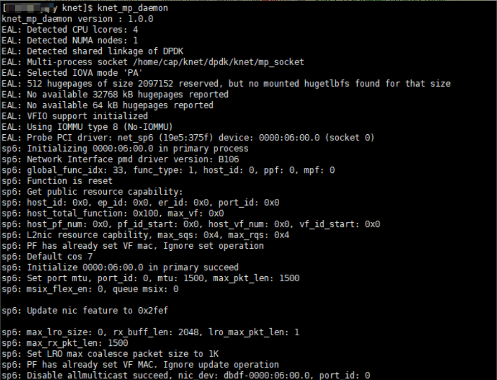

# 多进程模式加速

## 功能描述

提供多个业务进程并发运行的网络处理能力，支持针对多进程业务场景进行网络加速。

## 使用示例

本章示例以Redis为例。

> [!NOTE]说明  
>
>- 该模式支持服务端为配置VF（Virtual Function）直通的虚拟机以及物理机两种场景，服务端为物理机场景下使用DPDK接管网卡PF（Physical Function）运行K-NET，按照[配置大页内存](./environment_configuration.md#配置大页内存)进行环境配置。
>- 服务端为物理机场景时组网参考[物理机组网规划](../installation/installation_planning.md#组网规划)，服务端为虚拟机场景时组网参考[虚拟机组网规划](../installation/installation_planning.md#组网规划)。
>- 当前多进程基于共享内存实现，如果应用异常退出（如kill、内部段错误等）会造成部分资源无法回收（包括大页内存、锁），可能导致后续应用无法成功启动，恢复手段及规避方案见[启动业务进程失败提示“error allocating core states array”](../troubleshooting/multi_process_model.md)和[启动业务进程长时间阻塞且knet\_comm.log无错误日志输出](../troubleshooting/multi_process_model.md)。
>- 若任务运行失败，请参见[日志工具knet_comm.log](../om/knet_comm_log.md)查看日志排查原因。

1. 修改服务端knet\_comm.conf配置文件。

    ```bash
    vi /etc/knet/knet_comm.conf
    ```

    按“i”进入编辑模式，修改如下配置项：

    ```json
    #common配置项
        "common": {
            ...
            "mode": 1, # 运行模式，0表示单进程模式，1表示多进程模式；
            ...
            "ctrl_vcpu_ids": [
                0
            ],
            ...
        }
    #proto_stack配置项
        "proto_stack": {
            ...
            "max_worker_num": 2, 
            ...
        },
    #dpdk配置项
        "dpdk": {
            "core_list_global": "1,2",
            ...
        }
    ```

    > [!NOTE]说明  
    >以上为开启两个进程的配置文件。其中，“max\_worker\_num“需和“core\_list\_global“绑核的个数相等，“core\_list\_global“内绑定的CPU编号不应和“ctrl\_vcpu\_ids“有重复。

    按“Esc”键退出编辑模式，输入 **:wq!**，按“Enter”键保存并退出文件。

2. 删除服务端的socket文件，防止权限问题产生报错。

    > [!NOTE]说明  
    >该步骤适用于切换用户后运行的场景。

    ```bash
    rm /etc/knet/run/knet_mp.sock
    ```

3. 服务端中运行多个Redis。
    1. 先运行daemon。

        > [!NOTE]说明  
        >以KNET\_USER为用户名占位符，推荐在“/home/KNET\_USER“目录下执行该命令（KNET\_USER用户在此目录下拥有读写权限），实际运行时将其替换为实际用户名。KNET\_USER需具有命令执行权限。

        ```bash
        knet_mp_daemon
        ```

        

        > [!NOTE]说明  
        >- 多进程场景启动**knet\_mp\_daemon**之后不允许修改配置文件knet\_comm.conf，否则会在日志中报错。
        >- 关闭knet\_mp\_daemon后需要同步关闭所有Redis业务实例从进程。
        >- 禁止启动单进程后修改为多进程启动。

    2. 另起一个终端运行第一个业务。

        > [!NOTE]说明  
        >- 普通用户进入工具使用界面前需设置“XDG\_RUNTIME\_DIR”环境变量，如果新开终端，需要在新起的终端中导入。环境变量路径涉及的权限及安全需要用户保证。参考[环境配置](./environment_configuration.md)进行设置。
        >- 以KNET\_USER为用户名占位符，推荐在“/home/KNET\_USER“目录下执行该命令（KNET\_USER用户在此目录下拥有读写权限），实际运行时将其替换为实际用户名。KNET\_USER需具有命令执行权限。
        >- 若为root用户，执行时需添加so文件路径，运行命令如下：
        >
        > ```bash
        > taskset -c 64-95 env LD_PRELOAD=/usr/lib64/libknet_frame.so /path/redis-6.0.20/src/redis-server /path/redis-6.0.20/redis.conf --port 6379 --bind 192.168.*.*
        >    ```
        
        ```bash
        taskset -c 64-95 env LD_PRELOAD=libknet_frame.so /path/redis-6.0.20/src/redis-server /path/redis-6.0.20/redis.conf --port 6379 --bind 192.168.*.*
        ```
        
        观察到如下输出，表示启动成功：

        ```text
        * Ready to accept connections
        ```

        > [!NOTE]说明  
        >- taskset -c 64-95 env：将指定的进程绑定到CPU核心64\~95上运行，用户使用时根据[绑核与网卡所在NUMA一致](../reference/performance_tuning/cpu_core_pinning_consistent_with_nic_numa_node.md)中的步骤1和步骤2确认绑定的CPU范围。
        >- --port：Redis Server侦听的端口，请用户根据实际情况替换。绑定端口后，请勿再使用此端口运行其他业务。
        >- --bind：Redis Server侦听的IP地址，为具体网卡配置的IP地址，请用户根据实际情况替换。
        >- redis-server和redis.conf的路径根据实际安装Redis的路径填写。

    3. 再起一个终端，运行第二个业务。需要和上一条命令的端口不同，IP地址保持一致。其余进程重复执行该步骤。

        > [!NOTE]说明  
        >- 普通用户进入工具使用界面前需设置“XDG\_RUNTIME\_DIR”环境变量，如果新开终端，需要在新起的终端中导入。环境变量路径涉及的权限及安全需要用户保证。参考[相关业务配置中的步骤4 设置"XDG_RUNTIME_DIR"启动环境变量](./environment_configuration.md#相关业务配置)进行设置。
        >- 以KNET\_USER为用户名占位符，推荐在“/home/KNET\_USER“目录下执行该命令（KNET\_USER用户在此目录下拥有读写权限），实际运行时将其替换为实际用户名。KNET\_USER需具有命令执行权限。
        >- 若为root用户，执行时需添加so文件路径，运行命令如下：
        >
        > ```bash
        > taskset -c 64-95 env LD_PRELOAD=/usr/lib64/libknet_frame.so /path/redis-6.0.20/src/redis-server /path/redis-6.0.20/redis.conf --port 6380 --bind 192.168.*.*
        >    ```

        ```bash
        taskset -c 64-95 env LD_PRELOAD=libknet_frame.so /path/redis-6.0.20/src/redis-server /path/redis-6.0.20/redis.conf --port 6380 --bind 192.168.*.*
        ```

        观察到如下输出，表示启动成功：

        ```text
        * Ready to accept connections
        ```

    4. 确认第一个运行daemon进程的终端多了以下两行回显，表示上述两个业务进程启动成功。
        
        ```text
        hinic3: Add fdir tcam rule, function_id: 0x1, tcam_block_id: 0, local_index: 0, global_index: 0, queue: 0, tcam_rule_nums: 1 succeed
        hinic3: Add fdir tcam rule, function_id: 0x1, tcam_block_id: 0, local_index: 1, global_index: 1, queue: 1, tcam_rule_nums: 2 succeed
        ```

4. 客户端主机中运行多个redis-benchmark，进行性能测试。需要与服务端指定端口一致，及IP地址保持一致。<a id="客户端打流"></a>
    1. 启动一个终端运行redis-benchmark。

        ```bash
        taskset -c 33-62 /path/redis-6.0.20/src/redis-benchmark -h 192.168.*.* -p 6379 -c 1000 -n 10000000 -r 100000 -t set --threads 15
        redis-cli -h 192.168.*.* -p 6379 flushall   #客户端清理set数据，提升性能
        taskset -c 33-62 /path/redis-6.0.20/src/redis-benchmark -h 192.168.*.* -p 6379 -c 1000 -n 100000000 -r 100000 -t get --threads 15
        ```

        结果形如以下示例输出：

        ```bash
        ====== GET ======
        1000000 requests completed in 64.25 seconds  
        1000 parallel clients  
        3 bytes payload  
        keep alive: 1  
        host configuration "save": 900 1 300 10 60 10000  
        host configuration "appendonly": no  
        multi-thread: yes  
        threads: 1  

        0.00% <= 0.6 milliseconds  
        0.00% <= 0.7 milliseconds  
        0.00% <= 0.8 milliseconds  
        0.00% <= 2 milliseconds  
        0.00% <= 3 milliseconds  
        0.00% <= 4 milliseconds  
        0.01% <= 5 milliseconds
        ...
        305417.23 requests per second
        ```

        性能以实际环境为准。

    2. 再起一个终端，运行第二个redis-benchmark。其余进程重复执行该步骤。

        ```bash
        taskset -c 33-62 /path/redis-6.0.20/src/redis-benchmark -h 192.168.*.* -p 6380 -c 1000 -n 10000000 -r 100000 -t set --threads 15
        redis-cli -h 192.168.*.* -p 6380 flushall   #客户端清理set数据，提升性能
        taskset -c 33-62 /path/redis-6.0.20/src/redis-benchmark -h 192.168.*.* -p 6380 -c 1000 -n 100000000 -r 100000 -t get --threads 15
        ```

        结果形如以下示例输出：

        ```bash
        ====== GET ======
        1000000 requests completed in 64.25 seconds  
        1000 parallel clients  
        3 bytes payload  
        keep alive: 1  
        host configuration "save": 900 1 300 10 60 10000  
        host configuration "appendonly": no  
        multi-thread: yes  
        threads: 1  

        0.00% <= 0.6 milliseconds  
        0.00% <= 0.7 milliseconds  
        0.00% <= 0.8 milliseconds  
        0.00% <= 2 milliseconds  
        0.00% <= 3 milliseconds  
        0.00% <= 4 milliseconds  
        0.01% <= 5 milliseconds
        ...
        305417.23 requests per second
        ```

        性能以实际环境为准。

5. （可选）使用内核协议栈测试Redis性能对比K-NET加速性能。
    
    参考[DPDK接管网卡](./environment_configuration.md#DPDK接管网卡)说明中的取消接管网卡步骤。

    ```bash
    dpdk-devbind.py -b "hisdk3" 0000:06:00.0
    ```

    服务端不使用K-NET运行Redis业务进程：

    ```bash
    /path/redis-6.0.20/src/redis-server /path/redis-6.0.20/redis.conf --port 6379 --bind 192.168.*.*
    ```

    再新起一个终端运行第二个业务进程，确保端口号不同：

    ```bash
    /path/redis-6.0.20/src/redis-server /path/redis-6.0.20/redis.conf --port 6380 --bind 192.168.*.*
    ```

    观察到如下输出，表示启动成功：

    ```text
     * Ready to accept connections
    ```

    客户端运行redis-benchmark方式与K-NET场景一致，参考[步骤4](#客户端打流)。

    使用内核协议栈测试后，若需重新使用K-NET特性，需参考[DPDK接管网卡](./environment_configuration.md#DPDK接管网卡)重新接管网卡。

    ```bash
    dpdk-devbind.py -b vfio-pci 0000:06:00.0
    dpdk-devbind.py -s                 #确认是否接管
    ```

6. 完成后在服务端结束K-NET进程，按Ctrl+C结束Redis进程。

