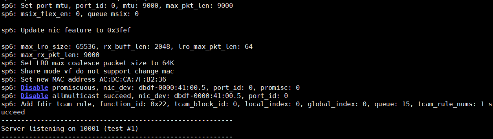
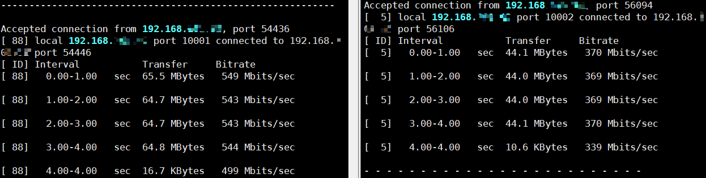
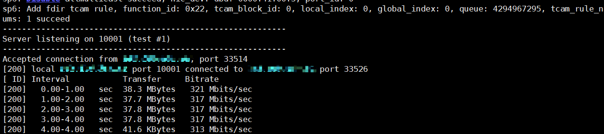

# 网卡流量分叉功能（SP233网卡）

## 功能描述

提供流量分叉能力开关，通过流表进程流量分发，支持内核态与<term>K-NET</term>应用的同时使能。

> [!NOTE]说明  
>
> - SP233网卡流量分叉功能支持在Kylin-V10-SP3-2403-release系统上使用。
> - SP233网卡支持流量分叉功能，通过hinicadm5工具将队列分组，每组队列数为最大支持的队列数减去工具分配给用户态的队列数，至多创建8个分组。
> - 开启流量分叉时，支持使用SP233 Bond全卸载功能。
> - 业务IP配置约束：非Bond卸载场景下，业务IP（配置于 `/etc/knet/knet_comm.conf` 的 `interface->ip` 字段）必须绑定至K-NET使用的网卡（配置于同文件的 `interface->bdf_nums` 字段对应的网口）；Bond全卸载场景下，在指定物理端口创建卸载bond后，这些端口对应的function共享端口在Bond模式的能力(模式4下，流量会对每个port负载均衡)。网卡各function仍保持独立使用，仅其出端口的转发模式发生变化。

流量分叉能使DPDK无需接管网卡即可使用K-NET网络加速特性。使用前需使能网卡的流量分叉功能和K-NET流量分叉配置。

## 前提条件

- 服务端已完成[环境配置](environment_configuration.md)。
- （可选）客户端如需启用K-NET加速（双端加速模式），也需完成相同的环境配置。
- 默认示例为单端加速模式（仅服务端启用K-NET）。

## 使用示例

本章示例以iPerf3为例。

### 流量分叉基础功能

以iPerf3单进程为例，说明如何使用流量分叉功能。

1. （服务端）确认并配置网卡模板。

    首先使用以下命令查看系统中可用的网卡设备，确定网卡名称（如hinic0）：

    ```bash
    hinicadm5 info
    ```

    回显中“Card”字段显示的即为网卡名称，示例如下：

    ```text
    Card num:1
    Device Information:
        Card        PCIe Function
    |----hinic0(CAL_SP23X_2X25G)
        |----0000:01:00.0(NIC:enp1s0f0)
        |----0000:01:00.1(NIC:enp1s0f1)
    ```


2. （服务端）启用网卡流量分叉功能。
    SP233配置流量分叉时需要将网卡down掉，先修改内核态队列个数，保证有队列预留给用户态，执行ethtool -L相关命令进行修改；使用hinicadm5  traffic_bifur设置用户态队列个数和查询用户态队列信息。配置完成后，需要将网卡up起来。
    ```bash
    ip link set dev enp1s0f0 down
    ethtool -L enp1s0f0 combined 32 # 设置内核态队列个数
    hinicadm5 traffic_bifur -i enp1s0f0 -t queue -n 32 # 设置用户态队列个数
    ip link set dev enp1s0f0 up
    ```

    有以下回显则代表设置成功。
    ```text
    Set qpooling group success, group is 2
    ```
    查询流分叉使能状态：
    ```bash
    hinicadm5 traffic_bifur -i enp1s0f0 -t queue -q
    ```
    回显中存在“traffic_bifur state is enablement”，代表流量分叉功能已使能。

3. （服务端）K-NET启用网卡流量分叉功能。

    ```bash
    vi /etc/knet/knet_comm.conf
    ```

    按“i”进入编辑模式。

    ```json
    # common配置项
    "hw_offload": {
        "bifur_enable": 1
    }
    ```

   完成修改后按“ESC”键，输入“:wq!”保存并退出文件。

4. （服务端）无需DPDK接管网卡，启动K-NET iPerf3。

    ```bash
    LD_PRELOAD=/usr/lib64/libknet_frame.so iperf3 -s -4 -p 10001 --bind 192.168.*.*
    ```
    > [!NOTE]说明
    > bind的地址为服务端配置文件中配置的业务IP地址。
    

5. （服务端）启动内核态iPerf3（另开一个终端）。

    ```bash
    iperf3 -s -4 -p 10002 --bind 192.168.*.*
    ```

6. （客户端）同时向服务端的K-NET、内核态iPerf3打流。

    使用`-t 10`参数指定打流时间为10秒，测试完成后客户端会自动退出：

    ```bash
    iperf3 -c 192.168.*.* -t 10 -p 10001 -b 0 -l 64 -P 1 # K-NET
    
    iperf3 -c 192.168.*.* -t 10 -p 10002 -b 0 -l 64 -P 1 # 内核态iPerf3
    ```

    K-NET和内核态iPerf3均会收到流量。

    

7. 测试完成后，在服务端使用`Ctrl+C`退出所有iPerf3进程。


### 流量分叉支持Bond卸载

流量分叉场景支持网卡Bond卸载功能。Bond全卸载配置请参考[《SP230 标准网卡 用户指南》](https://support.huawei.com/enterprise/zh/doc/EDOC1100575890/7e4bd2d6)中“hinicadm5管理工具命令参考/NIC命令/bond”章节。Bond卸载功能仅支持LACP动态协商聚合（IEEE 802.3ad Dynamic link aggregation）和Bond mode 4。K-NET不支持Bond mode 1的bond卸载，由于Bond机制问题无法从K-NET软件侧拦截，请勿配置为Bond mode 1。

（服务端和客户端）配置Bond：

```bash
hinicadm5 bond -i hinic0 -t add -s0 phy_port_0 -s1 phy_port_1 -m 1 
```
phy_port_x为需要绑定的物理端口，其中x的取值范围时0~3。

（交换机）配置参考如下：

```bash
system-view # 进入系统视图
inter eth-trunk 0 #（创建或者进入trunk 0，确保不和已有trunk编号名称冲突）
inter 100GE1/0/1 #进入网口
eth-trunk 0  #将网卡加入eth-trunk0
commit #保存配置

inter 100GE1/0/2  #进入网口
eth-trunk 0  #将网卡加入网口1所在的eth-trunk0
commit #保存配置

inter eth-trunk 0  #进入trunk 0口
mode lacp-dynamic  #启用lacp动态协商进行聚合
lacp timeout fast #启用lacp超时时间为fast
commit #保存配置
```

> [!NOTE]说明  
>- 服务端和客户端的bond配置需添加lacp\_rate fast，交换机的trunk口配置需添加lacp timeout fast，以实现网口故障快速切换。


1. （服务端）启用网卡流量分叉功能。

    ```bash
    ip link set dev enp1s0f0 down
    ethtool -L enp1s0f0 combined 32
    hinicadm5 traffic_bifur -i enp1s0f0 -t queue -n 32
    ip link set dev enp1s0f0 up
    ```

2. （服务端）<term>K-NET</term>启用网卡流量分叉功能。

    ```bash
    vi /etc/knet/knet_comm.conf
    ```

   按“i”进入编辑模式。
    
    ```json
    # common配置项
    "hw_offload": {
        "bifur_enable": 1
    }
    ```

    完成修改后按“ESC”键，输入“:wq!”保存并退出文件。

3. （服务端）无需<term>DPDK</term>接管网卡，启动K-NET iPerf3。

    ```bash
    LD_PRELOAD=/usr/lib64/libknet_frame.so iperf3 -s -4 -p 10001 --bind 192.168.*.*
    ```
    > [!NOTE]说明
    > bind的地址为服务端配置文件中配置的业务IP地址。
4. （客户端）向服务端进行iPerf3打流。

    使用`-t 10`参数指定打流时间为10秒，测试完成后客户端会自动退出：

    ```bash
    iperf3 -c 192.168.*.* -t 10 -p 10001 -b 0 -l 64 -P 1
    ```

    

5. 测试完成后，在服务端使用`Ctrl+C`退出iPerf3进程。
