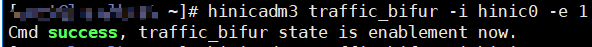
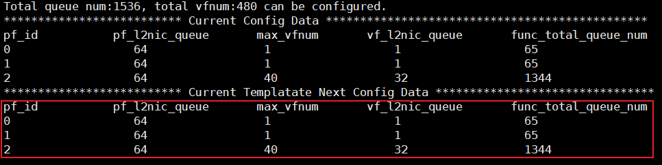

# 网卡流量分叉功能

## 功能描述

提供流量分叉能力开关，通过流表进程流量分发，支持内核态与<term>K-NET</term>应用的同时使能。

> [!NOTE]说明
>
> - 流量分叉功能仅支持在CTyunos-2.0.1系统上使用。
> - 流量分叉功能仅支持在物理机环境下SP670网卡的ROCE\_2X100G\_UN\_ADAP模板中使用。
> - 默认支持8队列，队列规格受网卡约束，可通过网卡hinicadm3工具将规格扩展至32队列。
> - 开启流量分叉时，支持使用SP670 Bond卸载功能。

流量分叉能使DPDK无需接管网卡即可使用K-NET网络加速特性。使用前需使能网卡的流量分叉功能和K-NET流量分叉配置。

## 前提条件

- 服务端已完成[环境配置](environment_configuration.md)。
- （可选）客户端如需启用K-NET加速（双端加速模式），也需完成相同的环境配置。
- 默认示例为单端加速模式（仅服务端启用K-NET）。

## 使用示例

本章示例以iPerf3为例。

### 流量分叉基础功能

以iPerf3单进程为例，说明如何使用流量分叉功能。

1. （服务端）确认并配置网卡模板。

    首先使用以下命令查看系统中可用的网卡设备，确定网卡名称（如hinic0）：

    ```bash
    hinicadm3 info
    ```

    回显中“Card”字段显示的即为网卡名称，示例如下：

    ```text
    Card num:1
    Device Information:
        Card        PCIe Function
    |----hinic0(CAL_2X100G)
    ```

    流量分叉功能仅支持SP670网卡的ROCE\_2X100G\_UN\_ADAP模板（模板索引为3）。使用查询到的网卡名称执行以下命令查看当前网卡模板：

    ```bash
    hinicadm3 cfg_template -i hinic0
    ```

    查看回显中“Current Info”字段的“Cfg template index”：
    - 若显示为“3”，表示模板正确，可直接执行后续步骤。
    - 若显示不为“3”，需要切换模板：

    ```bash
    hinicadm3 cfg_template -i hinic0 -s 3
    ```

    切换模板后执行重启使配置生效：

    ```bash
    reboot
    ```

2. （服务端）启用网卡流量分叉功能。

    ```bash
    modprobe vfio enable_unsafe_noiommu_mode=1
    modprobe vfio-pci
    hinicadm3 traffic_bifur -i hinic0 -e 1
    ```

    有以下回显则代表启用成功。

    

3. （服务端）K-NET启用网卡流量分叉功能。

    ```bash
    vi /etc/knet/knet_comm.conf
    ```

    按“i”进入编辑模式。

    ```json
    # common配置项
    "hw_offload": {
        "bifur_enable": 1
    }
    ```

   完成修改后按“ESC”键，输入“:wq!”保存并退出文件。

4. （服务端）无需DPDK接管网卡，启动K-NET iPerf3。

    ```bash
    LD_PRELOAD=/usr/lib64/libknet_frame.so iperf3 -s -4 -p 10001 --bind 192.168.*.*
    ```

    

5. （服务端）启动内核态iPerf3（另开一个终端）。

    ```bash
    iperf3 -s -4 -p 10002 --bind 192.168.*.*
    ```

6. （客户端）同时向服务端的K-NET、内核态iPerf3打流。

    使用`-t 10`参数指定打流时间为10秒，测试完成后客户端会自动退出：

    ```bash
    iperf3 -c 192.168.*.* -t 10 -p 10001 -b 0 -l 64 -P 1 # K-NET
    
    iperf3 -c 192.168.*.* -t 10 -p 10002 -b 0 -l 64 -P 1 # 内核态iPerf3
    ```

    K-NET和内核态iPerf3均会收到流量。

    

7. 测试完成后，在服务端使用`Ctrl+C`退出所有iPerf3进程。

### 流量分叉支持配置32队列

SP670网卡支持队列调整，可修改网卡队列数，使流量分叉能够支持32队列。操作步骤如下。

1. （服务端）修改pf0、pf1的队列数，以满足pf2配置32队列的需求。按实际需求配置，以下配置仅供参考。

    ```bash
    hinicadm3 cfg_data -i hinic0 -pf 0 -vfnum 1 -vfq 1
    hinicadm3 cfg_data -i hinic0 -pf 1 -vfnum 1 -vfq 1
    hinicadm3 cfg_data -i hinic0 -pf 2 -vfnum 40 -vfq 32
    
    # 查看网卡队列数，回显如下图红色框中所示，代表配置成功
    hinicadm3 cfg_data -i hinic0
    ```

    

    > [!NOTICE]须知
    >1. 若内核使用64K页面大小，启用流量分叉32队列配置时至少保证内存有100GB以上空闲空间。<p></p>
    >2. SP670网卡支持的最大队列数为1536，使能流量分叉32队列需配置资源32 \* 40（流量分叉vf数目）+ 64（pf2队列数）。对pf2禁止修改。<p></p>
    >3. 修改网卡队列数后，可能对使用vf的其他功能有影响，建议按需配置。

2. （服务端）重启使配置生效。

    ```bash
    reboot
    ```

3. （服务端）调整<term>K-NET</term>配置文件，启用流量分叉，开启32队列。

    ```bash
    modprobe vfio enable_unsafe_noiommu_mode=1
    modprobe vfio-pci
    hinicadm3 traffic_bifur -i hinic0 -e 1
    ```

    ```bash
    vi /etc/knet/knet_comm.conf
    ```

    按“i”进入编辑模式。

    ```json
    # common配置项
    "hw_offload": {
        "bifur_enable": 1
    }
    
    # proto_stack配置项
    "proto_stack": {
        "max_mbuf": 34816, # 按需调整
        "max_worker_num": 32
    }
    
    # dpdk配置项
    "dpdk": {
        "core_list_global": "1-32", # 按实际需求调整
        "queue_num": 32,
    }
    ```

    完成修改后按“ESC”键，输入“:wq!”保存并退出文件。

4. （服务端）无需DPDK接管网卡，启动K-NET iPerf3。

    ```bash
    LD_PRELOAD=/usr/lib64/libknet_frame.so iperf3 -s -4 -p 10001 --bind 192.168.*.*
    ```

5. （客户端）向服务端的K-NET打流。
    使用`-t 10`参数指定打流时间为10秒，测试完成后客户端会自动退出：

    ```bash
    iperf3 -c 192.168.*.* -t 10 -p 10001 -b 0 -l 64 -P 1
    ```

    

6. 测试完成后，在服务端使用`Ctrl+C`退出iPerf3进程。

### 流量分叉支持Bond卸载

流量分叉场景支持网卡Bond卸载功能。仅支持LACP动态协商聚合（IEEE 802.3ad Dynamic link aggregation）和Bond mode 4。

（服务端和客户端）配置Bond：

```bash
ifconfig enp1s0f0 0
ifconfig enp1s0f1 0
ip link del bond0
sudo ip link set dev enp1s0f0 down
sudo ip link set dev enp1s0f1 down
sudo ip link add bond0 type bond mode 4 xmit_hash_policy 1 miimon 100 updelay 100 downdelay 100 lacp_rate fast
sudo ip link set dev enp1s0f0 master bond0
sudo ip link set dev enp1s0f1 master bond0
sudo ip link set dev bond0 up
sudo ip addr add 192.168.*.*/24 dev bond0
sudo ip link set dev enp1s0f0 up
sudo ip link set dev enp1s0f1 up
```

（交换机）配置参考如下：

```bash
system-view # 进入系统视图
inter eth-trunk 0 （创建或者进入trunk 0，确保不和已有trunk编号名称冲突）
inter 100GE1/0/1 #进入网口
eth-trunk 0  #将网卡加入eth-trunk0
commit #保存配置

inter 100GE1/0/2  #进入网口
eth-trunk 0  #将网卡加入网口1所在的eth-trunk0
commit #保存配置

inter eth-trunk 0  #进入trunk 0口
mode lacp-dynamic  #启用lacp动态协商进行聚合
lacp timeout fast #启用lacp超时时间为fast
commit #保存配置
```

> [!NOTE]说明
>服务端和客户端的bond配置需添加lacp\_rate fast，交换机的trunk口配置需添加lacp timeout fast，以实现网口故障快速切换。

1. （服务端）启用网卡流量分叉功能。

    ```bash
    modprobe vfio enable_unsafe_noiommu_mode=1
    modprobe vfio-pci
    hinicadm3 traffic_bifur -i hinic0 -e 1
    ```

2. （服务端）<term>K-NET</term>启用网卡流量分叉功能。

    ```bash
    vi /etc/knet/knet_comm.conf
    ```

   按“i”进入编辑模式。
    
    ```json
    # common配置项
    "hw_offload": {
        "bifur_enable": 1
    }
    ```

    完成修改后按“ESC”键，输入“:wq!”保存并退出文件。

3. （服务端）无需<term>DPDK</term>接管网卡，启动K-NET iPerf3。

    ```bash
    LD_PRELOAD=/usr/lib64/libknet_frame.so iperf3 -s -4 -p 10001 --bind 192.168.*.*
    ```

4. （客户端）向服务端进行iPerf3打流。

    使用`-t 10`参数指定打流时间为10秒，测试完成后客户端会自动退出：

    ```bash
    iperf3 -c 192.168.*.* -t 10 -p 10001 -b 0 -l 64 -P 1
    ```

    

5. 测试完成后，在服务端使用`Ctrl+C`退出iPerf3进程。
