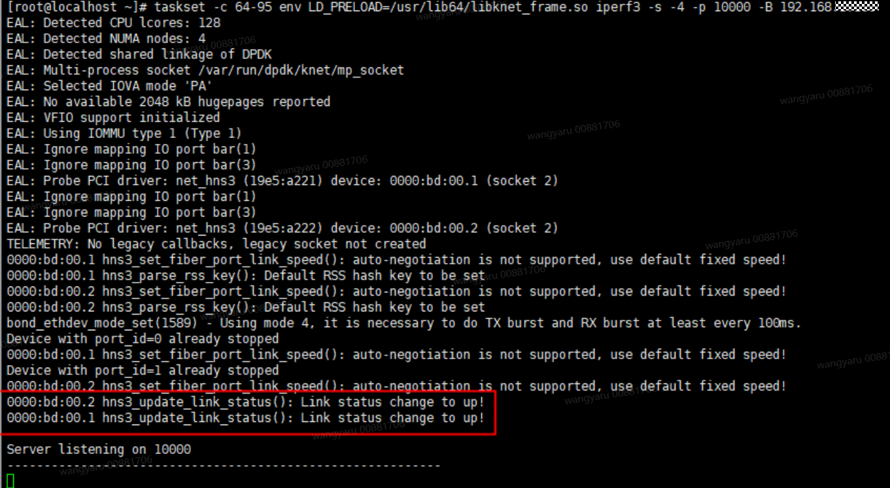
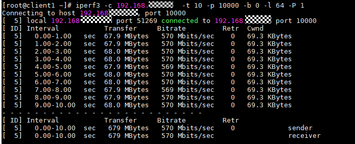

# 使用DPDK用户态虚拟Bond功能
>
>**说明：** 
>Bond场景参考组网[物理机组网规划](../installation/installation_planning.md#组网规划)，Bond功能具有如下约束：
>
>- 仅支持物理机场景。
>- Switch（交换机）支持LACP动态协商聚合（IEEE 802.3ad Dynamic link aggregation）。
>- 仅支持DPDK Bond mode 4模式。
>- 仅支持K-NET单进程模式。

1. 配置交换机。

    > **说明：** 
    >涉及到的操作命令适用于华为CE6881 V200R005C20SPC800交换机，如果遇到操作命令不适用其他型号交换机的情况，需要用户自行根据相应交换机操作手册调整。

    为服务端和客户端的2个PF口分别组Trunk，以服务端2个PF口分别在交换机25GE1/0/1、25GE1/0/2为例。

    1. 进入交换机配置页面。<a id="dpdk-li1"></a>

        ```bash
        system-view # 进入系统视图
        inter eth-trunk 0 #创建或者进入trunk 0，确保不和已有trunk编号名称冲突
        inter 25GE1/0/1 #进入网口1
        eth-trunk 0  #将网口1加入eth-trunk0
        commit #保存配置
        
        inter 25GE1/0/2  #进入网口2
        eth-trunk 0  #将网口2加入网口1的eth-trunk0
        commit #保存配置
        
        inter eth-trunk 0  #进入trunk 0口
        mode lacp-dynamic  #启用lacp动态协商进行聚合
        commit #保存配置
        ```

    2. 查看端口配置。

        ```bash
        dis interface brief
        ```

    3. 如果回显包含如下，Eth-Trunk口和网口状态为up，并且下面包含前面配置加入trunk的网口，即为配置成功：<a id="dpdk-li2"></a>

        ```ColdFusion
        Eth-Trunk0                up       up           0%     0%          0          0
          25GE1/0/1               up       up           0%  0.01%          0           0
          25GE1/0/2               up       up           0%  0.01%          0           0
        ```

    4. 客户端也需要进行上述操作，将2个PF口加入到一个trunk口并进行查看端口配置确认是否成功加入。

2. 客户端网卡组Bond。

    以客户端两个网口为enp1s0f0、enp1s0f1为例。

    ```bash
    ip link set dev enp1s0f0 down
    ip link set dev enp1s0f1 down
    modprobe bonding
    
    echo +bond0 > /sys/class/net/bonding_masters # 创建bond0网口
    echo 4 > /sys/class/net/bond0/bonding/mode
    ifconfig bond0 up
    
    ifenslave bond0 enp1s0f0 enp1s0f1 # 添加网口
    echo 1 > /sys/class/net/bond0/bonding/xmit_hash_policy
    ip addr add 192.168.*.*/24 dev bond0 
    
    cat /proc/net/bonding/bond0 # 查看bond0配置，可以看到有两个port
    
    cat /sys/class/net/bond0/speed # 查看bond0口速率，值应该为两个网口速率之和
    ```

    （可选）后续不需要使用Bond时可通过以下命令取消bond0口：

    ```bash
    echo -bond0 > /sys/class/net/bonding_masters
    ip link set dev enp1s0f0 up
    ip link set dev enp1s0f1 up
    ```

3. 配置服务端环境。

    参考[环境配置](./environment_configuration.md)，注意执行DPDK接管网卡时Bond场景需要接管两个网口，另外配置文件做以下修改：

    ```json
    "interface": {
        "bond_enable": 1,  # 0为关闭bond，1为开启bond
        "bond_mode": 4,    # 设置dpdk bond mode为4，目前只支持mode 4
        "bdf_nums": [
          "0000:01:00.0",  # 填写用来组bond的网卡的两个网口，跟上述dpdk接管的网口保持一致
          "0000:01:00.1"
        ],
        "mac": "52:54:00:2e:1b:a0", # 设置bond端口mac,可以为"bdf_nums"配置项中两个网口之一的mac
        "ip": "192.168.*.*",  #根据组网规划填写
        ...
      },
    ```

4. 运行业务。

    > **说明：** 
    >由于Bond功能涉及到交换机侧LACP协商，服务端首次启动后，客户端需要等待若干秒，直到LACP协商完毕才能连通打流。

    1. 服务端用户态劫持启动iPerf3。

        ```bash
        taskset -c 20-39 env LD_PRELOAD=/usr/lib64/libknet_frame.so iperf3 -s -4 -p 10000 -B 192.168.*.*
        ```

        > **说明：** 
        >- taskset -c  _20-39_：将指定的进程绑定到CPU核心20\~39上运行，用户使用时参考[绑核与网卡所在NUMA一致](../reference/performance_tuning/cpu_core_pinning_consistent_with_nic_numa_node.md)中的步骤1和步骤2确认绑定的CPU范围。
        >- -s：以服务器模式运行。
        >- -4：仅使用IPv4协议。
        >- -p：指定服务器端口。
        >- -B：指定服务端绑定的IP地址。用户根据实际DPDK接管的网卡IP地址进行填写。

        回显如下，可以看到两个网口成功处于up状态：

        

    2. 客户端主机中运行iPerf3进行打流测试。

        ```bash
        iperf3 -c 192.168.*.*  -t 10 -p 10000 -b 0 -l 64 -P 1
        ```

        > **说明：** 
        >- -c：以客户端模式运行。
        >- -t：传输时间。
        >- -p：指定端口，与上一步骤命令中保持一致。
        >- -b：使用带宽数量，0表示无限。
        >- -l：指定测试数据包的大小，单位字节。
        >- -P：指定测试的流数。

        回显如下：

        
