# 搭建环境

## 搭建物理机环境

### 配置BIOS

1. 登录iBMC。

    1. 在浏览器输入iBMC管理网口地址：https://_ipaddress_，按“Enter”键进入。
    2. 输入用户名和密码登录。

    

2. 打开HTML5集成远程控制台。

    在iBMC主页面右下角的虚拟控制台模块，单击“启动虚拟控制台”，选择“HTML5集成远程控制台（共享）”。

    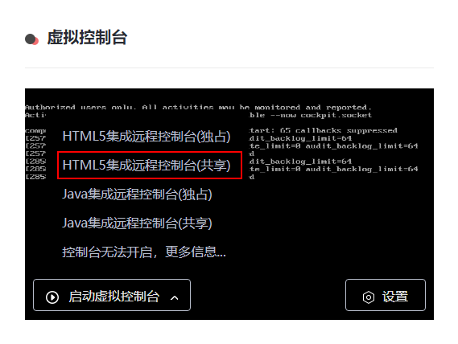

3. 选择“BIOS设置”。

    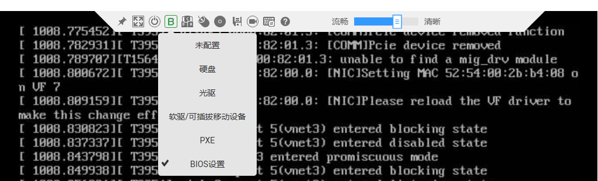

4. 电源先选择“下电”，再选择“上电”。

    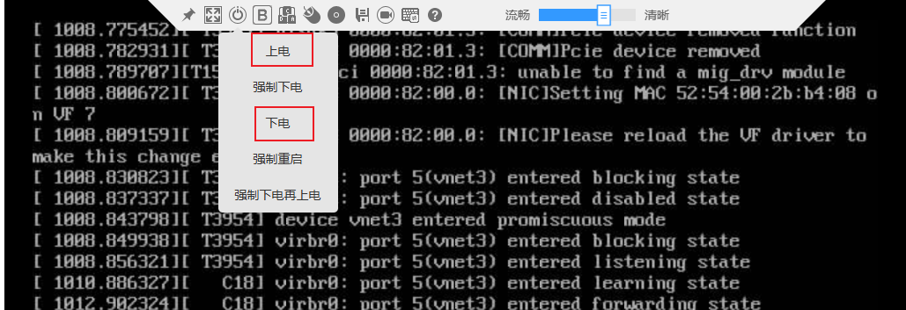

5. 输入BIOS登录密码。进入BIOS。
6. 进入“Advanced-\>MISC Config”配置页面。

    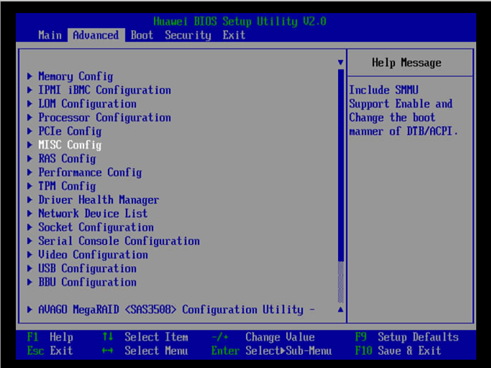

7. 将“Support Smmu“设置为“Enabled”，将“Smmu Work Around”设置为“Enabled”，按**F10**键保存退出。

    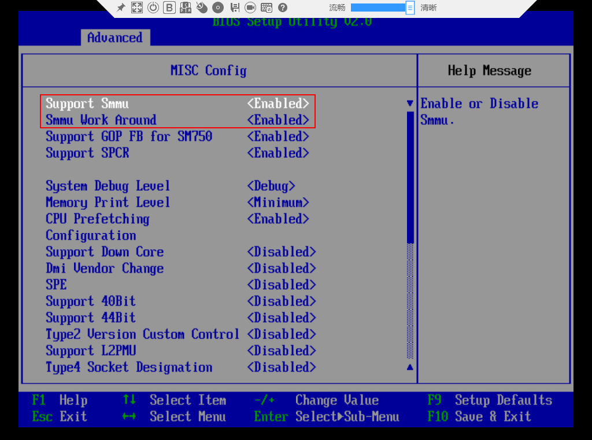

    >**说明：** 
    ><term>SMMU</term>是AArch64对输入输出内存管理单元（IOMMU）的具体实现。

### 升级BIOS（仅TM280网卡涉及）

>**说明：** 
>TM280网卡固件集成在提供的BIOS固件中，升级BIOS后网卡固件也会随之更新。

1. 请参见[版本配套关系](../release_note.md)获取BIOS固件。
2. 固件升级可以参考[《TaiShan 机架服务器 升级指导书》](https://support.huawei.com/enterprise/zh/doc/EDOC1100048781?idPath=23710424|251364417|9856629|250783947)中的“升级机箱组件固件--升级BIOS--通过iBMC Web升级BIOS”。
3. 升级完成后确认TM280网卡固件已经更新到所需的版本。

    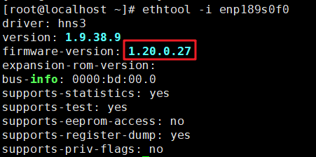

### （可选）配置物理机yum源

>**说明：** 
>这里以配置openEuler 22.03 LTS SP4系统物理机的yum源为例，如果环境已经配置过yum源，可跳过此章节。

1. 登录服务器节点，下载虚拟机镜像openEuler-22.03-LTS-SP4-everything-aarch64-dvd.iso上传至服务器。

    链接：[openEuler 22.03](https://repo.openeuler.org/openEuler-22.03-LTS-SP4/ISO/aarch64/)

    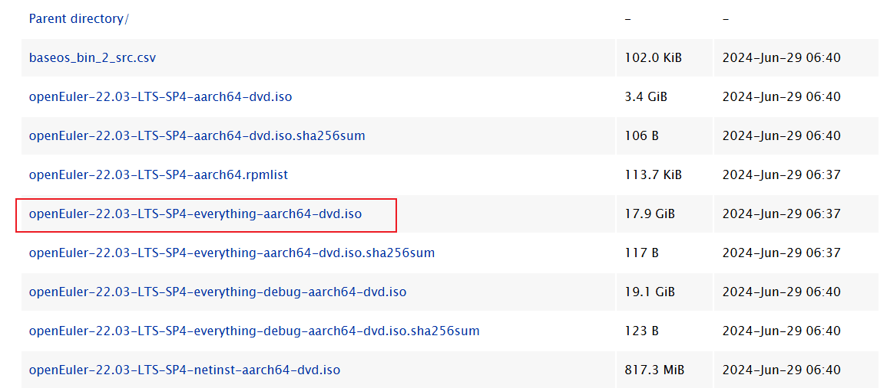

    > **说明：** 
    >x86环境需下载操作系统为openEuler 22.03 LTS SP1的镜像。

2. 使用mount命令挂载ISO文件。

    > **须知：** 
    >每次重启物理机后都要重新执行**mount**命令。

    ```bash
    mount /path/to/local/directory/openEuler-22.03-LTS-SP4-everything-aarch64-dvd.iso /mnt
    ```

    >**说明：** 
    >x86环境需下载操作系统为openEuler 22.03 LTS SP1的镜像。

3. 备份配置文件。

    ```bash
    cd /etc/yum.repos.d/
    mkdir bak
    mv *.repo bak/
    ```

4. 编辑local.repo文件。
    1. 打开local.repo文件。

        ```bash
        vi local.repo
        ```

    2. 按“i“进入编辑模式，将下面的内容拷贝到local.repo中。

        ```text
        [local]
        name=local.repo
        baseurl=file:///mnt #iso挂载路径
        enabled=1
        gpgcheck=0
        ```

    3. 按“Esc”键退出编辑模式，输入 **:wq!**，按“Enter”键保存并退出文件。

5. 更新源。

    ```bash
    yum clean all
    yum makecache
    ```

### 安装SP670驱动（仅SP670网卡涉及）

1. 智能网卡的驱动，固件及管理工具安装请参考[《SP200&SP600 网卡 驱动源码 编译指南》](https://support.huawei.com/enterprise/zh/doc/EDOC1100429557/edc0a769)中“编译和安装”章节。若使用流量分叉，需执行以下命令：

    ```bash
    sh install.sh -d bifur
    ```

2. 安装dpdk-hinic3驱动请参考[DPDK驱动源码](https://atomgit.com/openeuler/dpdk/tree/hinic3)编译安装。将[DPDK源码](../release_note.md#软件配套关系)下载解压后放在当前目录下，之后执行命令如下所示：

    ```bash
    git clone https://atomgit.com/openeuler/dpdk.git -b hinic3 dpdk-hinic3
    cd dpdk-hinic3
    sh install.sh ../dpdk-stable-21.11.7 install bifur
    ```

    以下安装DPDK驱动至指定目录和手动编译DPDK后拷贝so步骤任选一个执行，若第一次安装DPDK，请参考[安装DPDK](./installation.md#dpdk安装)执行步骤1：
    
    1. 安装DPDK驱动至指定目录：
    
        ```bash
        cd ../dpdk-stable-21.11.7
        meson -Ddisable_drivers=net/cnxk -Dibverbs_link=dlopen -Dplatform=generic -Denable_kmods=false -Dprefix=/usr build
        ninja -C build
        ninja install -C build
        ```
    
    2. 或手动编译DPDK后拷贝so：
    
        ```bash
        sh install.sh ../dpdk-stable-21.11.7 build
        cp -d ./../dpdk-stable-21.11.7/build/drivers/librte_net_hinic3.so{,.22,.22.0} /usr/lib64/
        ls -l /usr/lib64/librte_net_hinic3.so*
        ldconfig
        ```

        >**说明：** 
        > {,.22,.22.0} 根据实际DPDK版本替换
    
3. <a id="step4"></a>查看网卡模板。

    ```bash
    hinicadm3 cfg_template -i hinic0
    ```

    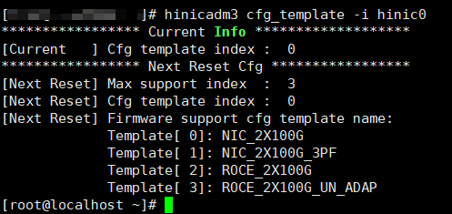

    “Current Info”字段中显示的为“0”表示模板正确，如果为其他值，请按照以下操作修改并重启：

    1. 切换网卡模板为0。

        ```bash
        hinicadm3 cfg_template -i hinic0 -s 0
        ```

    2. 重启。

        ```bash
        reboot
        ```

        重启后请再次查看当前网卡模板。

        >**说明：** 
        >若使用流量分叉功能，需切换模板为ROCE\_2X100G\_UN\_ADAP，命令如下：
        >
        >```bash
        >hinicadm3 cfg_template -i hinic0 -s 3
        >```

## 搭建虚拟机环境

若用户要在虚拟机上执行业务，则需在搭建物理机环境之后再搭建虚拟机环境。若用户在物理机上运行业务软件，则无需参照本章搭建虚拟机。

### 安装虚拟机环境

1. 关闭防火墙。

    ```bash
    systemctl stop firewalld
    systemctl disable firewalld
    ```

2. 安装虚拟机参考[《QEMU-KVM虚拟机 安装指南（openEuler 22.03）》](https://www.hikunpeng.com/document/detail/zh/kunpengcpfs/ecosystemEnable/QEMU-KVM/kunpengqemukvm_03_0002.html)，但是需要将里面的openEuler 22.03 SP3换成[版本配套关系](../release_note.md)中要求的系统版本。
3. 系统安装完成后按照安装界面的指示重启，然后连接虚拟机。_以虚拟机名为vm\_perf\_2203_为例。

    若重启虚拟机失败，进入shell页面，请参见[重启虚拟机失败进入shell界面](../reference/troubleshooting/vm_restart.md)进行恢复。

    - Arm环境连接到虚拟机。

        ```bash
        virsh console vm_perf_2203
        ```

    - x86环境连接到虚拟机，x86必须使用VNC连接操作。

        查看虚拟机显示的ID信息。

        ```bash
        virsh vncdisplay vm_perf_2203
        ```

        启动虚拟机。

        ```bash
        virsh console vm_perf_2203
        ```

        使用VNC工具登录UI界面，使用IP地址+虚拟机ID信息，登录到虚拟机界面。以vncviewer工具为例：IP为物理机的管理IP地址，冒号后面的0为执行**virsh vncdisplay _vm\_perf\_2203**命令后的返回结果，其他VNC工具操作相同。

        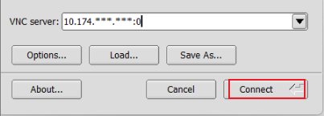

    > **说明：** 
    >x86环境需下载操作系统为openEuler 22.03 LTS SP1的镜像。

4. 配置Yum源，配置前需要先把虚拟机对应的ISO使用SFTP上传到虚拟机环境。本步骤及子步骤均需在虚拟机中执行。

    >**须知：** 
    >- /path/to/remote/file：ISO文件在物理机上的存放路径。
    >- root@remote\_host：用户为root，remote\_host表示物理机的控制IP地址，即物理机上192.168.122.\*的IP地址。
    >- /path/to/local/directory：表示虚拟机存放ISO文件路径。请用户根据实际存放路径修改。

    1. 使用mount命令挂载虚机对应的ISO文件。

        >**须知：** 
        >每次重启虚拟机后都要重新执行**mount**命令。

        ```bash
        mount /path/to/local/directory/openEuler-22.03-LTS-SP4-everything-aarch64-dvd.iso /mnt
        ```

        >**说明：** 
        >本文以鲲鹏环境为例，openEuler-22.03-LTS-SP4-everything-aarch64-dvd.iso是安装虚拟机的镜像。x86环境下镜像的操作系统为openEuler 22.03 LTS SP1。

    2. 备份repo文件。

        ```bash
        cd /etc/yum.repos.d/
        mkdir bak
        mv *.repo bak/
        ```

    3. 编辑local.repo文件。
        1. 打开local.repo文件。

            ```bash
            vi local.repo
            ```

        2. 按“i”进入编辑模式，将下面的内容拷贝到local.repo中。

            ```text
            [local]
            name=local.repo
            baseurl=file:///mnt #iso挂载路径
            enabled=1
            gpgcheck=0
            ```

        3. 按“Esc”键退出编辑模式，输入 **:wq!**，按“Enter”键保存并退出文件。

    4. 更新源。

        ```bash
        yum clean all
        yum makecache
        ```

### 虚拟机VF硬直通

配置直通设备，请用户在物理机上操作。

1. 使用lspci查看SP670设备。

    ```bash
    lspci | grep 0222
    ```

    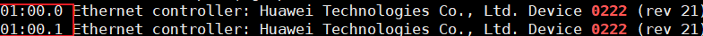

2. 查看BDF号和端口对应关系。

    ```bash
    ls -al /sys/class/net/
    ```

    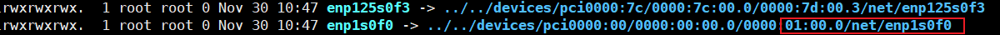

    BDF号为前一步骤查询出的结果，通过BDF号可以确定对应的端口为enp1s0f0。注意需要确保对应的端口状态为UP，若非UP状态则需更换端口。

    

3. 查看enp1s0f0设备支持的最大VF个数。

    ```bash
    cat /sys/class/net/enp1s0f0/device/sriov_totalvfs
    ```

    >**说明：** 
    >enp1s0f0为前一步骤查询得到的端口名称，请用户根据实际情况修改。

    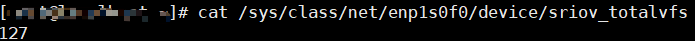

    从查询结果中可以看到最大VF为127。

4. 配置VF直通设备个数。这里给enp1s0f0配置8个VF，请用户根据实际情况修改。

    ```bash
    echo 0 > /sys/class/net/enp1s0f0/device/sriov_numvfs
    echo 8 > /sys/class/net/enp1s0f0/device/sriov_numvfs
    ```

5. <a id="step1.5"></a>查看配置完成VF设备个数信息，发现enp1s0f0会生成8个VF。

    ```bash
    ls -al /sys/class/net/
    ```

    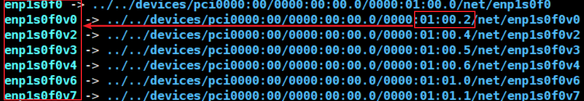

6. 关闭虚机。

    ```bash
    virsh shutdown vm_perf_2203
    ```

7. 在虚机xml中增加直通设备。
    1. 以enp1s0f0v0为例，进入配置文件界面：

        ```bash
        virsh edit vm_perf_2203
        ```

        参考下图，在<device\>中新增如下字段，注意mac地址需要更改，不能重复：

        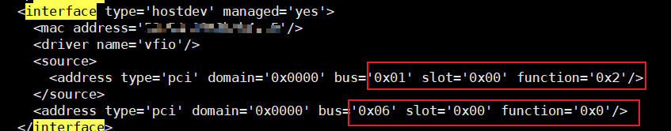

        >**说明：** 
        >第一个红框与[步骤1.5](#step1.5)配置的VF相对应，比如这里VF选择01:00.2所对应的端口（即[步骤1.5](#step1.5)图中右边红框），该端口为enp1s0f0v0，第二个红框表示这个VF会在虚机里面生成一个网口，网口名为enp6s0。如果需要配置多个VF，就在<device\>字段中添加多个字段。

        如下为模板，仅供参考：

        ```text
        <interface type='hostdev' managed='yes'>
            <mac address='xx:xx:xx:xx:xx:xx'/>
            <driver name='vfio'/>
            <source>
            <address type='pci' domain='0x0000' bus='0x01' slot='0x00' function='0x2'/>
            </source>
            <address type='pci' domain='0x0000' bus='0x06' slot='0x00' function='0x0'/>
        </interface>
        ```

    2. 配置完成后，进入虚拟机。

        ```bash
        virsh start vm_perf_2203
        virsh console vm_perf_2203
        ```

        其中vm\_perf\_2203是虚拟机名字。如果是x86环境需要使用VNC工具接入。

    3. 给enp6s0配置IP地址。

        >**须知：** 
        >每次重启虚拟机，都需要重新配置一次。

        ```bash
        ip a
        ```

        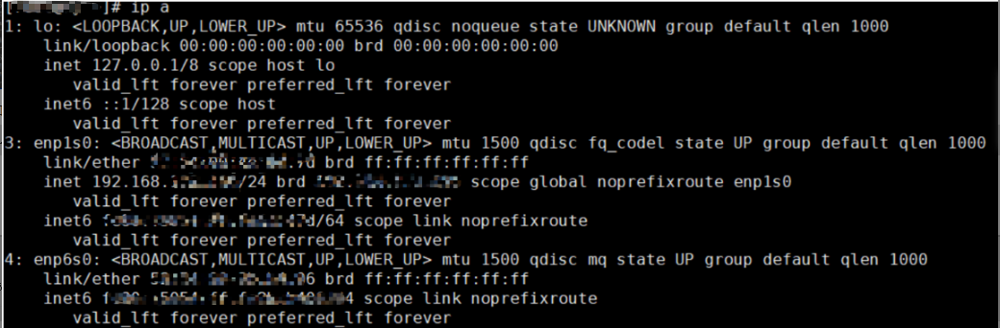

        注意这里的IP和VF对应的PF要属于同一网段，比如enp1s0f0的网段是192.168.32.0/24那么enp6s0的网段也是192.168.32.0/24。

        ```bash
        ip addr add 192.168.32.2/24 dev enp6s0
        ```

        > **说明：** 
        >192.168.32.2/24：用户根据实际情况配置IP和掩码。

### 安装SP670驱动

若用户需要在虚拟化环境上运行业务，还需要重新在虚机上安装SP670驱动。虚拟机中只需要安装dpdk-hinic3驱动。

安装dpdk-hinic3驱动请参考[DPDK驱动源码](https://atomgit.com/openeuler/dpdk/tree/hinic3)编译安装。将[DPDK源码](../release_note.md#软件配套关系)下载解压后放在当前目录下，之后执行命令如下所示：

```bash
git clone https://atomgit.com/openeuler/dpdk.git -b hinic3 dpdk-hinic3
cd dpdk-hinic3
sh install.sh ../dpdk-stable-21.11.7 install bifur
```

以下安装DPDK驱动至指定目录和手动编译DPDK后拷贝so步骤任选一个执行，若第一次安装DPDK，请参考[安装DPDK](./installation.md#安装dpdk)执行步骤1：
    
1. 安装DPDK驱动至指定目录：
    
    ```bash
    cd ../dpdk-stable-21.11.7
    meson -Ddisable_drivers=net/cnxk -Dibverbs_link=dlopen -Dplatform=generic -Denable_kmods=false -Dprefix=/usr build
    ninja -C build
    ninja install -C build
    ```
    
2. 或手动编译DPDK后拷贝so：
    
    ```bash
    sh install.sh ../dpdk-stable-21.11.7 build
    cp -d ./../dpdk-stable-21.11.7/build/drivers/librte_net_hinic3.so{,.22,.22.0} /usr/lib64/
    ls -l /usr/lib64/librte_net_hinic3.so*
    ldconfig
    ```

    >**说明：** 
    > {,.22,.22.0} 根据实际DPDK版本替换
