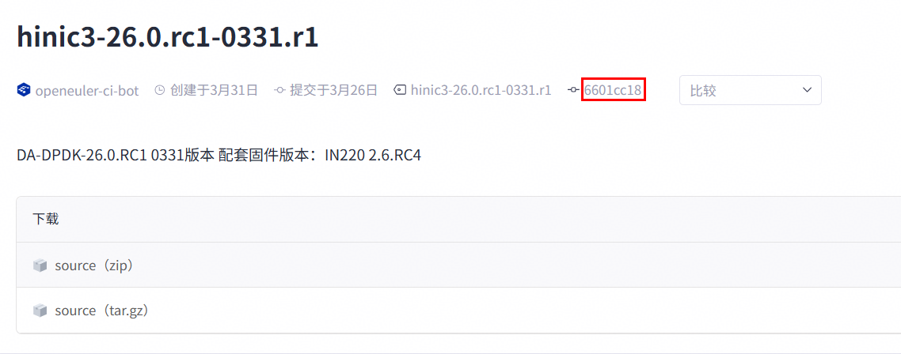

# 安装

文档中安装步骤适用于所有需要部署运行K-NET的物理机或虚拟机。

## 安全检查

### 检查Glibc版本

```bash
ldd --version
```

Glibc 2.10及以上版本会开启堆栈保护，若查询出来的版本低于2.10，建议升级至2.10以上。这里以2.28版本为例。

### 检查ASLR是否开启

ASLR是一种针对缓冲区溢出的安全保护技术，通过地址布局的随机化，增加攻击者预测目的地址的难度

```bash
cat /proc/sys/kernel/randomize_va_space
```

若结果不为2，请执行以下命令开启ASLR

```bash
bash -c 'echo 2 >/proc/sys/kernel/randomize_va_space'
```

## 安装依赖包

1. 安装系统依赖。

    ```bash
    yum install -y libcap-devel tar gzip vim
    ```

2. 安装部署工具依赖。

    ```bash
    yum install -y jq
    ```

3. 安装libboundscheck依赖。
    - openEuler操作系统下：

    ```bash
    yum install -y libboundscheck
    ```

    - CTyunOS操作系统下请参考：[https://atomgit.com/openeuler/libboundscheck/blob/v1.1.16/README.md](https://atomgit.com/openeuler/libboundscheck/blob/v1.1.16/README.md)。

## 安装DPDK

如果已经安装21.11.7版本的DPDK，且不需要抓包功能，可跳过以下DPDK的安装流程。
可先通过pkg-config查询DPDK版本：

```bash
pkg-config --modversion libdpdk 2>/dev/null || echo "未找到DPDK或pkg-config未配置"
```

如果回显未显示DPDK版本，建议检查是否安装了DPDK或重新安装DPDK。

在安装DPDK时应避免直接使用Yum源，因为Yum源安装的版本存在不可控风险。

1. 安装DPDK。

    1. 安装DPDK需要的依赖。

        ```bash
        yum install -y gcc meson ninja-build numactl-devel python3-pyelftools libnl3 libnl3-devel
        ```

    2. 下载DPDK软件包，以安装路径“/home/opt”、DPDK版本21.11.7为例。
    
        ```bash
        mkdir /home/opt
        cd /home/opt
        wget https://fast.dpdk.org/rel/dpdk-21.11.7.tar.xz
        ```

        > [!NOTE]说明
        >- 若执行**wget**命令出现错误“ERROR: The certificate of ‘xxxxx’ is not trusted”，请在命令末尾增加“--no-check-certificate”。

    3. 解压软件包。
        
        ```bash
        tar -xf dpdk-21.11.7.tar.xz
        cd dpdk-stable-21.11.7
        ```
    
    4. 安装驱动程序。

        ```bash
        meson -Ddisable_drivers=net/cnxk -Dibverbs_link=dlopen -Dplatform=generic -Denable_kmods=false -Dprefix=/usr build
        ```

        回显示例：

        

        ```bash
        ninja -C build
        ```

        回显示例：

        

        ```bash
        ninja install -C build
        ```

        回显示例：

        

2. 安装dpdk-hinic3驱动。

    1. 获取hinic3 PMD源码。
    
        ```bash
        cd /home/opt/
        git clone https://atomgit.com/openeuler/dpdk/.git -b hinic_master dpdk-hinic3
        ```
    
    2. 获取配套版本的tag。
    
        配套的dpdk-hinic3版本请见[版本配套表](../release_note.md)，跳转查看对应的commitid。

        以下为commitid位置示例：
            

    3. 切换至配套版本tag。

        > [!NOTE]说明
        > 命令中的\<commitid>请以实际获取值替换。

        ```bash
        cd dpdk-hinic3
        git checkout <commitid>
        ```

    4. 编译。
        
        ```bash
        sh install.sh /path/to/local/directory/dpdk-stable-21.11.9 install
        sh install.sh /path/to/local/directory/dpdk-stable-21.11.9 build
        ```

    5. 安装。

        ```bash
        cp -d ./../dpdk-stable-21.11.7/build/drivers/librte_net_hinic3.so{,.22,.22.0} /usr/lib64/
        ls -l /usr/lib64/librte_net_hinic3.so*
        ldconfig
        ```

        > [!NOTE]说明
        > {,.22,.22.0}根据实际DPDK版本替换，以DPDK 21.11.7版本为例，此处DPDK的so版本为21 + 1，即为22。

## （可选）安装抓包工具

> [!NOTE]说明
>
>- 启用K-NET抓包功能才需要参考以下步骤安装，无需抓包可直接跳过以下步骤。
>- 以下提到的“dpdk-stable-21.11.7”为DPDK解压所得目录，其他版本DPDK需自行适配。

1. 安装抓包工具依赖。

    ```bash
    yum install -y libpcap-devel libpcap make
    ```

2. 确保“dpdk-stable-21.11.7/app/dumpcap”目录下只有DPDK示例程序main.c和meson.build。若该目录下有其他文件，建议用户迁移至其他路径。
3. 请参见[Gitee](https://gitee.com/openeuler/dpdk/blob/575def3e5f5be8da8662d442c6ecd46e9ec82acf/patch/dpdk-21.11.7-dumpcap.patch)获取dpdk-21.11.7-dumpcap.patch并上传至“dpdk-stable-21.11.7/app”目录。
4. 进入“dpdk-stable-21.11.7/app”目录，应用patch。

    ```bash
    patch -p1 -d dumpcap/ < dpdk-21.11.7-dumpcap.patch
    ```

5. 进入dumpcap目录，执行make得到适配K-NET的dumpcap。

    ```bash
    cd dumpcap
    make
    ```

    > [!NOTE]说明  
    >如果编译失败，是由于缺少头文件或动态库，请检查Makefile中DPDK头文件路径INCLUDEDIR、DPDK动态库路径LDDIR、libpcap动态库路径LIBPCAPDIR下是否存在相应库或头文件，若不存在，安装后修改路径确保该路径下有对应文件。

6. 授予驱动和编译抓包程序执行权限。

    > [!NOTE]说明  
    >若为root用户可跳过此步骤。

    ```bash
    chmod a+s /usr/lib64/librte_net_hinic3.so
    setcap cap_sys_rawio,cap_dac_read_search,cap_sys_admin+ep dumpcap
    ```

7. （可选）若需要编译DPDK应用于其他业务时，请消除dpdk-21.11.7-dumpcap.patch的影响，操作顺序如下：
    1. 请先确保在“dpdk-stable-21.11.7”目录下。

        ```bash
        cd ./app/dumpcap
        ```

    2. 删除文件使得最后保留main.c Makefile meson.build三个文件。

        ```bash
        make clean 
        rm *.pcap
        ```

    3. 回退到“dpdk-stable-21.11.7/app”目录。

        ```bash
        cd ../
        ```

    4. 撤销patch变更。

        ```bash
        patch -p1 -Rd dumpcap/ < dpdk-21.11.7-dumpcap.patch
        ```

    5. 撤销后“dpdk-stable-21.11.7/app/dumpcap”恢复到源码刚解压后的状态，即只包含main.c和meson.build。

        ```bash
        ls dumpcap
        ```

        回显示例：

        ```ColdFusion
        main.c meson.build
        ```

## 安装K-NET

单服务器快捷部署时，请参考命令行安装方式。多个服务器批量部署时，请参考Computing ToolKit批量安装。请用户根据实际安装规模选择。

### 命令行安装

1. 下载<term>K-NET</term>源码并编译。
    此处以/home/knet-repo目录为例。
    
    ```bash
    mkdir -p /home/knet-repo
    cd /home/knet-repo
    git clone https://atomgit.com/openeuler/knet.git
    ```

2. 切换分支。
    > [!NOTE]说明
    > 命令中的\<commitid>请以实际获取值替换。
    
    ```bash
    cd knet
    git checkout <commitid>
    ```

3. 编译构建RPM包。

    ```bash
    python3 build.py rpm
    ```

4. 安装K-NET。

    若首次安装，执行以下命令：
    - 鲲鹏架构：

        ```bash
        rpm -ivh build/rpmbuild/RPMS/knet-1.0.0.aarch64.rpm
        ```

    - x86架构：

        ```bash
        rpm -ivh build/rpmbuild/RPMS/knet-1.0.0.x86_64.rpm
        ```
    
    成功回显如下：
        
    ```coldfusion
    Verifying...          ###################################[100%]
    Preparing...          ###################################[100%]
    Updating/installing...
    1:knet-1.0.0-1       ###################################[100%]
    Cleaning up/removing...
    ```

    若安装过K-NET，执行以下命令直接升级：
    - 鲲鹏架构：

        ```bash
        rpm -Uvh build/rpmbuild/RPMS/knet-1.0.0.aarch64.rpm --force --nodeps
        ```

    - x86架构：

        ```bash
        rpm -Uvh build/rpmbuild/RPMS/knet-1.0.0.x86_64.rpm --force --nodeps
        ```

    成功回显如下：

    ```coldfusion
    Veirfying...          ###################################[100%]
    Preparing...          ###################################[100%]
    Updating/installing...
    1:knet-1.0.0-1       ###################################[100%]
    Cleaning up/removing...
    ```        

### Computing ToolKit批量安装

对于Computing ToolKit方式的安装部署方法，请参见[批量运维](../reference/common_operations/batch_om.md)，将安装命令替换为如下，以ARM环境初次安装K-NET为例：

```bash
cd /path; rpm -ivh knet-1.0.0.aarch64.rpm
```

> [!NOTE]说明  
>“/path”为用户传输K-NET的RPM包路径，请根据实际填写。
