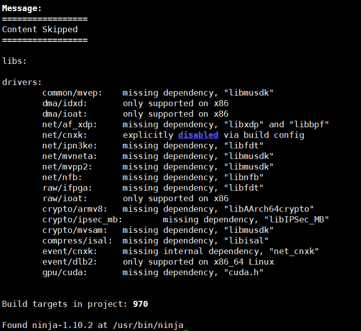
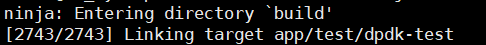
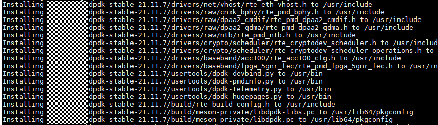

# 安装前配置

## 安全检查

### 检查Glibc版本

```bash
ldd --version
```

Glibc 2.10及以上版本会开启堆栈保护，若查询出来的版本低于2.10，建议升级至2.10以上。这里以2.28版本为例

```bash
yum update glibc-2.28
```

### 检查ASLR是否开启

ASLR是一种针对缓冲区溢出的安全保护技术，通过地址布局的随机化，增加攻击者预测目的地址的难度

```bash
cat /proc/sys/kernel/randomize_va_space
```

若结果不为2，请执行以下命令开启ASLR

```bash
bash -c 'echo 2 >/proc/sys/kernel/randomize_va_space'
```

## 安装依赖包

1. 安装系统依赖。

    ```bash
    yum install -y libcap-devel tar gzip vim
    ```

2. 安装部署工具依赖。

    ```bash
    yum install -y jq
    ```

3. 安装libboundscheck依赖。
    - openEuler操作系统下：

    ```bash
    yum install -y libboundscheck
    ```

    - CTyunos操作系统下：
    请参考[https://atomgit.com/openeuler/libboundscheck/blob/v1.1.16/README.md](https://atomgit.com/openeuler/libboundscheck/blob/v1.1.16/README.md)。

## （可选）安装DPDK

>**说明：** 
>如果已经安装21.11.7版本的DPDK，且不需要抓包功能，可跳过此章节。

### DPDK安装

在安装DPDK时应避免直接使用Yum源，因为Yum源安装的版本存在不可控风险。

1. 安装前先安装DPDK需要的依赖。

    ```bash
    yum install -y gcc # 安装编译工具
    yum install -y meson ninja-build numactl-devel python3-pyelftools libnl3 libnl3-devel# DPDK依赖
    ```

2. 按照[版本配套关系](../release_note.md)获取DPDK软件包。
3. 上传压缩包至服务器并传输到虚拟机，解压后进入解压文件夹目录。<a id="step3"></a>

    ```bash
    scp root@remote_host:/path/to/remote/dpdk-21.11.7.tar.xz /path/to/local/directory
    cd /path/to/local/directory
    tar -xf dpdk-21.11.7.tar.xz
    cd dpdk-stable-21.11.7
    ```

    > **说明：** 
    >- remote\_host：物理机192.168.122.\*对应的IP地址。
    >- /path/to/remote/：软件包的路径，需要根据实际情况替换。
    >- /path/to/local/directory：虚拟机中的保存路径。

4. 执行如下命令安装驱动程序。

    ```bash
    meson -Ddisable_drivers=net/cnxk -Dibverbs_link=dlopen -Dplatform=generic -Denable_kmods=false -Dprefix=/usr build
    ```

    回显示例：

    

    ```bash
    ninja -C build
    ```

    回显示例：

    

    ```bash
    ninja install -C build
    ```

    回显示例：

    

### （可选）安装抓包工具

>**说明：** 
>启用K-NET抓包功能才需要参考以下步骤安装，无需抓包可直接跳过以下步骤。
>以下提到的“dpdk-stable-21.11.7”为DPDK解压所得目录，其他版本DPDK需自行适配。

1. 安装抓包工具依赖。

    ```bash
    yum install -y libpcap-devel libpcap make
    ```

2. 确保“dpdk-stable-21.11.7/app/dumpcap”目录下只有DPDK示例程序main.c和meson.build。若该目录下有其他文件，建议用户迁移至其他路径。
3. 请参见[Gitee](https://gitee.com/openeuler/dpdk/blob/575def3e5f5be8da8662d442c6ecd46e9ec82acf/patch/dpdk-21.11.7-dumpcap.patch)获取dpdk-21.11.7-dumpcap.patch并上传至“dpdk-stable-21.11.7/app”目录。
4. 进入“dpdk-stable-21.11.7/app”目录，应用patch。

    ```bash
    patch -p1 -d dumpcap/ < dpdk-21.11.7-dumpcap.patch
    ```

5. 进入dumpcap目录，执行make得到适配K-NET的dumpcap。

    ```bash
    cd dumpcap
    make
    ```

    >**说明：** 
    >如果编译失败，是由于缺少头文件或动态库，请检查Makefile中DPDK头文件路径_INCLUDEDIR_、DPDK动态库路径_LDDIR_、libpcap动态库路径_LIBPCAPDIR_下是否存在相应库或头文件，若不存在，安装后修改路径确保该路径下有对应文件。

6. 授予驱动和编译抓包程序执行权限。

    > **说明：** 
    >若为root用户可跳过此步骤。

    ```bash
    chmod a+s /usr/lib64/librte_net_hinic3.so
    setcap cap_sys_rawio,cap_dac_read_search,cap_sys_admin+ep dumpcap
    ```

7. （可选）若需要编译DPDK应用于其他业务时，请消除dpdk-21.11.7-dumpcap.patch的影响，操作顺序如下：
    1. 请先确保在“dpdk-stable-21.11.7”目录下。

        ```bash
        cd ./app/dumpcap
        ```

    2. 删除文件使得最后保留main.c Makefile meson.build三个文件。

        ```bash
        make clean 
        rm *.pcap
        ```

    3. 回退到“dpdk-stable-21.11.7/app”目录。

        ```bash
        cd ../
        ```

    4. 撤销patch变更。

        ```bash
        patch -p1 -Rd dumpcap/ < dpdk-21.11.7-dumpcap.patch
        ```

    5. 撤销后“dpdk-stable-21.11.7/app/dumpcap”恢复到源码刚解压后的状态，即只包含main.c和meson.build。

        ```bash
        ls dumpcap
        ```

        回显示例：

        ```ColdFusion
        main.c meson.build
        ```

# 安装K-NET

## 命令行安装

1. 下载K-NET源码并编译。

    ```bash
    git clone https://atomgit.com/openeuler/knet.git
    cd knet
    python3 build.py rpm
    ```

2. 安装K-NET。

    若首次安装，执行以下命令：
    - 鲲鹏架构：

        ```bash
        rpm -ivh build/rpmbuild/RPMS/knet-1.0.0.aarch64.rpm
        ```

    - x86架构：

        ```bash
        rpm -ivh build/rpmbuild/RPMS/knet-1.0.0.x86_64.rpm
        ```
    
    若安装过K-NET，执行以下命令直接升级：
    - 鲲鹏架构：

        ```bash
        rpm -Uvh build/rpmbuild/RPMS/knet-1.0.0.aarch64.rpm --force --nodeps
        ```

    - x86架构：

        ```bash
        rpm -Uvh build/rpmbuild/RPMS/knet-1.0.0.x86_64.rpm --force --nodeps
        ```

## Computing ToolKit批量安装

对于Computing ToolKit方式的安装部署方法，请参见[批量运维](../reference/FAQs/batch_om.md)，将安装命令替换为如下，以ARM环境初次安装K-NET为例：

    ```bash
    cd /path; rpm -ivh knet-1.0.0.aarh64.rpm
    ```

    > **说明：** 
    >“/path”为用户传输K-NET的RPM包路径，请根据实际填写。
