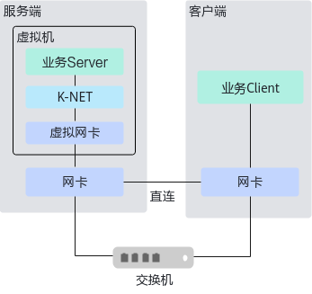

# 组网规划

测试组网模型如下：

- 服务端：在物理机或者虚机安装业务服务端（Server）和<term>K-NET</term>网络加速套件。
- 客户端：运行业务客户端（Client），向服务端发起请求以及性能测试。

**图 1**  物理机组网规划

**图 2**  物理机组网规划（Bond场景）

**图 3**  虚拟机组网规划

服务端和客户端可以直连或者通过交换机连接。

