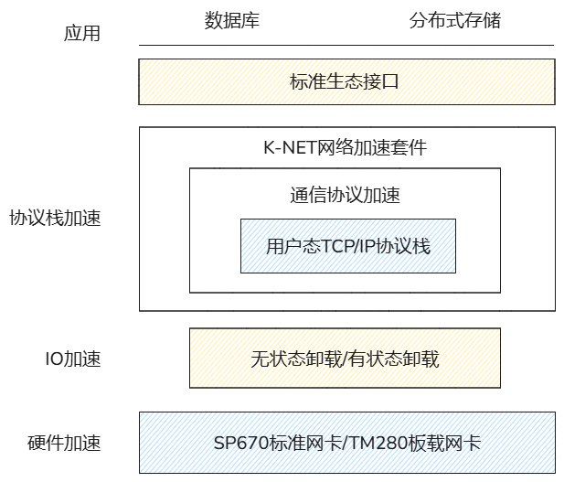
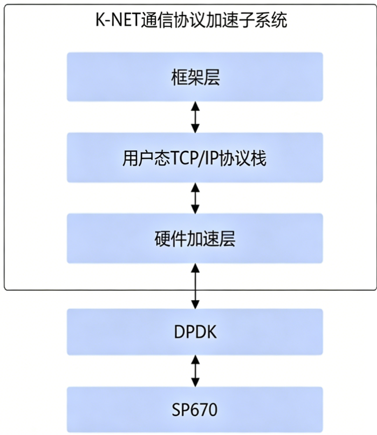

# 方案架构

## 架构描述

<term>K-NET</term>网络加速套件，主要面向通用协议加速、网络安全加速业务场景，同时也面向通用计算业务、安全通信业务， 基于SP670网卡，提供用户态TCP/IP协议栈加速。

- 用户态TCP/IP协议栈

## 通信协议加速

K-NET通信协议加速子系统中包含框架层、用户态TCP/IP协议栈、硬件加速层。

- 框架层：提供标准的POSIX API接口，可以直接对业务标准的POSIX Socket接口重定向，替换为协议栈Socket接口；同时提供扩展socket接口，通过使用诸如零拷贝的扩展socket接口，可以得到更优性能。
- 用户态TCP/IP协议：用户态协议栈加速核心，提供标准TCP/IP协议能力，将原生内核态协议栈切到用户态协议栈进行加速。
- 硬件加速层：提供高性能的报文转发能力，含控制面和数据面；结合鲲鹏SP670/TM280释放网卡硬件能力。

## 运维管理

- K-NET通信协议加速用户态TCP/IP协议栈特性：
    - 支持数据传输抓包
    - 支持查询协议栈统计信息

## 硬件平台

SP670标准网卡的具体描述请参见[《SP600 标准网卡 用户指南》](https://support.huawei.com/enterprise/zh/doc/EDOC1100309168?idPath=23710424%7C251364417%7C9856629%7C253287505)。

TM280 灵活IO卡的具体描述请参见[《TM280 灵活IO卡 用户指南》](https://support.huawei.com/enterprise/zh/doc/EDOC1100118649?idPath=23710424|251364409|21782478|15791)。
