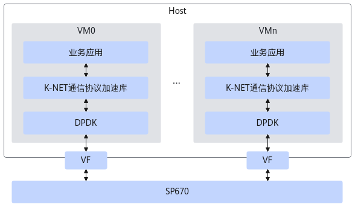
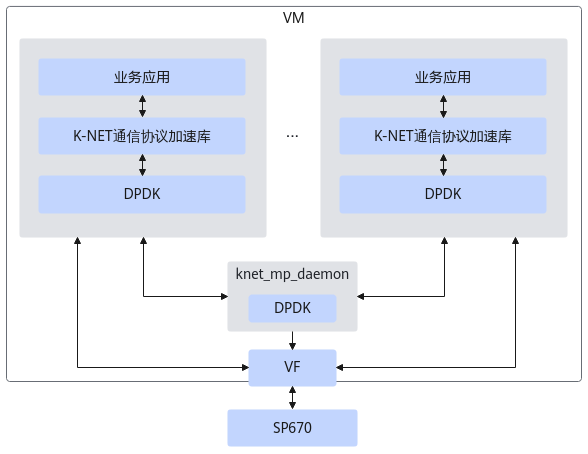
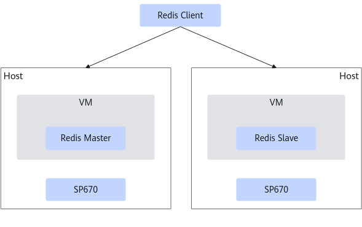
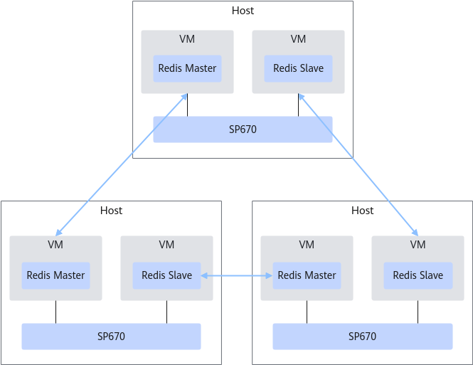
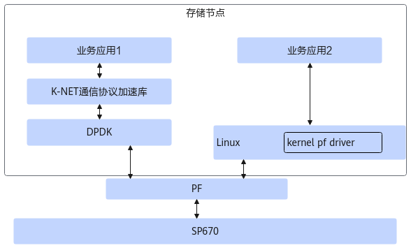
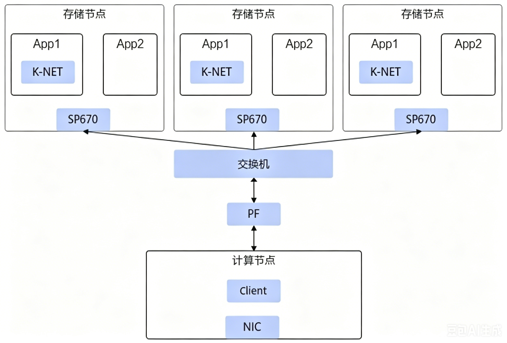

# 典型应用场景

## 数据库场景

### 场景介绍

K-NET网络加速套件结合鲲鹏SP670标准网卡，应用在虚拟化场景（包含裸金属场景和虚机场景）时，主要应用在公有云/私有云等场景中。在云场景中网卡一般作为计算节点（服务器）对外业务通信的主要通道，为主机提供了网络加速能力。

通信协议加速：基于K-NET用户态TCP/IP协议栈和网卡硬件特性，从网卡收到报文后，通过DPDK直接转发给用户态协议栈，相比传统内核态协议栈减少系统调用、上下文切换和中断开销，Redis单实例业务性能提升75%以上。

以虚拟化场景为例：

**图 1**  单进程模型  

**图 2**  多进程模型  

### 组网介绍

**虚拟化场景**

组网概要：

- SP670插入计算节点的PCIe插槽中，通过PCIe与计算节点的CPU互通。
- NIC提供的高带宽网口接入到公有云/私有云的计算网络中，支持本节点上的裸金属对接其他的计算节点，采用TCP/IP通信。
- 支持Redis主从和集群组网场景。

**图 1**  典型主备组网  

**图 2**  三主三从集群组网  

### 兼容性

|设备|型号|
|--|--|
|整机|TaiShan 200 (Model 2280)(VD)|
|网卡|SP670|

|软件|版本|
|--|--|
|DPDK|21.11|
|Redis|6.0.20|
|x86服务器OS|OpenEuler 22.03 LTS SP1|
|x86服务器虚拟机OS|OpenEuler 22.03 LTS SP1|
|鲲鹏服务器OS|OpenEuler 22.03 LTS SP4|
|鲲鹏服务器虚拟机OS|OpenEuler 22.03 LTS SP4|

## 分布式存储场景

### 场景介绍

K-NET网络加速套件结合鲲鹏服务器板载网卡TM280，应用在分布式存储场景时，主要应用在存储节点中。

通信协议加速：基于K-NET用户态TCP/IP协议栈和网卡硬件特性，从网卡收到报文后，通过DPDK直接转发给用户态协议栈，相比传统内核态协议栈减少系统调用、上下文切换和中断开销，基于网络流量分叉功能也支持其他未重定向的进程使用同样的IP地址通过内核协议栈和外部通信。

使用场景如下：

### 组网介绍

组网概要：

- 存储节点通过SP670接入交换机及网络，并采用TCP/IP通信。
- 三个存储节点上均部署K-NET，计算节点不部署。

**图 1**  典型存储集群组网图  

### 兼容性

|设备|型号|
|--|--|
|整机|TaiShan 200 (Model 2280)(VD)|
|网卡|SP670|

|软件|版本|
|--|--|
|DPDK|21.11|
|iPerf3（仅使用iPerf3作为测试工具）|3.16|
|鲲鹏服务器OS|ctyunos-2.0.1-220311-aarch64|
