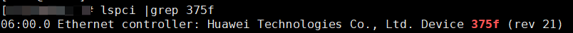
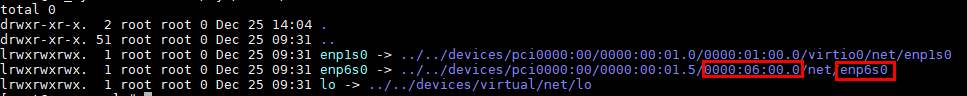
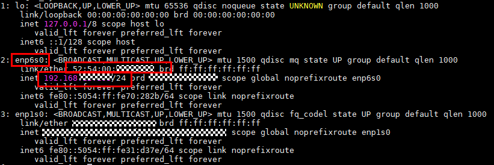

# 快速入门

K-NET（K-Network，网络加速套件）旨在打造一款网络加速套件，提供统一的软件框架，发挥软硬件协同优势，释放网卡硬件性能，详细介绍请参见[产品描述](./introduct/introduct_menu.md)。
本快速入门以在SP670网卡上，运行Redis单实例加速任务为例，快速教您如何使用K-NET。

## 1、安装K-NET

单实例加速至少需要一个服务端和一个客户端，请在服务端安装K-NET和Redis，在客户端安装Redis。关于K-NET的安装详情请参见[安装](./installation/install_menu.md)。

### Redis安装

Redis参考[软件配套关系](./release_note.md#软件配套关系)获取，上传源码，解压并进入源码目录。

```bash
cd redis-6.0.20
make && make install
```

## 2、配置运行环境

### 确认要使用的网卡
SP670网卡：
- 虚拟机场景，通过查找VF设备的DeviceID：375f确认。

    ```bash
    lspci |grep 375f
    ```

- 物理机场景，通过查找PF设备的DeviceID：0222确认。

    ```bash
    lspci |grep 0222
    ```

以虚拟机场景为例：



```bash
# 查看当前系统中所有网络接口，可以获取上一步中查找到BDF号为"06:00.0"的网口名为"enp6s0"
ls -al /sys/class/net
```



```bash
#可以查询到网卡的IP地址以及MAC地址
ip a
```



### 确认网卡NUMA与CPU

1. 确认网卡所在numa：

```bash
 # 以enp6s0为例，请用户根据实际使用的网口替换
cat /sys/class/net/enp6s0/device/numa_node
```

2. 确认所用CPU范围：

```bash
lscpu
```

回显示例如下：

```bash
NUMA node0 CPU(s):          0-31
NUMA node1 CPU(s):          32-63
```

假设所在NUMA为1，则网卡所用CPU为32-63。

### 配置大页内存 
1. 配置大页。
- 服务端为物理机场景：

    ```bash
    # 关闭透明大页
    echo never > /sys/kernel/mm/transparent_hugepage/enabled 

    # 配置2个1G内存大页
    # 以node1为例，根据具体node编号根据查询到的网口所在NUMA进行更改
    echo 2 > /sys/devices/system/node/node1/hugepages/hugepages-1048576kB/nr_hugepages
    ```
- 服务端为虚拟机场景：

    ```bash
    # 关闭透明大页
    echo never > /sys/kernel/mm/transparent_hugepage/enabled 

    # 配置2个1G内存大页
    echo 2 > /sys/kernel/mm/hugepages/hugepages-1048576kB/nr_hugepages
    ```
>**说明：** 
>- 配置2个1G类型内存大页，用户可以根据实际所需修改大页数量。

2. 挂载1G大页。

```bash
# 以/home/hugepages1G路径为例，实际请根据情况设置
mkdir -p /home/hugepages1G
mount -t hugetlbfs -o pagesize=1G hugetlbfs /home/hugepages1G
```

3. 查看大页挂载情况。

```bash
mount | grep huge
```

> 回显如下，表示成功使能1G大页：

```ColdFusion
cgroup on /sys/fs/cgroup/hugetlb type cgroup (rw,nosuid,nodev,noexec,relatime,hugetlb)
hugetlbfs on /dev/hugepages type hugetlbfs (rw,relatime,pagesize=2M)
hugetlbfs on /home/KNET_USER/hugepages type hugetlbfs (rw,relatime,pagesize=1024M)
```

>**说明：** 
>这里需要注意是否存在其他1G类型大页挂载路径，如果存在的话，可能会造成权限问题影响后续业务运行，需要执行以下命令取消挂载：
>```bash
>umount /path     # /path为其他1G类型大页挂载路径
>```

4. 确认大页配置成功：

```bash
grep Huge /proc/meminfo
# 也可以用dpdk查看当前大页内存配置信息
dpdk-hugepages.py -s
```

### 加载vfio驱动


```bash
modprobe vfio enable_unsafe_noiommu_mode=1
modprobe vfio-pci
```

### DPDK接管网卡

以华为SP670网口enp6s0为例，具体以网口function名为准。

```bash
ip link set dev enp6s0 down
dpdk-devbind.py -b vfio-pci enp6s0
```

如需取消接管网卡，执行：

```bash
# 以"0000:06:00.0"为例，具体替换为实际的BDF号
dpdk-devbind.py -b "hisdk3" 0000:06:00.0
```

## 3、修改K-NET配置文件并试用单进程加速能力
>**说明**：当前章节仅体验Redis单实例加速，其他单进程功能，如主从场景、集群场景可参考[单进程特性](./feature/single_process_mode.md)。
### 修改K-NET配置
1. 打开文件。

    ```bash
    vi /etc/knet/knet_comm.conf
    ```

2. 按“i“进入编辑模式，参考[确认要使用的网卡](#确认要使用的网卡)与[确认网卡numa与cpu](#确认网卡numa与cpu)修改配置项，示例如下：

    填写获取的网卡信息。

    ```json
    "interface": {
        ...
        "bdf_nums": [
            "0000:06:00.0"
        ], # 1. 填写获取的BDF号
        "mac": "52:54:00:2e:1b:a0", # 2. 填写绑定网卡的MAC地址 
        "ip": "192.168.1.6",        # 3. 填写绑定网卡的IP地址
        ...
        },
    ```

    >**说明**
    >1. 填写获取的BDF号：根据接管网卡实际填写。
    >2. 填写绑定网卡的MAC地址：根据接管网卡实际MAC填写。
    >3. 填写绑定网卡的IP地址：用户可以填写预期的网段IP。

    填写dpdk配置项。

    ```json
        "dpdk": {
            "core_list_global": "1",  # 4. 数据面绑核。
            ...
            "socket_mem": "--socket-mem=0,1024", # 5. 配置每个socket大页内存。
            ...
        }
    ```

    >**说明**
    >4. 数据面绑核：以1为例，表示K-NET使用1号核进行报文收发，需要确保与ctrl_vcpu_ids绑定的核不同。用户可配置为网卡所在CPU。
    >5. 配置每个socket大页内存：服务端为物理机时，以网卡所在numa_node编号为1为例， 在0号socket上预分配0MB大页内存，在1号socket上分配 1024MB大页内存，用户需要根据自己使用的网卡所在numa_node编号进行更改该配置项，给网卡所在numa_node分配大页内存；服务端为虚拟机时，使用默认配置"socket_mem" : "--socket-mem=1024"即可。

如想查看更多配置说明，可参见[配置项参考](./configuration_item_reference.md)。

3. 按“Esc”键退出编辑模式，输入 **:wq!**，按“Enter”键保存并退出文件。

### 服务端中运行Redis-server

>**说明**：
>/path/redis-server与path/redis.conf：根据实际路径进行填写。

```bash
# 以taskset -c 0-31为例，根据网卡实际所在CPU范围进行填，请参考[确认网卡numa与cpu](#确认网卡numa与cpu)。
# bind的ip以192.168.1.6为例， 替换为具体K-NET配置文件的IP地址。
taskset -c 0-31 env LD_PRELOAD=/usr/lib64/libknet_frame.so /path/redis-server /path/redis.conf --port 6380 --bind 192.168.1.6
```

### 客户端运行Redis-benchmark

1. 测试set性能：

>**说明**：
>/path/redis-server与path/redis.conf：根据实际路径进行填写。

```bash
# 以taskset -c 33-62为例，根据网卡实际所在CPU范围进行填，请参考[确认要使用的网卡](#确认要使用的网卡)与[确认网卡numa与cpu](#确认网卡numa与cpu)。
# bind的ip以192.168.1.6为例， 替换为具体K-NET配置文件的IP地址。
taskset -c 33-62 /path/redis-benchmark -h 192.168.1.6 -p 6380 -c 1000 -n 10000000 -r 100000 -t set --threads 15
```

得到形如如下结果：

```bash
====== SET ======
10000000 requests completed in 25.75 seconds
1000 parallel clients
3 bytes payload
keep alive: 1
host configuration "save": 900 1 300 10 60 10000
host configuration "appendonly": no
multi-thread: yes
threads: 15
                
0.00% <= 0.4 milliseconds
0.00% <= 0.5 milliseconds
0.00% <= 0.6 milliseconds
0.00% <= 0.7 milliseconds
0.01% <= 0.8 milliseconds
...
388274.12 requests per second
```

则性能为388274.12 rps，实际性能以运行为准。

2. 清理set数据，提升get性能

```bash
redis-cli -h 192.168.1.6 -p 6380 flushall
```

3. 测试get性能：

>**说明**：
>/path/redis-benchmark：根据实际路径进行填写。

```
# 以taskset -c 33-62为例，根据网卡实际所在CPU范围进行填，请参考[确认要使用的网卡](#确认要使用的网卡)与[确认网卡numa与cpu](#确认网卡numa与cpu)。
# bind的ip以192.168.1.6为例， 替换为具体K-NET配置文件的IP地址。
taskset -c 33-62 /path/redis-benchmark -h 192.168.1.6 -p 6380 -c 1000 -n 100000000 -r 10000000 -t get --threads 15
```

得到形如如下结果：

```bash
====== GET ======
1000000 requests completed in 64.26 seconds  
1000 parallel clients  
3 bytes payload  
keep alive: 1  
host configuration "save": 900 1 300 10 60 10000  
host configuration "appendonly": no  
multi-thread: yes  
threads: 1  

0.00% <= 0.6 milliseconds  
0.00% <= 0.7 milliseconds  
0.00% <= 0.8 milliseconds  
0.00% <= 2 milliseconds  
0.00% <= 3 milliseconds  
0.00% <= 4 milliseconds  
0.01% <= 5 milliseconds
...
305608.11 requests per second
```

则性能为305608.11 rps，实际性能以运行为准。

### 观测性能提升效果
测试内核协议栈相同场景下Redis set、get性能，可以与上述K-NET结果进行对比，观测提升效果。

1. 服务端取消接管网卡。

```bash
# 以"0000:06:00.0"为例，具体替换为实际的BDF号
dpdk-devbind.py -b "hisdk3" 0000:06:00.0
```

2. 服务端设置网卡IP。

```bash
# 以enp6s0为例，具体替换为实际的网卡名
ip link set dev enp6s0 up
# 以192.168.1.6/24为例，具体替换为实际需要的ip与掩码
ip addr add 192.168.1.6/24 dev enp6s0
```

3. 服务端运行内核协议栈Redis-server。

```bash
taskset -c 0-31 /path/redis-server /path/redis.conf --port 6380 --bind 192.168.1.6
```

>**说明**：
>taskset -c 0-31：根据网卡实际所在CPU范围进行填，请参考[确认网卡numa与cpu](#确认网卡numa与cpu)。
>bind的ip 192.168.1.6: 替换为具体K-NET配置文件的IP地址。
>/path/redis-server与path/redis.conf：根据实际路径进行填写。

4. 客户端运行Redis-benchmark。
参考[客户端运行redis-benchmark](#客户端运行redis-benchmark)运行测试命令，获取内核性能。

以测试内核性能set 176956.69 rps，get 199952 rps为例，K-NET对其有具有明显提升效果。

# 更多特性
K-NET更多特性详细使用方式请参见[特性指南](./feature/feature_menu.md)。

# 性能调优
K-NET性能调优请参见[性能调优](./reference/performance_tuning/tuning_menu.md)。