# 批量运维

如果需要同一时刻批量操作多个业务环境，可以采用Computing ToolKit进行批量运维，具体步骤如下：

1. 安装Computing ToolKit工具。

    下载安装方式请参见[《Computing ToolKit 25.2.0 用户指南》](https://support.huawei.com/enterprise/zh/management-software/computing-toolkit-pid-264314551)中"安装Computing ToolKit"来操作，使用25.2.0版本的软件安装包。

2. 配置服务器信息。
    打开Computing ToolKit，进入首页“批量分发”，参见[《Computing ToolKit 25.2.0 用户指南》]中"5.7.3.3 添加设备"，设备类型选择“OS”，添加目标服务器的IP地址、用户名和密码，将需要批量操作的服务器信息全部添加到此列表中。

    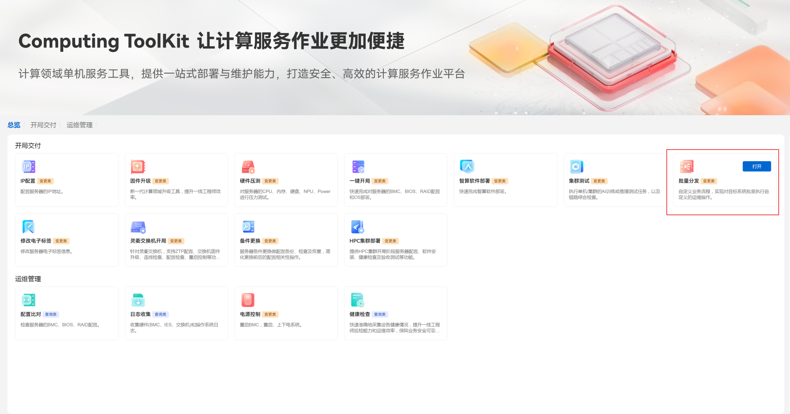

    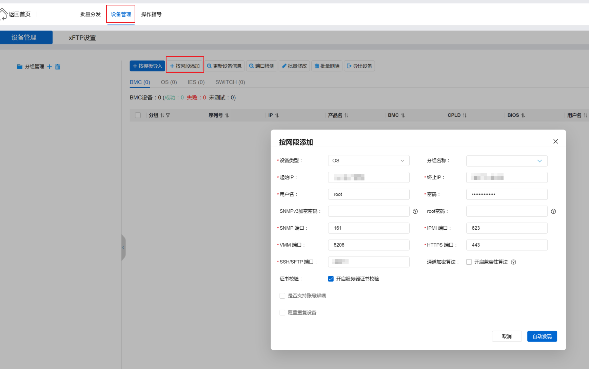

    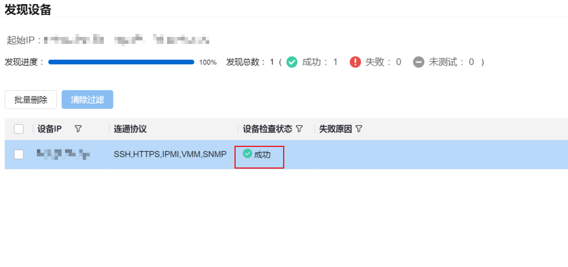

3. 配置批量分发命令。
    1. 点击“批量分发”，选中要批量操作的DPU OS，单击“下一步”。

    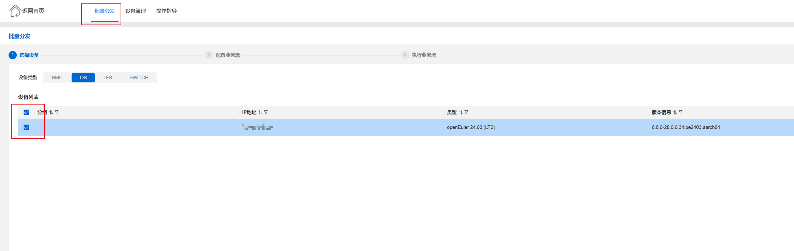
    2. 单击“添加”，选择“文件传输”，填写“任务名称”、“本地路径”和“远端路径”，然后单击“确定”（该步骤用于将本地的K-NET传输到目标服务器）。

    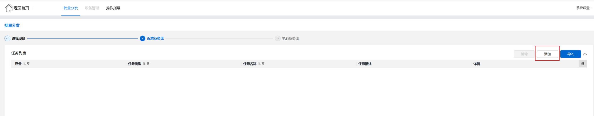

    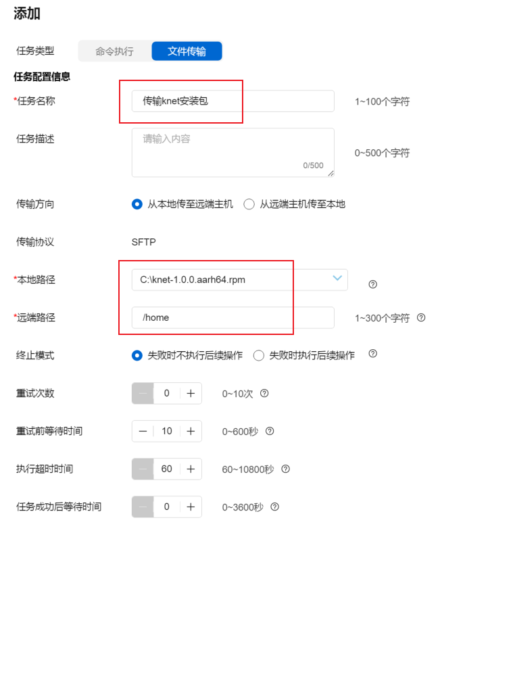
    3. 单击“添加”，选择“命令执行”，输入要批量执行的命令，然后单击“确定”。
    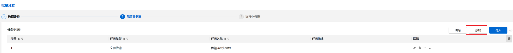

    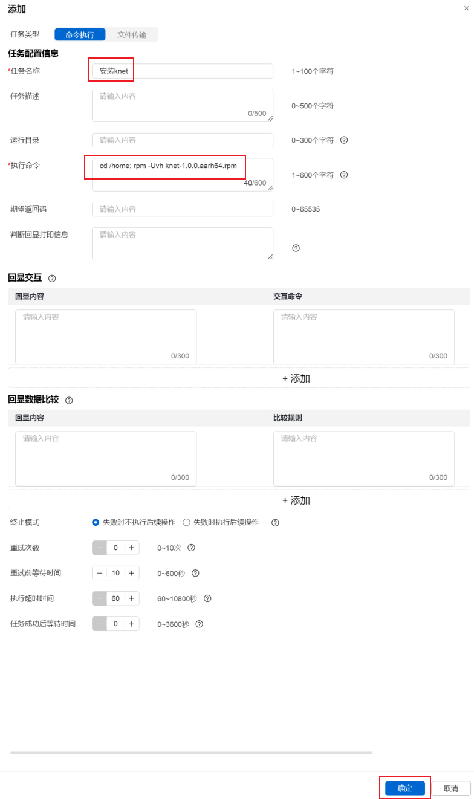

    命令示例如下：
    - 鲲鹏架构：
            ```
      cd /home; rpm -Uvh knet-1.0.0.aarh64.rpm
            ```
    - x86架构：
            ```
      cd /home; rpm -Uvh knet-1.0.0.x86_64.rpm
            ```

4. 批量执行命令。
    1. 单击“下一步”，选择“执行业务流”，即可实现批量执行命令，即批量运维。
    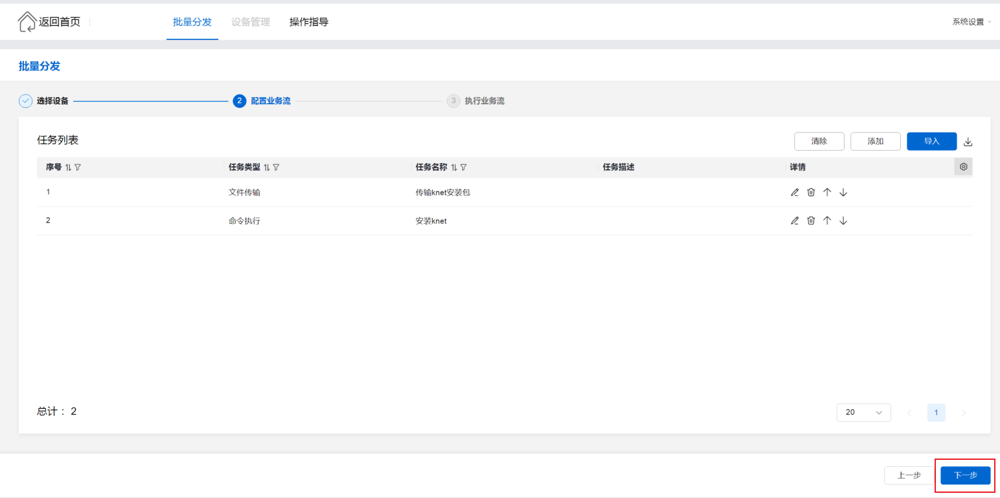

    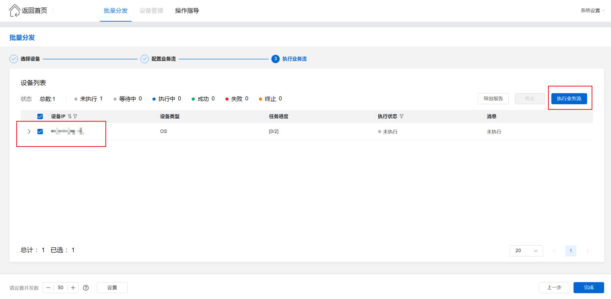
    2.  单击“导出报告“，查看批量执行结果。

    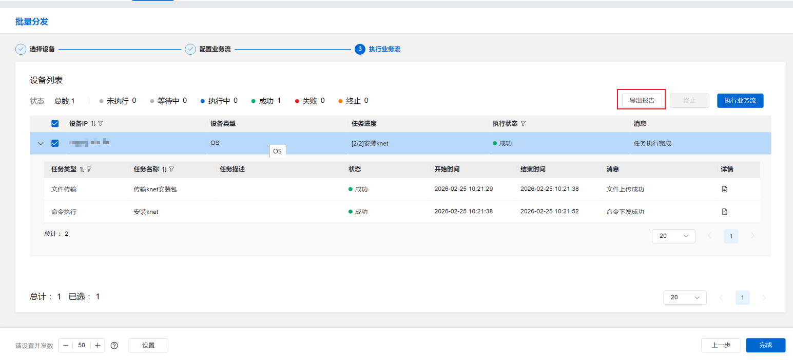
