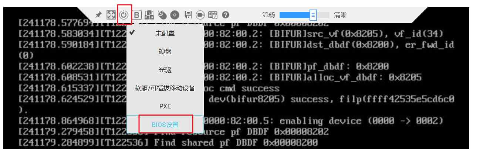
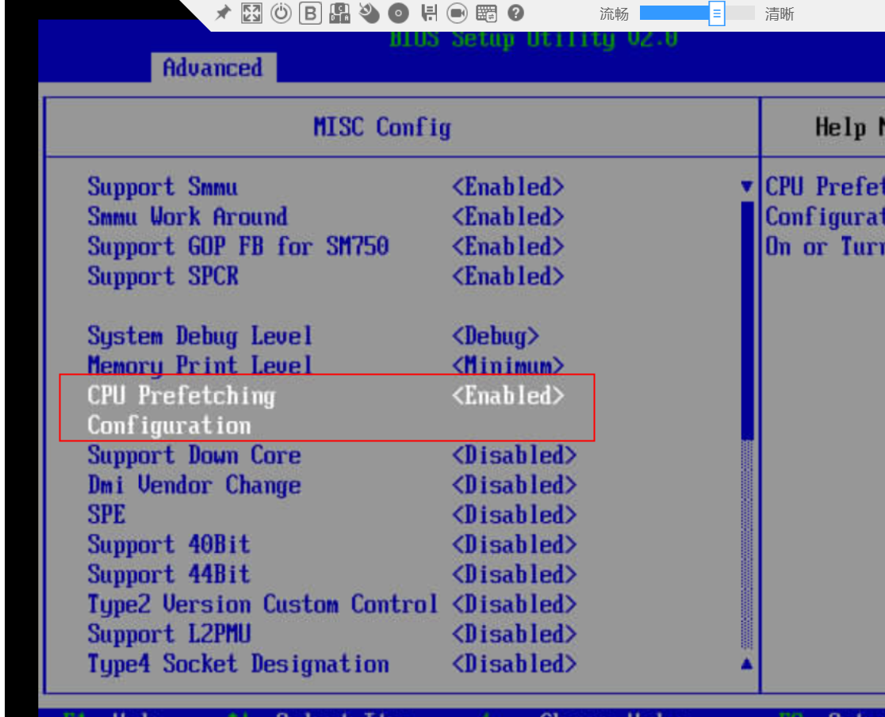
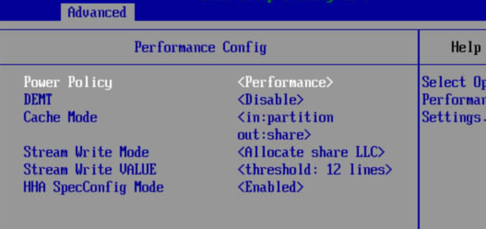
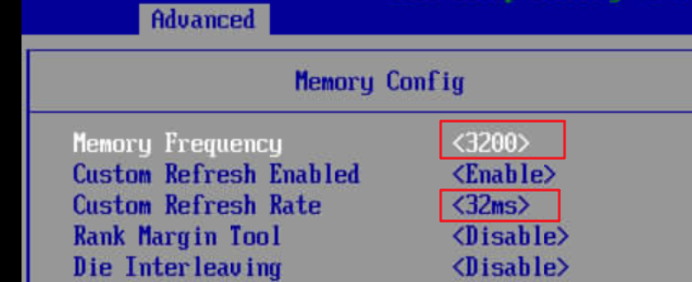

# BIOS调优

1.  进入服务器的BMC虚拟控制台，点击“B”按钮-\>BIOS配置-\>电源按钮-\>强制重启。

    

2.  CPU预取：等待界面进入BIOS界面后，进入“Advanced”-\>“MISC Config”页面，移动向下方向键到“CPU Prefetching Configuration”，按回车，将其选为“Enabled”。

    

3.  电源策略：在步骤2界面，按 “ESC”回到上一层，进入“Performance Config”页面，移动到“Power Policy”，按回车，将其选为“Performance”。

    

4.  内存配置：在步骤3界面，按“ESC”回到上一层，进入“Memory Config”页面，移动到“Memory Frequency”，按回车，将其选为最大值，例如此处为“3200”，按回车，再移动向下方向键到“Custom Refresh Rate”，按回车，将其选为最小值，例如此处为“32ms”。

    

5.  按“F10”按钮保存并退出。等待服务器重启成功即可。