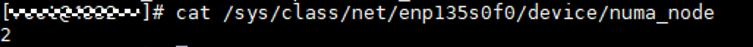
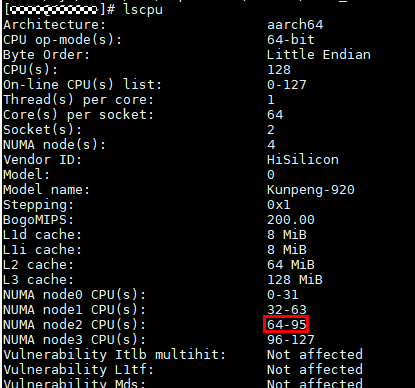
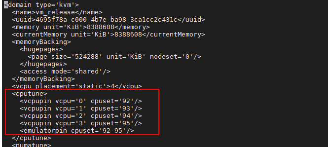
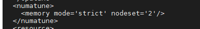

# 绑核与网卡所在NUMA一致

1. 确定物理机网卡所在NUMA。<a id="numa-li1"></a>

    ```bash
    cat /sys/class/net/enp135s0f0/device/numa_node  # 网卡名根据用户具体使用的网卡进行修改
    ```

    

2. 确定物理机网卡所在NUMA的CPU编号。<a id="numa-li2"></a>

    ```bash
    lscpu
    ```

    

3. 修改绑核配置，使用网卡所在NUMA的CPU。

    > **说明：** 
    >以[步骤2](#numa-li2)中查询到使用网卡所在NUMA的CPU编号为64\~95为例，后续绑核的CPU编号要在该区间内。

    - 服务端为虚拟机场景

        ```bash
        virsh shutdown vm_name    # 关闭虚拟机
        virsh edit vm_name        # 修改虚拟机绑核配置，vm_name请用户根据实际进行填写
        virsh start vm_name       # 开启虚拟机
        ```

        

        查看如下字段，保证内存后端使用网卡同[步骤1](#numa-li1)的NUMA。

        

    - 服务端为物理机场景

        ```bash
        vi /etc/knet/knet_comm.conf # 修改knet_comm.conf配置文件进行绑核
        ```

        按“i”进入编辑模式，修改如下配置项：

        ```json
        #common配置项
            "common": {
                ...
                
                "ctrl_vcpu_ids": [
                    92
                ]
            }
        #dpdk配置项
            "dpdk" : {
                "core_list_global": "93",
                # 以上配置了一个数据核及队列，若需配置多核多队列修改为 "core_list_global": "93-95" 或 "core_list_global": "93,94,95"
                ...
            }
        ```

        按“Esc”键退出编辑模式，输入 **:wq!**，按“Enter”键保存并退出文件。

4. 启动Redis-server时使用taskset绑定网卡所在NUMA的CPU编号。

    ```bash
    taskset -c 64-95 env LD_PRELOAD=/usr/lib64/libknet_frame.so redis-server /path/to/redis/redis.conf --port 6380 --bind 192.168.*.*
    ```

    > **说明：** 
    >taskset -c 64-95：绑核设置参考前面步骤，应避免跨NUMA。
