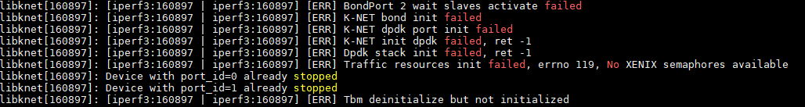
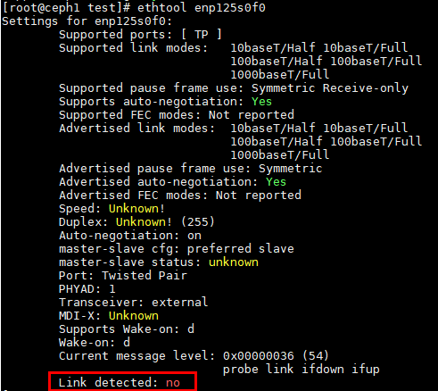

# Bond故障

## Bond场景下启动业务失败，日志报错“ BondPort 2 wait slaves activate failed”

### 现象描述

Bond场景下启动业务失败，日志可以看到“ BondPort 2 wait slaves activate failed”。



### 原因

被接管的网口至少有一个链路不通，导致Bond等待slave端口唤醒过程超时，程序退出。

### 处理步骤

参考[相关业务配置中的步骤2](../../feature/preparations.md#相关业务配置)中提到的取消接管网卡步骤还原网口，检测网口状态。

```bash
ethtool enp125s0f0  # 网口名根据用户具体使用的网口进行修改
```



以上回显说明网口链路不通，需要先解决组网问题。

## Bond场景下启动业务，长期无本端或者对端进行连接后，报错“XXX: Failed to allocate LACP packet from pool”

### 现象描述

Bond场景下启动业务，长期无本端或者对端进行连接后，报错“XXX: Failed to allocate LACP packet from pool”。

### 原因

dpdk内部bug，当bond端口长期空闲后LACP数据报文分配失败。

### 处理步骤

方案一：保持使用bond端口进行网络通信，确保bond端口空闲状态不超过1分钟。
方案二：参考该[dpdk社区patch](https://mails.dpdk.org/archives/dev/2022-March/237926.html)修改dpdk后重新编译安装dpdk，再运行业务。
