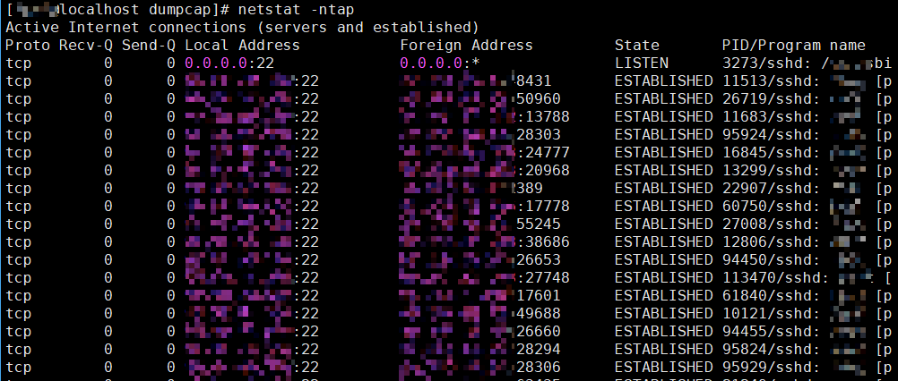

# 内核流量转发故障
## 转发的内核应用无法收到数据包

### 现象描述

开启K-NET业务进程后，运行内核态协议栈应用，经由K-NET转发后，内核态协议栈应用connect或listen后收不到报文，无法建链，但实际抓包抓到了内核协议栈应用端口的报文。

### 原因

1.  查看内核态协议栈应用端口：

    ```
    netstat -ntap
    ```

    

2.  查看K-NET使用端口范围：

    ```
    "proto_stack": {
        "min_port": 49152,
        "max_port": 65535,
        ...
    }
    ```

3.  观察到运行的用户态协议栈应用使用了K-NET用户态协议栈端口区间的端口。

### 处理步骤

方案参考[共线程功能中的步骤4](../../feature/shared_thread.md)。

