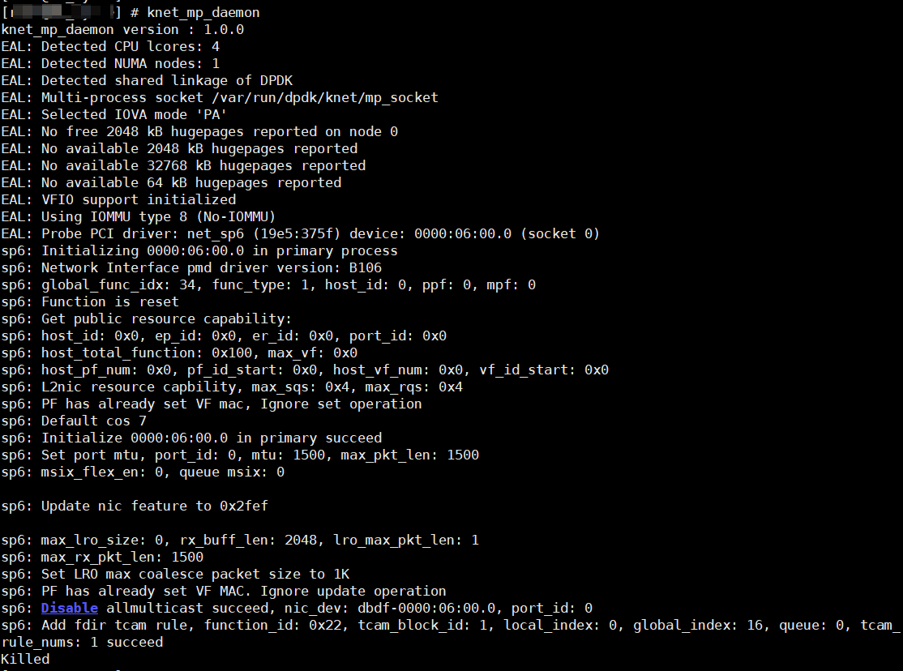
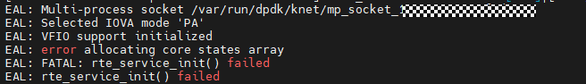

# 多进程故障

## Redis-benchmark回显为0或者无回显，几分钟后退出

### 现象描述

多进程模式启动，knet\_mp\_daemon进程被意外挂起。导致客户端打流失败，且knet\_comm.log报错。



客户端运行Redis-benchmark命令时回显为0或者无回显，几分钟之后客户端退出，回显如下：

```ColdFusion
Could not connect to Redis at 192.168.**.***:****: Connection timed out
WARN: could not fetch server CONFIG
Writing to socket: Connection timed out
...
All clients disconnected... aborting.
```

在服务端查看K-NET日志：

```bash
vim /etc/knet/knet_comm.log
```

可以观察到如下报错：

```ColdFusion
Rpc client failed, ret -1
K-NET rpc client socket failed to be connected, clientFd: xx, error: 111
```

### 原因

- 意外终止knet\_mp\_daemon进程。
- knet\_mp\_daemon进程运行过程中意外终止。

### 处理步骤

关闭K-NET所有的业务进程，然后重新启动knet\_mp\_daemon进程，再启动从进程业务。业务启动命令参见[多进程模式加速](../../feature/multi-process_mode.md)。

## 启动业务进程失败提示“error allocating core states array”

### 现象描述

启动业务进程失败，提示“error allocating core states array”。



在服务端查看K-NET日志：

```bash
vim /etc/knet/knet_comm.log
```

可以观察到如下报错（当前默认大页内存使用超过75%时会打印此告警）：

```ColdFusion
Socket SOCKET_ID: Memory usage is too high: 0.xx
```

或者如下报错（当前默认mbuf内存池使用超过70%时会打印此告警）：

```ColdFusion
Mbuf pool usage is too high: 0.xx
```

### 原因

没有足够的可用的大页内存：可能是/etc/knet/knet\_comm.conf配置文件中socket\_limit配置得太小，或者大页内存碎片化严重。

### 处理步骤

1. 增大/etc/knet/knet\_comm.conf配置文件中socket\_limit配置，并增加实际可用大页内存。
2. 关闭K-NET knet\_mp\_daemon进程以及所有的业务进程，然后重新启动。业务启动命令参考[多进程模式加速](../../feature/multi-process_mode.md)。

## 启动业务进程长时间阻塞且knet\_comm.log无错误日志输出

### 现象描述

启动业务进程长时间阻塞且knet\_comm.log无错误日志输出。


### 原因

之前某个进程锁住了共享内存上的锁，然后异常退出导致未释放该锁，后续进程尝试申请该锁则会死锁。

### 处理步骤

上述问题可以通过两个方法解决：

- 方案1：关闭K-NET knet\_mp\_daemon进程以及所有的业务进程，然后重新启动，业务启动命令参见[多进程模式加速](../../feature/multi-process_mode.md)。
- 方案2：将dpdk源码中的rte\_spinlock\_lock修改为pthread的锁实现，可以保证进程异常退出之后可以释放锁。

用户可以根据实际情况选择相应的方法。
