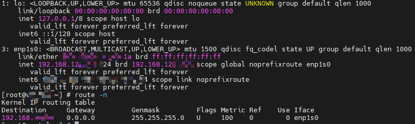

# 网络故障

## 现象描述

DPDK未接管SP670网卡，启动后未产生knet\_tap0设备：

## 原因

未正确接管SP670网卡，SP670网卡未正常使能。

## 处理步骤

参照[相关业务配置](../../feature_guide/environment_configuration.md#相关业务配置)接管网卡，正确接管网卡后启动K-NET，能够看到knet\_tap0设备后，方可正常使用K-NET加速。
