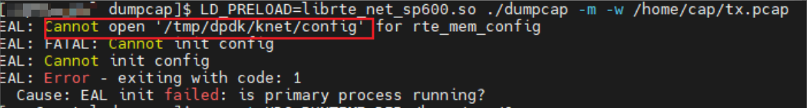
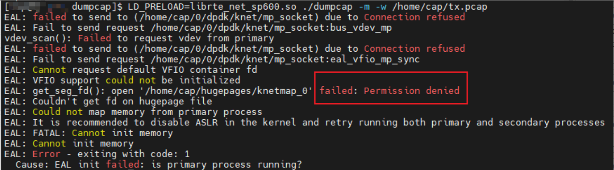
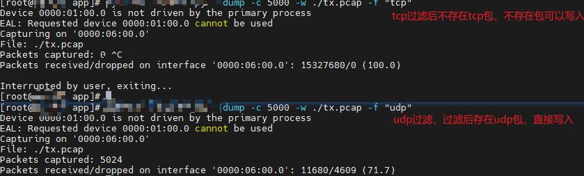
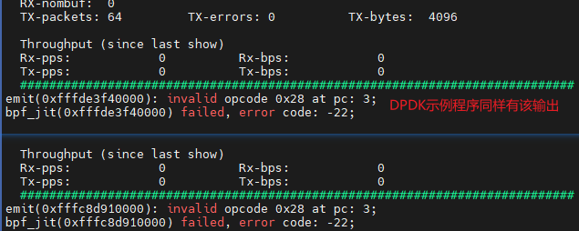
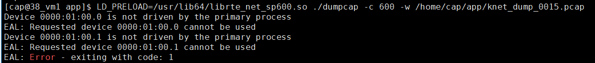

# 抓包故障

## 抓包连接主进程失败

### 现象描述

直接启用抓包获取，出现以下报错信息：

```ColdFusion
EAL: Multi-process socket /var/run/dpdk/(null)/mp_socket_3884565_28c50010577fe
EAL: failed to send to (/var/run/dpdk/(null)/mp_socket) due to Connection refused
EAL: Fail to send request /var/run/dpdk/(null)/mp_socket:bus_vdev_mp
vdev_scan(): Failed to request vdev from primary
EAL: Selected IOVA mode 'PA'
EAL: Probing VFIO support...
EAL: failed to send to (/var/run/dpdk/(null)/mp_socket) due to Connection refused
EAL: Cannot send message to primary
EAL: error allocating rte services array
EAL: FATAL: rte_service_init() failed
EAL: rte_service_init() failed
EAL: Error - exiting with code: 1
  Cause: No Ethernet ports found
```

### 原因

K-NET未启动。

### 处理步骤

启动K-NET，保证K-NET进程正常启动。

## 抓包无法打开配置

### 现象描述

抓包无法打开配置：



### 原因

非root用户进入工具前需设置“XDG\_RUNTIME\_DIR”环境变量。“/tmp/dpdk/knet/config”是临时目录，表明未设置启动的环境变量。

### 处理步骤

1. 设置“XDG\_RUNTIME\_DIR”启动环境变量，普通用户未设置该变量会产生错误。

    > **说明：** 
    >用户名使用KNET\_USER作为通配符进行示例，运行时请将其替换为实际用户名。环境变量路径涉及的权限及安全需要用户保证。

    用户可以根据需要选择永久或者临时配置环境变量。如果用户选择临时配置环境变量，需要在每个终端会话执行相关命令。

    - 永久配置环境变量。

        > **说明：** 
        >配置完成之后重新切换到该用户时无需重新配置环境变量。

        1. 创建环境变量路径。

            ```bash
            cd /home/KNET_USER/
            mkdir knet
            ```

        2. 编辑环境变量相关文件。

            ```bash
            vi ~/.profile
            ```

        3. 按“i“进入编辑模式，在末尾加上：

            ```bash
            export XDG_RUNTIME_DIR=/home/KNET_USER/knet
            ```

        4. 按“Esc“键退出编辑模式，输入**:wq!**，按“Enter“键保存并退出文件。

            ```bash
            sh -c "source ~/.profile" 
            echo $XDG_RUNTIME_DIR #确认是否配置环境变量，如果已配置会显示配置的路径
            ```

    - 临时配置环境变量。

        >**说明：** 
        >- 服务端环境关闭或重启后，或者退出普通用户再重新切换到该用户，均需要重新执行步骤。
        >- 通过设置环境变量指定运行时目录，路径依据不同用户名会有差异。

        1. 创建环境变量路径。

            ```bash
            cd /home/KNET_USER/
            mkdir knet
            ```

        2. 配置环境变量。

            ```bash
            export XDG_RUNTIME_DIR=/home/KNET_USER/knet
            echo $XDG_RUNTIME_DIR #确认是否配置环境变量，如果已配置会显示配置的路径
            ```

## 抓包进程连接被主进程拒绝

### 现象描述

抓包程序请求抓包被拒绝，提示操作不被允许：



### 原因

抓包程序缺少权限。

### 处理步骤

授予驱动和编译抓包程序执行权限。

```bash
chmod a+s /usr/lib64/librte_net_hinic3.so
setcap cap_sys_rawio,cap_dac_read_search,cap_sys_admin+ep dumpcap
```

## 抓包混杂模式开启失败

### 现象描述

抓包程序如果想开启混杂模式，会产生错误输出提醒，出现如下问题：

```ColdFusion
port X set promiscuous enable failed: xx
```

### 原因

K-NET不会开启混杂模式，抓包出现混杂模式开启失败不用关注。

## 处理步骤

K-NET默认关闭混杂模式，如果用户修改了程序，出现混杂模式开启失败，请将程序复原，复原方法参考[安装抓包工具](../../installation/installation.md#可选安装抓包工具)。定位数据流无需关心混杂模式未开启收不到的数据包。

## 抓包过滤条件在主进程输出错误代码

### 现象描述

在生成BPF过滤表达式的时候会输出如下信息，DPDK示例程序同样存在该输出。





### 原因

在某些机器中无法使用JIT即时编译语句加快过滤，即无法加速过滤语句，过滤语句仍然起效。

### 处理步骤

如果存在该输出，可以忽略。

## 抓包退出时业务进程输出错误日志

### 现象描述

关闭抓包后，业务进程输出错误日志。

```ColdFusion
No existing rx/tx callback for port and queue
Pdump cbs failed to be set, ret -22
```

### 原因

抓包工具仅能感知其启动前运行的业务进程，因此在抓包工具启动后新启动的业务进程无法被抓包，在抓包工具关闭时会产生此输出。提示用户无法抓到该业务进程数据，重新启动抓包工具后便可以抓包，并且不会产生此输出。

### 处理步骤

重启抓包工具，进入“dpdk-stable-21.11.7/app/dumpcap“目录，示例命令如下：

```bash
LD_PRELOAD=librte_net_hinic3.so ./dumpcap -w /home/KNET_USER/tx.pcap # 使用默认DPDK接管网口，抓取K-NET业务数据包，写入/home/KNET_USER用户目录下，文件名为tx.pcap
```

## 抓包找不到设备

### 现象描述

抓包发现没有可用设备。



### 原因

普通用户无法通过/usr/lib64下的库访问硬件设备，因此需要root用户或者sudo权限赋予驱动和程序权限后，直接运行不带/usr/lib64前缀的librte\_net\_sp600.so驱动。

### 处理步骤

赋予驱动和抓包程序访问权限并再次运行抓包程序。

```bash
chmod a+s /usr/lib64/librte_net_hinic3.so
setcap cap_sys_rawio,cap_dac_read_search,cap_sys_admin+ep /home/KNET_USER/dumpcap
LD_PRELOAD=librte_net_hinic3.so /home/KNET_USER/dumpcap -w /home/KNET_USER/tx.pcap
```
