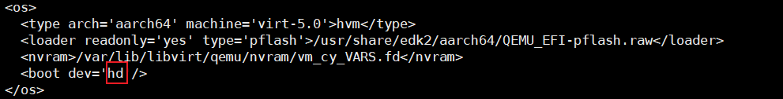

# 重启虚拟机失败进入shell界面

## 现象描述

重启虚拟机后进入shell界面，未进入虚拟机。

## 原因

安装的时候“os boot”没有设置为“hd”，导致启动时找不到虚拟机的启动项。

## 处理步骤

1. 回到物理机，查看虚拟机配置，查看“<os\>”里面的“boot”是否为“hd”，若不是则改为“hd”，然后保存修改。

    ```bash
    virsh edit vm_perf_2203
    ```

    > **说明：** 
    >“vm\_perf\_2203”为虚拟机名称，请用户根据实际情况修改。

    

2. 重启虚拟机以使配置生效。

    ```bash
    virsh shutdown vm_perf_2203
    virsh start vm_perf_2203
    ```
