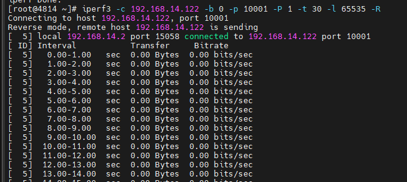
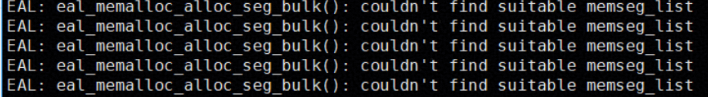

# 零拷贝故障

## 零拷贝启动后断流

### 现象描述

iPerf3适配零拷贝后启动断流：



现有日志无明显ERR报错，设置日志级别为DEBUG级别后仅可以看到如下报错，无其他报错日志：

```bash
K-NET zero copy writev failed, osFd *** dpFd * DP_ZWritev ret -1,errno 11, Resource temporarily unavailable, iovcnt 1
```

### 原因

应用调用零拷贝写接口，写入一直失败，出现打流中断等问题，原因为def\_sendbuf的配置值过小。零拷贝写接口knet\_zwritev需保证发送的原子性，如果发送的数据总量大于def\_sendbuf，则无法成功发送。

### 处理步骤

1. 排查应用中调用knet\_zwritev的地方，确认单次写入所需要的最大字节数。
2. 保证def\_sendbuf的值大于单次写入所需的最大字节数，修改配置项后重新启动，业务运行成功。
3. knet\_zwritev默认非阻塞，修改配置后应用能正常运行，但日志中仍会有同样的错误打印，此为正常现象。

## 零拷贝启动后输出“EAL: eal\_memalloc\_alloc\_seg\_bulk\(\): couldn't find suitable memseg\_list”

### 现象描述

业务适配零拷贝后启动输出：

`EAL: eal\_memalloc\_alloc\_seg\_bulk\(\): couldn't find suitable memseg\_list`



### 原因

K-NET会根据配置文件中“zcopy\_sge\_len”及“zcopy\_sge\_num”进行大页申请，DPDK无法找到合适大小的连续大页来申请所需的内存。

### 处理步骤

1. 查看环境上大页的配置，可以根据实际需求增加大页配置。
2. 查看K-NET配置文件，根据实际情况减少“zcopy\_sge\_len”或者“zcopy\_sge\_num”。
